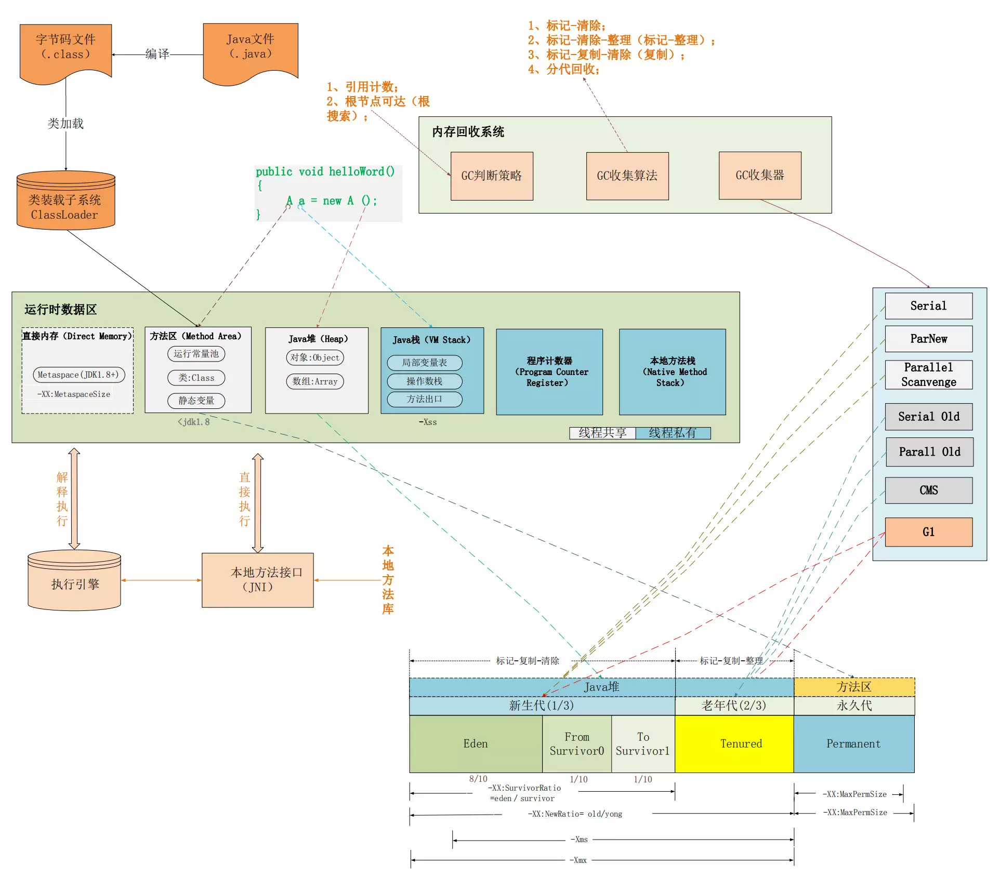

# 深入理解Java虚拟机 #

## 第一部分 走进Java ##

[1.走进Java](src/main/java/com/lun/c01)

## 第二部分 自动内存管理机制 ##

[2.Java内存区域与内存溢出异常](src/main/java/com/lun/c02)

[3.垃圾收集器与内存分配](src/main/java/com/lun/c03)

[4.虚拟机性能监控与故障处理工具](src/main/java/com/lun/c04)

[5.调优案例分析与实战](src/main/java/com/lun/c05)

## 第三部分 虚拟机执行子系统 ##

[6.类文件结构](src/main/java/com/lun/c06)

[7.虚拟机类加载机制](src/main/java/com/lun/c07)

[8.虚拟机字节码执行引擎](src/main/java/com/lun/c08)

[9.类加载及执行子系统的案例与实战](src/main/java/com/lun/c09)

## 第四部分 程序编译与代码优化 ##

[10.早期（编译期）优化](src/main/java/com/lun/c10)

[11.晚期（运行期）优化](src/main/java/com/lun/c11)

## 第五部分 高效并发 ##

[12.Java内存模型与线程](src/main/java/com/lun/c12)

[13.线程安全与锁优化](src/main/java/com/lun/c13)

## 附录 ##

[A](#)

[B.虚拟机字节码指令表](src/main/java/com/lun/appendix/B)

[C](#)

[D](#)

[E](#)

