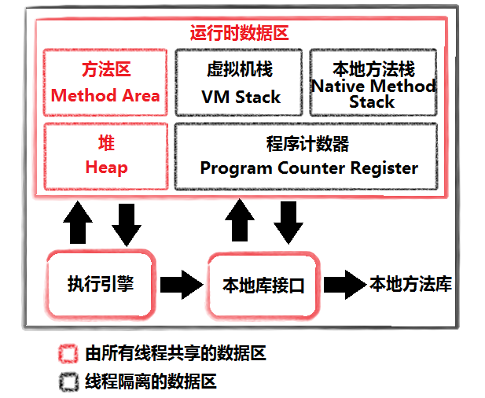
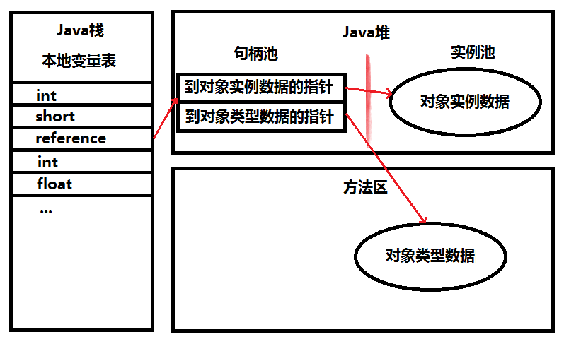
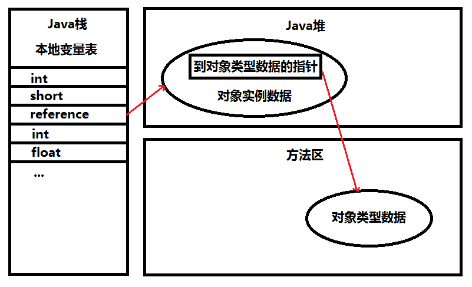
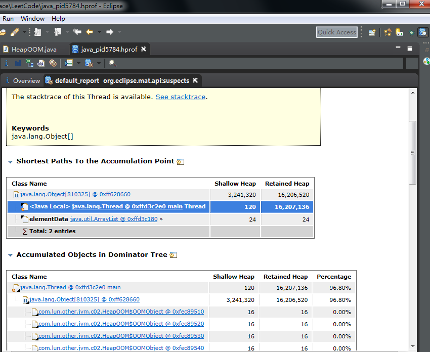
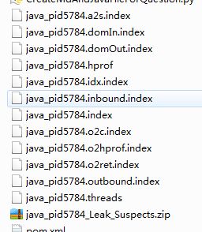

# Java内存区域与内存溢出异常 #

[1.概述](#概述)

[2.运行时数据区域](#运行时数据区域)

[2.1.程序计数器](#程序计数器)

[2.2.Java虚拟机栈](#java虚拟机栈)

[2.3.本地方法栈](#本地方法栈)

[2.4.Java堆](#java堆)

[2.5.方法区](#方法区)

[2.6.运行时常量池](#运行时常量池)

[2.7.直接内存](#直接内存)

[3.HotSpot虚拟机对象探秘](#hotspot虚拟机对象探秘)

[3.1.对象的创建](#对象的创建)

[3.1.1.第一步](#第一步)

[3.1.2.第二步](#第二步)

[3.1.3.第三步](#第三步)

[3.1.4.第四步](#第四步)

[3.1.5.最后一脚](#最后一脚)

[3.2.对象的内存布局](#对象的内存布局)

[3.2.1.对象头Header](#对象头header)

[3.2.1.1.第一部分](#第一部分)

[3.2.1.2.第二部分](#第二部分)

[3.2.2.实例数据Instance](#实例数据instance)

[3.2.3.对齐填充Padding](#对齐填充padding)

[3.3.对象的访问定位](#对象的访问定位)

[3.3.1.句柄](#句柄)

[3.3.2.直接指针](#直接指针)

[3.3.3.对象的访问定位小结](#对象的访问定位小结)

[4.实战：OutOfMerroyError](#实战outofmerroyerror)

[4.1.Java堆溢出](#java堆溢出)

[4.1.1.解决之道](#解决之道)

[4.2.虚拟机栈和本地方法栈溢出](#虚拟机栈和本地方法栈溢出)

[4.2.1.解决之道](#解决之道)

[4.3.方法区和运行时常量池溢出](#方法区和运行时常量池溢出)

[4.3.1.运行时常量池溢出](#运行时常量池溢出)

[4.3.2.方法区溢出](#方法区溢出)

[4.3.3.方法区和运行时常量池溢出小结](#方法区和运行时常量池溢出小结)

[4.4.本机直接内存溢出](#本机直接内存溢出)

## 概述 ##

**内存泄露 Memory Leak**

**内存溢出 Out Of Memory**

有JVM存在，无需为每个new操作写配对的delete/free代码，不易出现 **Out Of Memory** 或 **Memory Leak**。但是，愿望是美好的，该出现的问题还是会出现，了解JVM如何使用内存有助于解决问题。

>A memory leak in Java is when objects you aren't using cannot be garbage collected because you still have a reference to them somewhere.

>An OutOfMemoryError is thrown when there is no memory left to allocate new objects. This is usually caused by a memory leak, but can also happen if you're just trying to hold too much data in memory at once.

>——[What is the difference between an OutOfMemoryError and a memory leak](https://stackoverflow.com/a/4943570)

## 运行时数据区域 ##

### 程序计数器 ###

**Program Counter Register PCR** 是一块较小的内存空间，可看作**当前线程所执行的字节码的行号指示器**。

在VM概念模型中，字节码解释器工作时就是通过改变PCR的值来选取下一条需要执行的字节码指令。

以下功能需要这个计数器来完成。

1. 分支
2. 循环
3. 跳转
4. 异常处理
5. 线程恢复
6. ...

---

由于JVM多线程是通过**线程轮流切换**并**分配处理器执行时间**的方式来实现的，在任何一个确定的时刻，一处理器（对于多核处理器来说是一个内核）都只会执行一条线程中的指令。（**一时刻一核一指令**）

因此，为了线程切换后能恢复到正确的执行位置，每条线程需要一个独立PCR，各条线程PCR互不影响，独立存储，这内存区域被称为“**线程私有**”。（**线程独立性**）

---

若线程正执行一个Java方法，这PCR记录**正在执行VM字节码指令的地址**；若正执行是Native方法，这PCR则为空Undefinded。

这内存区域是**唯一一个**在JVM规范没有规定任何**OutOfMemoryError OOME**情况的区域

### Java虚拟机栈 ###

**VM Stack**，线程私有，声明周期与线程相同。

VM Stack描述的Java方法执行的内存模型：每个方法在执行的同时会创建一个**栈帧Stack Frame**。

Stack Frame用于

1. 存储局部变量表
2. 操作数栈
3. 动态链接
4. 方法出口信息

**每一个方法从调用直至执行完成的过程，就对应着一个Stack Frame 在VM Stack中入栈到出栈的过程**。

---

粗糙说法，Java内存区分为

1. Heap 堆内存
2. Stack 栈内存 这里指 VMStack

Java内存区域划分实际上远比这复杂。

---

**局部变量表**存放

1. 编译期可知的各种**基本数据类型**（boolean/byte/char/short/int/float/double）
2. **对象引用** reference类型 它不等同于对象本身，可能是
	- 一个指向对象起始地址的**引用指针**
	- 一个代表对象的**句柄**或其他与此对象相关的位置
3. returnAddress类型（指向了一条字节码指令的地址）

---

64位的double/long类型数据会占用2个**局部变量空间Slot**，其余基本类型占1个。

局部变量表所需的内存空间**在编译期间完成分配**，当进入一个方法时，这方法需要在帧中分配多大的局部变量空间是**完全确定的**，在方法运行期间**不会**改变局部变量表的大小。

---

JVM规范中，这区域规定2种异常状况：
1. **StackOverflowError SOE**，当线程请求栈深度大于VM所允许深度时。
2. ** OutOfMemoryError OOME**，VM Stack可动态扩展（当前大部分JVM都可动态扩展，只不过JVM规范中允许固定程度的VM Stack），当扩展时无法申请到足够的内存。

---

### 本地方法栈 ###

**Native Method Stack NVS** 与 VM Stack作用相似，它们区别为
1. VM Stack为VM执行Java方法（也就是字节码）服务。
2. NVS则为VM使用到Native方法服务。

VM规范未强制规定

1. 对NVS中方法使用的**语言**
2. 使用方式与数据结构并没有强制规定。

不同VM各有发挥。

Sum HotSpot VM 直接把 VM Stack 和 NVS 合二为一。

会抛SOE和OOME异常。

### Java堆 ###

Java Heap ，线程共享

通常，Java堆是JVM所管理内存最大一块。

VM启动时创建。

**此内存区域的唯一目的就是存放对象实例，几乎所有对象实例在这里分配内存**。

JVM规范：所有对象实例以及数组都要在堆上分配。

但随着JIT编译器技术等发展，所有对象在堆上分配不是那么绝对。

---

Java堆是GC管理主要区域，因此也被称为GC堆（Garbage Collected Heap）

**从内存回收的角度看**，由于现在收集器基于**分代收集算法**，所以Java堆中可细分为：**新生代** 和 **老生代**；更细致的 Eden空间、From Survivor 空间、To Survivor空间等。

**从内存分配的角度来看**，线程共享的Java堆可划分多个线程私有的分配缓冲区（Thread Local Allocation Buffer，TLAB）

无论怎样划分，**目的始终是 更好回收内存，更快分配内存**。

---

通过-Xmx/-Xms控制扩展大小

若堆中没有内存完成实例分配，并且堆也无法再扩展时，将会抛出OOME

### 方法区 ###

Method Area 线程共享。

它用于存储已被VM加载的

1. 类型信息
2. 常量
3. 静态变量
4. 即时编译器编译后的代码等数据
5. 。。。

JVM规范 把 方法区描述为对的一个逻辑部分，但它别名叫做Non-Heap（非堆），目的与Java堆区分开。

---

大部分HotSpot VM开发者更愿意成**方法区**称为**永久代Permanent Generation**，

二者并不等价，只因HotSpot设计团队**选择把GC分代收集扩展至方法区**，或说使用**永久代**来实现方法区而已，这样HotSpot的GC可以像管理Java堆一样管理这部分内存，能够省去专门为方法区编写内存管理代码工作。

其他虚拟机BEA JRockit/IBM J9等不存在永久代的概念。

原则上，如何实现方法区属于VM实现细节，不受虚拟机规范结束，但使用永久代来实现方法区，现在看不是好主意，因为易于 **内存溢出** 问题（永久代有-XX:MaxPermSize的上限）

JDK1.7的HotSpot已把原在**永久代**的字符串常量池移出.

GC比较少在方法区内出现，但并非数据进入了方法区就如永久代的名字一样“永久”存在了，这区域的内存回收目标主要是**针对常量池的回收** 和 **对类型的卸载**。

---

当内存不满足，抛OOME

### 运行时常量池 ###

Runtime Constant Pool RCP是**方法区**的一部分

Class文件中除了有类的版本、字段、方法、接口等描述信息外，还有一项信息是**常量池Constant Pool Table**，用于存放编译期生成的各种**字面量**和**符号引用**，这部分内容将在类加载后进入方法区的RCP中存放。

---

JVM对Class文件每一部分的格式都有严格规定，每一字节用于存储那种数据都必须符合规范上的要求才会被VM认可、装载和执行。

但对于RCP，JVM规范没有做任何细节的要求，不同的提供商实现的虚拟机可以按照自己的需要实现区域。

通常，除了保存Class文件中描述的符号引用外，还会翻译出来的字节引用也存储在RCP中。

---

运行时常量池 相对于Class文件常量池 的另外一个重要特征是**具备动态性**。

Java语言并不要常量一定只有编译器才能产生，也就是并非预置如Class文件中常量池的内容才能进入方法区RCP，运行期间也可能将新的常量放入池中，如String类的intern()方法。

---

当内存不满足，抛OOME

### 直接内存 ###

Direct Memory 并不是虚拟机运行时数据区的一部分，也就是JVM规范中定义的内存区域。

这部分内存也频繁使用，而也可能导致OOME.

在JDK1.4中新加入了NIO类，引入一种基于**通道Channel**与**缓冲区Buffer**的IO方式，它可以使用Native函数库直接分配堆外内存，然后通过一个存储在Java堆中的DirectByteBuffer对象作为这块内存的引用进行操作。这样能在一些场景中显著提高性能，因为避免了在Java堆和Native堆中来回复制数据。

---

显然，Direct Memory分配不受Java 堆大小的限制，但是，既然是内存，肯定还是会受到本机总内存（包括RAM一级SWAP区或者分页文件）大小 以及 处理器寻址空间的限制。

服务器管理员在配置VM参数，会根据实际内存设置-Xms等参数信息，但经常忽略直接内存，使得各种内存区域总和大于**物理内存限制**，从而导致动态扩展时出现OOME.

## HotSpot虚拟机对象探秘 ##

对于细节问题，必须把讨论范围限定在具体的虚拟机和集中在某一个内存区域上才有意义。

### 对象的创建 ###

JVM创建一个普通对象（非数组或Class对象）过程大概可分4步。

#### 第一步 ####

VM遇到一条new指令时，首先将去检查这个指令的参数是否能在常量池中定位到一个类的符号引用，并且检查这个符号引用是否已被加载、解析和初始化过。

若没有，那必须先执行相应的类加载过程。

#### 第二步 ####

在类加载检查通过后，接下来VM将为新生对象分配内存。

对象所需内存的大小在类加载完成后完全确定为对象分配空间的任务等同于把一块确定大小的内存从Java堆中划分出来。

两种分配方式:

1. 指针碰撞 Bump the Pointer
2. 空闲列表Free List

**假设Java堆中内存是绝对的完整的**，所有用过的内存放在一边，空闲的内存放在另一边，中间放着一个指针作为分界点的指示器，那所分配内存就仅是那指针向空闲那边挪动一段与对象大小相等的距离，这种分配方式称为“**指针碰撞 Bump the Pointer**”

若Java堆中的内存并不是规整的，已使用的内存和空闲的内存相互交错，那就无法简单地进行**指针碰撞**，VM就必须维护**一个列表**，记录上哪些内存块是可用的，在分配的时候从列表中找到一块足够大的空间划分给对象实例，并更新列表上的激励，这种分配方式称为“**空闲列表Free List**”。

**采用GC是否带有压缩整理功能 --决定-->Java堆是否规整 --决定--> ? 指针碰撞 : 空闲列表**

因此，使用Serial、ParNew等带Compact过程的收集器时，系统采用的分配算法是**指针碰撞**

使用CMS这种基于Mark-Sweep算法的手机器时，通常采用**空闲列表**

---

除了如何划分可用空间之外，还有另外一个需要考虑的问题是**对象创建在虚拟机中是否非常频繁的行为，即使是仅仅修改一个指针所指向的位置**，在并发情况下也不是线程安全，可能出现正在给对象A分配内存，指针还没来得及修改，对象B又同时使用了原来的指针来分配内存的情况。（分配内存时的线程安全问题）

解决上述问题有两种方案：（好似synchronized和ThreadLocal ：）

1. **对分配内存空间的动作进行同步处理**——实际上虚拟机采用CAS配上失败重试的方式保证更新操作的原子性
2. **把内存分配的动作按照线程划分在不同的空间之中进行**，即每个线程在Java堆中预先分配一小块内存，称为本地线程分配缓存（Thread Local Allocation Buffer, TLAB）。哪个线程分配内存，就在哪个线程上的TLAB上分配，只有TLAB用完并分配新的TLAB是，才需要同步锁定。VM是否使用TLAB，可以通过-XX:+/-UseTLAB参数来设定。

#### 第三步 ####

内存分配完成后，**VM需要将分配到的内存空间都初始化为零值**（不包括对象头），如果使用TLAB，这一工作也可以提前至TLAB分配时进行。这一步操作保证了对象的实例字段在Java代码中可以不赋初始值就直接使用，程序能访问到这些字段的数据类型所对应的零值。

#### 第四步 ####

VM对对象进行必要的设置，例如：

1. 这个对象是哪个类的实例
2. 如何才能找到类的元数据信息
3. 对象的哈希码
4. 对象的GC分代年龄
5. 。。。

这些信息存放在对象的对象头（Object Header）之中。根据VM当前的运行状态的不同，如是否启用偏向锁等，对象头会有不同的设置方式。

#### 最后一脚 ####

在上面工作都完成之后，从VM的视角来看，**一个新对象已经诞生**，**但**从Java程序的视角来看，对象创建才刚刚开始（前面那个顶多是个半成品）——<init&gt;方法还没有执行，所有字段都还为零。所以，一般来说（由字节码是否跟随invokespecial指令所决定），执行new指令之后会接着执行<init&gt;方法，把对象按照程序员的意愿进行初始化，这样**一个真正可用的对象才算完全产生出来**。

### 对象的内存布局 ###

在**HotSpot VM**中，对象在内存中存储的布局可以分为3块区域：对象头（Header）、实例数据（Instance）和对齐填充（Padding）

#### 对象头Header ####

对象头包含两部分信息

##### 第一部分 #####

第一部分用于存储对象自身的运行时数据，如

1. 哈希码HashCode
2. GC分代年龄
3. 锁状态标志
4. 线程持有的锁
5. 偏向线程ID
6. 偏向时间戳
7. 。。。

这部分数据的长度在32/64位的VM（未开启压缩指针）中分别为32/64bit，官方称它为“**Mark Word**”

##### 第二部分 #####

另一部分是类型指针，即**对象指向它的类元数据的指针**，VM通过这个指针来确定这个对象是哪个类的实例。

**并不是**所有VM实现都必须在对象数据上保留类型指针，换句话说，查找对象的元数据信息并不一定要经过对象本身。

**若对象是一个Java数组**，那在对象头还必须有一块用于记录数组长度的数据，因为VM可通过普通Java对象的元数据信息确定Java对象的大小，但是从数组的元数组中却无法确定数组的大小。

#### 实例数据Instance ####

对象真正存储的有效信息，也是程序代码中所定义的各种类型的字段内容。

无论是从父类继承下来的，还是在子类中定义的，都需要记录起来。这部分的存储顺序会受到**虚拟机分配策略参数**（FieldsAllocationStyle）和**字段在Java源码中定义顺序**的影响。

#### 对齐填充Padding ####

鸡肋，仅仅起着占位符的作用。HotSpot VM的自动内存管理系统要求对象起始地址必须是8字节的整数倍。也就是对象大小必须是8字节的整数倍。当对象实例数据部分没有对齐时，就需要通过对齐填充来补充。

### 对象的访问定位 ###

建立对象是为了使用对象，Java程序需要通过栈上的reference数据来操作堆上的具体对象。

由于reference类型在JVM规范中只规定了一个指向对象的引用，并没有定义这个引用通过何种方式去**定位**、**访问**堆中的对象的具体位置，所以对象访问方式也是取决于虚拟机实现而定的。

目前主流访问方式有使用**句柄**和**直接指针**两种

#### 句柄 ####

Java堆中将会划分出一块内存来作为**句柄池**，reference中存储的就是对象的句柄地址，而句柄中包含了**对象实例数据** 与 **对象类型数据**各自的具体地址信息。

#### 直接指针 ####

Java堆对象的布局中就必须考虑如何放置访问类型数据的相关信息，而reference中存储的直接就是**对象地址**

#### 对象的访问定位小结 ####

这两种对象访问方式各有优势，使用**句柄**来访问的最大好处就是reference中存储的是**稳定**的句柄地址，在对象被移动（垃圾收集时移动对象是非常普遍的行为）时只会改变句柄中的实例数据指针，而reference本身不需要修改。

使用**直接指针**访问方式的最大好处就是速度**更快**，它节省了一次指针定位的时间开销，由于对象的访问在Java中非常频繁，因此这类开销积少成多也是一项非常可观的执行成本。

HotSpot使用**直接指针**进行对象访问的，但从整个软件开发的范围来看，各种语言和框架使用句柄来访问的情况也十分常见。

## 实战：OutOfMerroyError ##

1. 通过代码验证JVM规范中描述的各个运行时区域存储内容。
2. 希望读者在工作中遇到实际的内存溢出异常，知道什么样的代码可能会导致这区域内存溢出，以及出现这异常该如何处理。

例如，VM启动参数

	-verbose:gc -Xms20M -Xmx20M -Xmn10M -XX:+PrintGCDetails -XX:SurvivorRatio=8

>verbose /vɝ'bos/ adj. 冗长的；啰嗦的

### Java堆溢出 ###

Java堆用于存储对象实例，只要不断创建对象，并且保证GC Roots到对象之间有达途径来避免垃圾回收机制清除这些对象，那么再对象数量到达最大堆的容量限制后就会产生内存溢出异常

将堆的最小值-Xms和最大值-Xmx参数设置一致可避免堆自动扩展

-XX:+HeapDumpOnOutOfMemoryError让VM在出现内存溢出时Dump出当前的内存堆转储快照以便事后进行分析

[HeapOOM](HeapOOM.java)

运行结果：

	...
	java.lang.OutOfMemoryError: Java heap space
	Dumping heap to java_pid5784.hprof ...
	Heap dump file created [28135555 bytes in 0.213 secs]
	Exception in thread "main" java.lang.OutOfMemoryError: Java heap space
		at java.util.Arrays.copyOf(Arrays.java:3210)
		at java.util.Arrays.copyOf(Arrays.java:3181)
	...

Java堆内存的**java.lang.OutOfMemoryError**是实际应用中常见的**内存溢出异常**情况。

#### 解决之道 ####

先通过内存影响分析工具（如**Eclipse Memory Analyzer**）对Dump出来的堆转储快照进行分析，**重点是确认内存中的对象是否是必要的，也就是要先分清楚到底是出现了内存泄露Memory Leak还是内存溢出Memory Overflow**（从字面上理解吧！）

>Eclipse Memory Analyzer使用方法
>1. 使用Help->Eclipse Marketplace安装
>2. Open Perspective中选择Memory Analysis
>3. Open Heap Dump 打开上例程序运行所产生的堆转储快照文件java_pid5784.hprof（在classpath目录下）

>注意！java_pid5784.hprof文件被打开后，系统产生一堆文件

- 若**内存泄露**，可一步通过工具查看泄露对象到GC Roots的引用链。于是就能找到泄露对象是同过怎样的路径与GC Roots相关联并导致GC无法自动回收它们的。掌握了泄露对象的类型信息及GC Roots引用链的信息，即可比较准确地定位出泄露代码的位置。
- 若**不存在泄露**，换句话说，就是内存中的对象确实都还必须存活着，那就应当检查VM的堆参数最小值-Xms和最大值-Xmx参数，与机器物理内存对比看是否还可以调大，从代码检查是否存在某些对象生命周期过长、持有状态时间过长的情况，尝试减少程序运行期的内存消耗。

### 虚拟机栈和本地方法栈溢出 ###

Hotspot VM并不区分 VM Stack和 Native Method Stack，因此，-Xoss参数（设置本地方法栈大小）形同虚设，栈容量只由-Xss参数设定。

关于VM Stack和 Native Method Stack，在JVM规范中描述了两种异常：

1. 若线程请求的栈深度大于VM所允许的最大深度，将抛出**StackOverflowError**异常。
2. 若VM在扩展栈时无法申请到足够的内存空间，则抛出**OutOfMemoryError**异常

这两异常有相互重叠地方：当栈空间无法继续分配时，到底是内存太小，还是栈空间太大，其本质上只是对同一件事情的两种描述。

---

在单线程环境操作

[JavaVMStackSOF](JavaVMStackSOF.java)

1. 使用 -Xss参数减少栈内存存量。会抛出java.lang.StackOverflowError，异常出现时输出的堆栈深度相应缩小。
2. 定义大量的本地变量，增大此方法帧中本地变量表的长度。会抛出java.lang.StackOverflowError，异常出现时输出的堆栈深度相应缩小。

上例程序针对第1点

运行结果：

	stack length:999
	Exception in thread "main" java.lang.StackOverflowError
		at com.lun.c02.JavaVMStackSOF.stackLeak(JavaVMStackSOF.java:12)
		at com.lun.c02.JavaVMStackSOF.stackLeak(JavaVMStackSOF.java:13)
		at com.lun.c02.JavaVMStackSOF.stackLeak(JavaVMStackSOF.java:13)
	...

实验结果表明：单线程环境下，无论栈帧太大还是VM栈容量太小，当内存无法分配时，VM都抛出StackOverflowError异常等。

---

[JavaVMStackOOM](JavaVMStackOOM.java)

	把-Xss从108k设置到1024M 5min内 依然跑不出书上那样结果
	
	加上-Xmx20M -Xms20M 也是一样跑不出

上例通过不断创建线程方式产生**内存溢出异常**。但是这样产生的**内存溢出异常**与栈空间是否足够大并存在任何联系，或者准确地说，在这种情况下，为每个线程的栈分配的内存越大，反而越容易产生**内存溢出异常**。（为什么我跑不出这样的实验结果呢？）

---

归根到底，OS分配每个进程内存是有限制的，譬如32位的Windows限制为2GB。VM提供了参数来参加Java堆 和 方法区的这两部分内存的最大值。剩余内存为2GB（OS限制）减去Xmx（最大堆容量），再减去MaxPermSize（最大方法区容量），PCR内存消耗很小，可忽略。

若VM进程本身消耗的内存不计算在内，剩下的内存就由VM Stack 和 Native Method Stack“瓜分”了。

每个线程分配到的栈容量越大，可建立的线程数量自然就越少，建立线程时就越容易把剩下内存耗尽。

#### 解决之道 ####

在开发多线程时要注意，出现StackOverflowError会有**错误堆栈信息**可阅读，相对来说，比较容易找打问题的所在。而且，若使用虚拟机默认参数，栈深度通常达到1000~2000完全没问题，对于正常的方法调用（包括递归），这深度应该完全够用了。

但是，若建立过多线程导致的内存溢出，在不能减少线程数或者更换64位VM情况下，就只能通过**减少最大堆**和**减少栈容量**来换取更多线程。

这种通过“**减少内存**”的手段来解决内存溢出的方式会比较难以想到。（似非而是）

### 方法区和运行时常量池溢出 ###

#### 运行时常量池溢出 ####

JDK1.7开始逐步“去永久代”。

String.intern()是一个Native方法，其作用：若**字符串常量池**中已经包含一个等于此String对象的字符串，则返回代表池中这个字符串的String对象；否则，将此String对象包含的字符串添加到常量池中，并且返回此String对象的引用。

**JDK1.6及以前的版本中**由于**常量池**分配在**永久代**内，可通过-XX:PermSize和-XX:MaxPermSize限制方法区大小，从而间接限制其中常量池的容量（-XX:PermSize 和 -XX:MaxPermSize 已被JDK1.8移除，取而代之的是-XX:MetaspaceSize和-XX:MaxMetaspaceSize）

[RuntimeConstantPoolOOM](RuntimeConstantPoolOOM.java)

运行时常量属于方法区（HotSpot虚拟机中永久代）的一部分。

使用JDK1.7运行这段程序就不会得到相同的结果，while循环将一直进行下去

JDK 1.8 JVM内部结构的元空间(Metaspace)取代永久代(PermGen)

---

[RuntimeConstantPoolOOM2](RuntimeConstantPoolOOM2.java)

运行结果

JDK1.6 -> 两个false
JDK1.7 -> 前true后false

在JDK1.6，intern()会把首先遇到的字符串实例复制到**永久代**中，返回的也是永久代中这个字符串实例的引用，而由StringBuilder创建的字符串实例在**Java堆**上，所以必然不是同一个引用，将返回false。

在JDK1.7的intern()实现不会再复制实例，只是在常量池中**记录首次**出现的实例引用，因此intern()返回的引用和由StringBuilder创建的那个字符串实例是同一个。

对str2比较返回false是因为“java”这个字符串在执行StringBuilder.toString()之前已经出现过，**字符串常量池**中已经有它的引用，不符合“**首次出现**”的原则，而“计算机软件”这个字符串是首次出现，因此返回true

#### 方法区溢出 ####

方法区用于存放Class的相关信息，如

1. 类名
2. 访问修饰符
3. 常量池
4. 字段描述
5. 方法描述
6. 。。。

对于这区域测试，基本思路是运行时产生大量的类填满方法区，直到溢出。

为简单起见，不使用反射而借助CGLib直接操作字节码运行时生成了大量的动态类。

[JavaMethodAreaOOM](JavaMethodAreaOOM.java)

当前的很多主流框架，如Spring、Hibernate，在对此进行增强时，都会使用CGLib这类字节码技术，增强的类越多，就需越大的方法区来保证动态生成的Class可以加载入内存。

另外，JVM动态语言（如Groovy等）通常都会持续创建类来实现语言的动态性。

一个类要被GC回收掉，判定条件是比较苛刻的。在经常动态生成大量Class的应用中，需要特别注意类的回收状况。

这类场景除了上面提到的程序使用了CGLib字节码增强和动态语言之外，常见还有

1. 大量JSP或动态产生的引用（JSP第一次运行时需要编译为Java类）
2. 基于OSGi的应用（即使是同一个类文件,被不同的加载器加载也会视为不同的类）

#### 方法区和运行时常量池溢出小结 ####

-XX:PermSize 和 -XX:MaxPermSize 已被JDK1.8移除，查阅资料得知，JDK 1.8 JVM内部结构的元空间(Metaspace)取代永久代(PermGen)，所以在JDK1.8 机器上跑不出书本上那样结果。

若把参数换成-XX:MetaspaceSize和-XX:MaxMetaspaceSize则有类似的结果。

### 本机直接内存溢出 ###

DirectMemory容量可通过-XX:MaxDirectMemorySize指定，若不指定，则默认与Java堆最大值（-Xmx指定）一样。

直接通过Unsafe实例进行内存分配（Unsafe类的getUnsafe()方法限制了只有引导类加载器才会返回实例，也就是设计者希望只有rt.jar中的类才能使用Unsafe的功能）。

DirectByteBuffer分配内存也会抛出内存溢出异常，但它抛出异常时并没有真正想OS申请分配内存，而是通过计算得知内存无法分配，于是直接抛出异常，真正申请分配内存的方法是unsafe.allocateMemory()

[DirectMemoryOOM](DirectMemoryOOM.java)

运行结果

	Exception in thread "main" java.lang.OutOfMemoryError
		at sun.misc.Unsafe.allocateMemory(Native Method)
		at com.lun.c02.DirectMemoryOOM.main(DirectMemoryOOM.java:18)

由DirectMemory导致的内存溢出，一个明显的特征是在Heap Dump文件中不会看见明显的异常，若发现OOME之后Dump文件很小，而程序中又直接或间接使用了NIO，那就可以考虑检查一下是不是这方面的原因。

