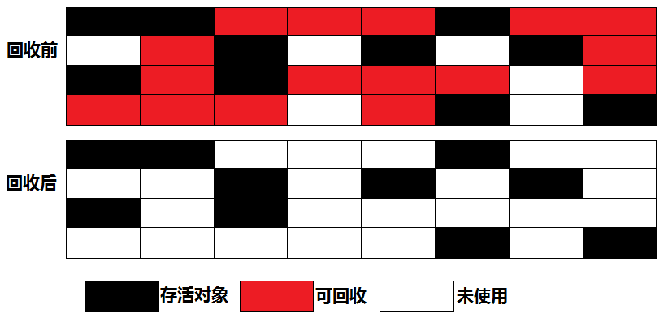
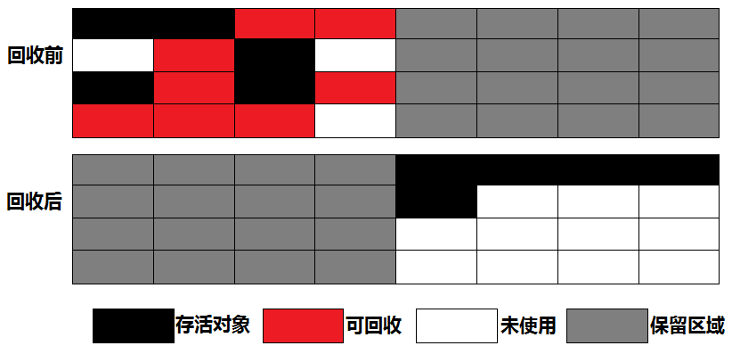
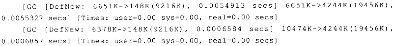

# 垃圾收集器与内存分配策略 #

[1.概述](#概述)

[2.对象已死吗](#对象已死吗)

[2.1.引用计数算法](#引用计数算法)

[2.2.可达性分析算法](#可达性分析算法)

[2.3.再谈引用](#再谈引用)

[2.4.finalize()：生存还是死亡](#finalize生存还是死亡)

[2.5.回收方法区](#回收方法区)

[3.垃圾收集算法](#垃圾收集算法)

[3.1.标记-清除算法](#标记清除算法)

[3.2.复制算法](#复制算法)

[3.3.标记-整理算法](#标记整理算法)

[3.4.分代收集算法](#分代收集算法)

[4.HotSpot的算法实现](#hotspot的算法实现)

[4.1.枚举根结点](#枚举根结点)

[4.2.安全点](#安全点)

[4.3.安全区域](#安全区域)

[5.垃圾收集器](#垃圾收集器)

[5.1.Serial](#serial)

[5.2.ParNew](#parnew)

[5.3.Parallel Scavenge](#parallelscavenge)

[5.4.Serial Old](#serialold)

[5.5.Parallel Old](#parallelold)

[5.6.CMS](#cms)

[5.6.1.CMS运作步骤](#cms运作步骤)

[5.6.2.CMS优缺点](#cms优缺点)

[5.7.G1](#g1)

[5.7.1.G1实现原理](#g1实现原理)

[5.7.2.G1实现难点](#g1实现难点)

[5.7.3.G1运作步骤](#g1运作步骤)

[5.7.4.G1性能评测](#g1性能评测)

[5.8.理解GC日志](#理解gc日志)

[5.9.GC小结](#gc小结)

[5.10.垃圾收集器参数总结](#垃圾收集器参数总结)

[6.内存分配与回收策略](#内存分配与回收策略)

[6.1.对象优先在Eden分配](#对象优先在eden分配)

[6.1.1.程序运行结果解释1](#程序运行结果解释1)

[6.1.2.新生代GC与老年代GC区别](#新生代gc与老年代gc区别)

[6.2.大对象直接进入老年代](#大对象直接进入老年代)

[6.2.1.程序运行结果解分析2](#程序运行结果解分析2)

[6.3.长期存活的对象将进入老年代](#长期存活的对象将进入老年代)

[6.3.1.程序运行结果解分析3](#程序运行结果解分析3)

[6.4.动态对象年龄判定](#动态对象年龄判定)

[6.4.1.程序运行结果解分析4](#程序运行结果解分析4)

[6.5.空间分配担保](#空间分配担保)

[7.本章小结](#本章小结)

## 概述 ##

1960年诞生于MIT的Lisp是**第一门**真正使用**内存动态分配**和**垃圾收集技术**的语言。

当Lisp还在胚胎期，人们就在思考GC需要完成3件事情：

1. 哪些内存需要回收？
2. 什么时候回收？
3. 如何回收？

经过多年发展，垃圾收集器与内存分配技术日臻完善，**为什么还有去了解GC和内存分配**？

因为当需要排查各种内存溢出、内存泄露问题时，当垃圾收集称为系统达到**更高并发量的瓶颈**时，就需要对这些“自动化”的技术实施必要的**监控**和**调节**。

---

在Java内存运行时区域中，**PCR、 VM Stack、 Native Method Stack 3个区域与线程同生共死**。

栈中的栈帧随着方法的进入和退出而有条不紊地执行者出栈和入栈的操作。每一栈帧中分配多少内存基本上是在类结构确定下俩就已知的。

因此这几个区域内存分配和回收都具备确定性，所以无需多虑，**内存随着方法结束或者线程结束而回收**。

Java堆 和 方法区与这3区域的不同。

一个接口中的多个实现类需要的内存可能不一样，一个方法中的多个分支需要的内存也可能不一样，这能在程序运行期间才能知道会创建哪些对象，这部分内存分配和回收都是动态。

GC所关注的是这部分内存。

## 对象已死吗 ##

GC在堆进行回收前，第一件事就是要哪些对象是“活”的，哪些是“死”的。

### 引用计数算法 ###

**引用计数算法 Reference Counting**思路：给对象中添加一个**引用计数器**，每当有一个地方引用它时，计数器+1；引用失效时，计数器-1；任何时刻计数器为0的对象就是不可能再被使用。

它的优点：简单高效

但是，主流JVM**未选用**该算法管理内存，其中最主要的原因是**它很难解决对象间相互循环引用的问题**。

两对象相互引用的例子

[ReferenceCountingGC](ReferenceCountingGC.java)

上例侧面说明VM并不是通过引用计数算法来判断对象是否存活的。

PS. 上例没有main方法，另外程序例子运行后如何生成GC日志暂未说明，GC日志内容也未说明。

PS. [理解GC日志](#理解gc日志)

### 可达性分析算法 ###

Reachability Analysis/əˈnælɪsɪs/

Java、C#、古老Lisp都是通过这种算法来判断对象是否存活。

算法思路：通过一系列称为“GC Roots”的对象作为起始点，从这些节点开始向下搜索，搜索所走过的路径称为**引用链Reference Chain**，当一对象到GC Roots没有任何引用链相连（用图论的话来说，就是从GC Root到这个对象不可达）时，则证明此对象是不可用的。

在Java语言中，可作为GC Roots的对象包括下面几种：

1. VM Stack(栈帧的本地变量表)中引用的对象
2. 方法区中类静态属性引用的对象
3. 方法区中常量引用的对象
4. 本地方法栈中JNI（即一般说的Native方法）引用的对象

### 再谈引用 ###

无论是通过**引用计数算法**判断对象的引用对象，还是**通过可达性分析算法**判断对象的引用链是否可达，判定对象是否存活都与“**引用**”有关。

JDK1.2以前，Java中的引用的定义很传统：若reference类型的数据中存储的数字代表的是另一块内存的起始地址，就称这块内存代表着一个引用。这定义纯粹，但狭隘，一个对象在这种顶一下只有被引用或者没有被引用两种状态。

愿景：有一类对象，当内存空间还足够时，则保留在内存中；若内存空间在进行垃圾收集后还是非常紧张，则可抛弃这些对象。很多系统的缓存功能都符合这样的应用场景。

在JDK1.2后，Java对引用的概念进行了扩充。

1. **强引用StrongReference**指在程序代码中普遍存在的，类似“Object obj = new Object()”这类的引用，只要强引用还存在，GC永不回收掉被引用的对象。
2. **软引用SoftReference**用来描述一些还有用但并非必需的对象。 对于软引用关联着的对象，在系统将要发生**OOME**之前，将会把这些对象列入回收范围之中进行第二次回收。若这次回收还没有足够内存，才会抛出OOME。在JDK1.2后，SoftReference类实现软引用
3. **弱引用WeakReference**用来描述非必需对象的，但是它的强度比软引用更弱一些，被弱引用关联的对象只能生存到下一次垃圾收集发生之前。当GC工作时，无论当前内存是否足够，都会回收掉只被弱引用关联的对象。在JDK1.2后，WeakReference类实现弱引用
4. **虚引用PhantomReference**最弱的引用。一个对象是否有虚引用的存在，完全不会对其生存时间构成影响，也无法通过虚引用用来取得一个对象实例。**为一个对象设置虚引用关联的唯一目的就是能在这个对象被GC回收时收到一个系统通知**。在JDK1.2后，PhantomReference类实现虚引用

这4种引用强度依次逐渐减弱。

### finalize()：生存还是死亡 ###

要真正宣告一个对象死亡，至少要经历两次标记过程：

若对象在进行可达性分析后发现没有与GC Roots相连接引用链，那它会被**第一次标记**。第一次标记后进行一次筛选，条件是**此对象是否有必要执行finalize()方法**。

VM将两种情况视为“没必要执行”
- 对象没有覆盖finalize()方法
- finalize()方法已经被VM调用过

---

若这对象被判定为有必要执行finalize()方法，这对象就将会防止在一个叫做F-Queue的队列之中，并在稍后由一个由VM自动建立的、低优先级的Finalizer线程去执行它。

这里所谓的“执行”是指VM会触碰这个方法，但**并不承诺会等待它运行结束**，这样做的原因是，若一个对象在finalize()方法中执行缓慢，或者发生了死循环（更极端的情况），将可能会导致F-ueue队列中其他对象永久处于等待，甚至导致整个内存回收系统崩溃。

finalize()方法是对象逃脱死亡命运的最后一次机会，稍后GC将对F-Queue中的对象进行**第二次小规模标记**，

自赎的方法：

若对象要在finalize()成功拯救自己——只要重新与引用链上的任何一个对象建立关联即可，譬如把自己（this关键字）赋值给某个类变量或者对象的成员变量，那在第二次标记时它将被移除出“即将回收”的集合：若对象这时候还没有逃脱，那基本上它就真的被回收了。如下例

[FinalizeEscapeGC](FinalizeEscapeGC.java)

上例子中，代码有两段完全一样的代码片段，执行结果却是一次逃脱成功，一次失败，这是因为任何一个对象的finalize()方法都只会被系统自动调用一次，若对象面临下一次回收，它的finalize()方法不会被再次执行，因此第二段代码自救行动失败了。

---

**建议finalize()不要被调用**。

它不是C/C++中的析构函数，而是Java诞生初期为使C/C++程序员更容易接受它所作出的一个妥协。

它的运行代价高昂，不确定性大，无法保证各个对象的调用顺序。

finalize()能做的所有工作，使用try-finally或者其他方式都可以做得更好、更及时。

所以，finalize()方法了解一下就行了。

### 回收方法区 ###

方法区（HotSpotVM的永生代）被认为没有垃圾收集，JVM规范确实说过可以不要求VM在方法区实现垃圾收集，而且在方法区中进行垃圾收集的“性价比”一般较低：在堆中，尤其是在新生代中，常规应用进行一次垃圾收集一般可以回收70%~95%的空间，而永久代的垃圾收集效率远低于此。

永久代的垃圾收集主要回收两部分内容

1. 废弃常量
2. 无用类

回收废弃常量与回收Java堆中的对象非常类似。

**以常量池中字面量的回收为例**，假如一个字符串“abc”已经进入常量池中，当前系统没有任何一个String对象叫做“abc”的，换句话说，就是没有任何String对象引用常量池中的“abc”常量，也没有其他地方引用了这个字面量，如果这时发生内存回收，而且必要的话，这“abc”常量就会被系统清理出常量池。常量池中的其他类（接口）、方法、字段的符号引用也与此类似。

---

判定一个常量是否是“废弃常量”比较简单，而要判定一个类是否是“无用的类”的条件则相对苛刻许多。

类需要同时满足下面3个条件才能算是“无用的类”：

1. 该类所有实例已被回收，也就是Java堆中不存在该类的任何实例。
2. 加载该类的ClassLoader已经被回收
3. 该类对应的java.lang.Class对象没有在任何地方被引用，无法在任何地方通过反射访问该类的方法。

VM可对满足上述3个条件的无用类进行回收，这里仅仅是“可以”，而并不是和对象一样，不使用了就必然会回收。

---

是否对类进行回收，HotSpot VM提供了-Xnoclassgc参数进行控制，还可以使用-verbose:class以及-XX:+TraceClassLoading、-XX:+TraceClassUnLoading查看类加载和卸载信息，

其中-verbose:class、-XX:+TraceClassLoading可在Product版的虚拟机中使用，-XX:+TraceClassUnLoading参数需要FastDebug版的虚拟机支持。

---

在大量使用反射、动态代理、CGLib等ByteCode框架、动态生JSP以及OSGi这类频繁自定义ClassLoader的场景都需要VM具备卸载的功能，以保证永久代不会溢出。

## 垃圾收集算法 ##

这里只介绍算法思想，各种VM有各种垃圾收集算法

### 标记-清除算法 ###

Mark-Sweep

算法分两阶段

1. 标记 标记出所有需要回收的对象（标记过程在上章介绍）
2. 清除 标记完成后统一回收所有被标记的对象

它的不足有两个

1. 效率问题，标记和清除两个过程效率不高；
2. 空间问题，标记清除走会产生大量不连续的内存碎片，空间碎片太多可能会导致一首在程序运行过程中需要分配较大对象时，无法找到足够的连续内存而不得不提前出发另一次垃圾回收动作。

### 复制算法 ###

Copying 为解决效率问题而出现的。

它将可用内存按容量划分为大小相等的两块，每次只使用其中一块。**当这一块内存用完了，就将还存活着的对象复制到另外一块上面，然后再把已使用过的内存空间一次清理掉**。

这样使得每次都是对整个半区进行内存回收；内存分配时也就不用考虑内存碎片等复杂情况，只是移动堆顶指针，按顺序分配内存即可，实现简单，运行高效。

只是这种算法的代价是将内存缩小为了原来的一般，未免太高了一点。

现在VM都采用这种收集算法来回收新生代。

IBM研究发现，新生代中的对象98%是“朝生夕死”（短命），所以不必按照1：1比例划分内存空间。

而是将内存分为一块较大的Eden（伊甸园）空间和两块较小的Survivor空间，每次使用Eden和其中一块Survivor。

**当回收时，将Eden和Survivor中还存活着的对象一次性地复制到另一块Survivor上，最后清理掉Eden和刚才用过的Survivor空间**。

HotSpot虚拟机默认Eden和Survivor大小比例是8：1，也就是每次新生代可用内存空间为整个新生代容量的90%（80%+10%），只有10%内存会被“浪费”。当然，98%的对象可回收只是一般场景下的数据，无法保证每次回收都只有不多于10%的对象存活，当Survivor空间不够用时，需要依赖其他内存（这里指老年代）进行分配担保**Handle Promotion**

---

**类比**

内存的**分配担保**就好比我么去**银行借款**，若信誉良好，在98%情况下都能按时偿还，于是银行可能会默认我们下一次也能按时按量地偿还贷款，只需要有一个担保人能保证如果我不能还款时，可以从他的账户扣钱，那银行就认为没有风险了

若另一块Survivor空间**没有足够空间**存放上一次新生代收集下来存活对象时，这些对象将直接通过分配担保机制进入**老年代**。

### 标记-整理算法 ###

复制收集算法在对象存活率较高时就要进行较多的复制操作，效率将会变低。

若不想浪费50%的空间，就需要有额外的空间进行分配担保，以应对被使用内存中所有对象都100%存活的极端情况，所以老年代一般不能直接选用这种算法。

根据老年代的特点，有人提出了另外一种“标记-整理”**Mark-Compact**算法，标记过程仍然与“标记-清除”算法一样，但后续步骤不是直接对可回收对象进行清理，而是让所有存活的对象都向一端移动，然后直接清理掉端边界以外的内存。

### 分代收集算法 ###

当代商业VM的垃圾收集都采用“分代收集”Generational Collection算法，根据对象存活周期的不同将内存划分为几块。

一般是把Java堆分为 **新生代** 和 **老生代**，然后根据各种年代特点采用最适当的收集算法。

在新生代中，每次垃圾收集时都发现有大批对象死掉，只有少量存活，那就选用**复制算法**，只需要付出少量存活对象的复制成本就可以完成收集。

而老年代中因为对象存活率高、没有额外空间对它进行分配担保，就必须使用“**标记——清理**”或者“**标记——整理**”算法来进行回收。

## HotSpot的算法实现 ##

### 枚举根结点 ###

从可达性分析中从GC Roots节点找引用链这个操作为例，可作为GC Roots的节点主要在全局性的引用（例如常量或静态属性）与执行上下文（例如栈帧中的本地变量表）中，**现在很多应用仅仅方法区就有数百兆，若要逐个检查这里面的引用，那必然会消耗很多时间**（局限）。

---

另外，可达性分析对执行时间的敏感还体现在**GC停顿**上，因为这项分析工作必须在一个能确保**一致性的快照**中进行

这里“**一致性**”的意思是指在整个分析期间整个执行系统看起来就像被冻结在某个时间点上，不可以出现分析过程中对象引用关系还在不断变化的情况，该点不满足的话分析结果准确性就无法得到保证。

这点是导致GC进行时必须停顿所有Java执行线程的其中一个重要原因，即使是在号称不会停顿CMS收集器中，枚举根结点时也是必须要停顿的。

---

由于目前的主流JVM使用的多事准确性GC，所以当执行系统停顿下来，**并不需一个不漏地检查完所有执行上下文和全局的引用位置**，VM应当是有办法直接得知哪些地方存放着对象引用。

在HotSpot的实现中，是使用一组称为**OopMap**的数据结构来达到这个目的的，在类加载完成的时候，HotSpot就把**对象内什么偏移量上是什么类型的数据计算出来**，在JIT编译过程中，也会在**特定的位置**记录下栈和寄存器中哪些位置是引用。这样，GC在扫描时就可以直接得知这些信息了。

---

总结：用OopMap记录对象存放地方，减少枚举根结点消耗时间（空间换时间）

### 安全点 ###

Safepoint

在OopMap的协助下，HotSpot可以快速且准确地完成GC Roots枚举。

但**一个很现实的问题**随之而来：可能导致引用关系变化，或者说OopMap内容变化指令非常多，如果为每一条指令都生成对应的OopMap，那将会需要大量的额外空间，这样GC的空间成本将会变得很高。

---

实际上，**HotSpot也的确没有为每条指令都生成OopMap**，只是在**特定的位置**记录这些信息，这些位置称为安全点（**Safepoint**），即**程序执行时并非在所有地方都能停顿下来开始GC**，只有在到达安全点时才能暂停。

**安全点的选定即不能太少以致于让GC等待时间太长，也不能过于频繁以致于过分增大运行时的负荷**。

所以，安全点的选定基本上是以程序“**是否具有让程序长时间执行的特征**”为标准进行选定的——因为每条指令执行的时间都非常短暂，程序不太可能因为指令流长度太长这个原因而过长时间运行。“长时间执行”的最明显特征就是指令序列复用，例如

1. 方法调用
2. 循环跳转
3. 异常跳转
4. ...

所以具有这些功能的指令才会产生**Safepoint**。

---

对于Safepoint，另一个需要考虑的问题是**如何在GC发生时让所有线程（这里不包括执行JNI调用的线程）都“跑”到最近的安全点上再停顿下来**。

这里两种方案可供选择：

1. 抢先式中断（Preemptive Suspension）不需要线程的执行代码主动去配合，在GC发生时，首先把所有线程全部中断，若发现有线程中断的地方不在安全点上，就恢复线程，让它“跑”到安全点上。**现在几乎没哟VM实现采用这方案来暂停从而响应GC事件**。
2. 主动式中断（Voluntary Suspension）不直接对线程操作，仅仅简单地设置一个标志，各个线程执行时主动去轮询这个标志，发现中断标志为真时就自己中断挂起。**轮询标志的地方和安全点是重合的**，另外再加上创建对象需要分配内存的地方。（类似**信号灯**）

---

小结：选择适合的Safepoint来而启动GC，避免过多或过少启动GC而影响性能。

### 安全区域 ###

Safepoint机制保证了程序执行时，在不太长的时间内就会遇到可进入GC的Safepoint。

但是，程序“不执行”的时候呢？所谓的程序不执行就是没有分配CPU时间，典型的例子就是线程处于**Sleep**状态或者**Blocked**状态，**这时候线程无法响应JVM的中断请求**，“走”到安全的地方去中断挂起，JVM也显然不太可能等待线程重新被分配CPU时间。对于这种情况，就需要**安全区域Safe Region**来解决。

**安全区是指在一段代码片段之中，引用关系不会发生变化。在这区域中的任意地方开始GC都是安全，我们也可以吧Safe Region看作是被扩展了的Safepoint**。

---

在线程执行到Safe Region中的代码时，首先标识自己已经进入Safe Region，那样，当在这段时间里JVM要发起GC时，就不用管标识自己为Safe Region状态的线程了。

在线程要离开Safe Region时，它要检查系统是否已经完成了根节点枚举（或者是整个GC过程），如果完成了，那线程就继续执行，否则它就必须等待直到收到可以安全离开Safe Region的信号为止。

---

小结：Safe Region看作是被扩展了的Safepoint

## 垃圾收集器 ##

**若说收集算法是内存回收的方法论，那么GC就是内存回收的具体实现**。

JVM规范对垃圾收集器应该如何实现并没有任何规定，因此不同的厂商、不同版本的VM所提供的GC可能大有差别，并且一般都会提供参数供用户根据自己的应用特点和要求组合出各个年代所使用的收集器。

接着讨论的GC基于JDK 1.7 Update14之后的HotSpot VM（这版本中正式提供了商用G1收集器，之前G1仍处于实验状态）

图中展示了7种作用于不同分代的收集器，若两个GC有联线，就说明他们可以搭配使用。GC所处的区域，则表示它是属于**新生代收集器**还是**老年代收集器**。

明确一点：**虽然是在对各个GC进行比较，但并非为了挑出了一个最好的GC。因为直到现在为止还没有最好的GC出现，更加没有万能的GC，所以我们选择的只是对具体应用最合适的GC**。这点不需要多加解释就能证明：如果有一种放之四海而皆准、任何场景都适用的完美的GC存在，那HotSpot VM就没必要实现那么多不同的GC了。

### Serial ###

它是JDK 1.3之前是VM**新生代**收集的唯一选择。

它是一个单线程的收集器，但它的“单线程”的意义并不仅仅说明它只会使用一个CPU或一条收集线程去完成来及收集工作，**更重要的是在它进行垃圾收集时，必须暂停其他所有的工作线程，直到它收集结束**。（Stop the World）。

这项工作实际上是由VM在后台自动发起和自动完成的。在用户不可见的情况下把用户正常工作的线程全部停掉，这对很多应用来说都是难以接受的。

---

**类比**

你妈妈在给你打扫房间的时候，肯定也会让你老老实实地在椅子上或者房间外待着，若她一边打扫，你一边乱扔纸屑，这件还能打扫完？

---

HotSpot VM开发团队为消除或者减少工作线程因内存而导致停顿的努力一直在进行着。

---

Serial收集器实属鸡肋

但实际上到现在为止，它依然是VM运行在Client模式下的**默认新生代收集器**。

它的优点：简单高效（与其他收集器的单线程比），对于限定单个CPU环境来说，Serial收集器没有线程交互的开销，专心垃圾收集，可获得最高的单线程收集效率。

在用户**桌面应用**场景中，分给VM管理的内存一般来说不会很大，收集(10，200)M的新生代，停顿时间完全可以控制在(10,100)ms内，只要不频繁发生，这点停顿是可接受的。

所以，**Serial收集器对于运行在Client模式下的VM来说是一个很好的选择**。

### ParNew ###

ParNew收集器其实就是Serial收集器的多线程版本。

除了使用多条线程进行垃圾收集之外，其余行为包括：

1. Serial收集器可用的所有控制参数
	1. -XX:SurvivorRatio
	2. -XX:PretenureSizeThreshold
	3. -XX:HandlePromotionFailure
	4. ...
2. 收集算法
3. Stop the World
4. 对象分配原则
5. 回收策略

它两公用了相当多代码。

---

ParNew收集器除了多线程收集之外，其他与Serial收集器相比没有太多创新之处。

但它是许多运行在Server模式下的VM中首选的新生代收集器，其中有一个与性能无关但很重要的语音是，除了Serial收集器，目前只有它能与CMS(Concurrent Mark Sweep)收集器配合工作

---

ParNew收集器在单CPU的环境中绝对不会有比Serial收集器更好的效果，甚至由于存在线程交互开销，该收集器在通过超线程技术实现的两个CPU的环境中都不能百分之百保证可以超越Serial收集器。

当然，随着可使用CPU数量的增加，它对于GC时系统资源的有效利用还是有很多好处的。

>并发和并行在GC上下文语境中的解释：
>并行Parallel/ˈpærəˌlɛl/ 指多条**垃圾收集线程**并行工作，但此时用户线程仍然处于等待状态。
>并发Concurrent/kənˈkɜ:rənt/ 指用户线程与垃圾收集线程**同时**执行(但不一定是并行的，可能会交替执行)，用户程序在继续运行，而垃圾收集程序运行于另一个CPU上。

### Parallel Scavenge ###

**新生代收集器**

>scavenge

>英 [ˈskævɪndʒ]   美 [ˈskævəndʒ]  

>vt.& vi.

>清除污物，打扫;（在废物中）寻觅;（动物）食腐肉

Parallel Scavenge收集器的特点是它的关注点与其他收集器不同

**CMS等收集器的关注点**是尽可能地缩短垃圾收集时用户线程的**停顿时间**

**Parallel Scavenge收集器的目标**则是达到一个可控制的**吞吐量Throughput**

所谓**吞吐量**就是CPU用于运行用户代码的时间与CPU总消耗时间的比值，即**吞吐量 = 运行用户代码时间 /（运行用户代码时间 + 垃圾收集时间）**，虚拟机总共运行了100分钟，其中垃圾收集花掉1分钟，那吞吐量就是99%。

**停顿时间越短**就越适合需要与用户交互的程序，良好的响应速度能提升用户体验

而**高吞吐量**则可以高效率地利用CPU时间，尽快完成程序的运算任务，主要适合在后台运算而不需要太多交互的任务。

---

Parallel Scavenge收集器提供了两个参数用于精确控制吞吐量，分别是控制最大垃圾收集停顿时间的-XX:MaxGCPauseMillis参数以及直接设置吞吐量大小的-XX:GCTimeRatio参数。

**MaxGCPauseMillis**参数允许的值是一个大于0的毫秒数，收集器将尽可能地保证内存回收花费的时间不超过设定值。不过大家不要认为如果把这个参数的值设置得稍小一点就能使得系统的垃圾收集速度变得更快，GC停顿时间缩短是以牺牲吞吐量和新生代空间来换取的：系统把新生代调小一些，收集300MB新生代肯定比收集500MB快吧，这也直接导致垃圾收集发生得更频繁一些，原来10秒收集一次、每次停顿100毫秒，现在变成5秒收集一次、每次停顿70毫秒。停顿时间的确在下降，但吞吐量也降下来了。

**GCTimeRatio**参数的值应当是一个大于0且小于100的整数，也就是垃圾收集时间占总时间的比率，相当于是吞吐量的倒数。如果把此参数设置为19，那允许的最大GC时间就占总时间的5%（即1 /（1+19）），默认值为99，就是允许最大1%（即1 /（1+99））的垃圾收集时间。

由于与吞吐量关系密切，Parallel Scavenge收集器也经常称为“**吞吐量优先**”收集器。

---

**GC自适应的调节策略**

除上述两个参数之外，Parallel Scavenge收集器还有一个参数**-XX:+UseAdaptiveSizePolicy**值得关注。

这是一个开关参数，当这个参数打开之后，就不需要手工指定新生代的大小（-Xmn）、Eden与Survivor区的比例（-XX:SurvivorRatio）、晋升老年代对象年龄（-XX:PretenureSizeThreshold）等细节参数了，虚拟机会根据当前系统的运行情况收集性能监控信息，动态调整这些参数以提供最合适的停顿时间或者最大的吞吐量，这种调节方式称为**GC自适应的调节策略**（GC Ergonomics）。

如果读者对于收集器运作原来不太了解，手工优化存在困难的时候，使用Parallel Scavenge收集器配合自适应调节策略，把内存管理的调优任务交给虚拟机去完成将是一个不错的选择。

只需要把基本的内存数据设置好（如-Xmx设置最大堆），然后使用MaxGCPauseMillis参数（更关注最大停顿时间）或GCTimeRatio（更关注吞吐量）参数给虚拟机设立一个优化目标，那具体细节参数的调节工作就由虚拟机完成了。**自适应调节策略也是Parallel Scavenge收集器与ParNew收集器的一个重要区别**。

### Serial Old ###

Serial Old是Serial收集器的老年代版本，它同样是单线程收集器，使用“标记-整理”算法。这个收集器的主要意义也是在于给Client模式下的虚拟机使用。

如果在Server模式下，那么它主要还有两大途径：

1. 在JDK1.5 以及 之前的版本与Parallel Scavenge收集器搭配使用
2. 作为CMS收集器的后备预案，在并发收集发生**Concurrent/kənˈkɜ:rənt/ Mode Failure**

### Parallel Old ###

Parallel Old是Parallel Scavenge收集器的老年代版本，使用多线程和“标记－整理”算法。

这个收集器是在JDK 1.6中才开始提供的，在此之前，新生代的Parallel Scavenge收集器一直处于比较尴尬的状态。

原因是，如果新生代选择了Parallel Scavenge收集器，老年代除了Serial Old（PS MarkSweep）收集器外别无选择（还记得上面说过Parallel Scavenge收集器无法与CMS收集器配合工作吗？）。

由于老年代Serial Old收集器在服务端应用性能上的“拖累”，使用了Parallel Scavenge收集器也未必能在整体应用上获得吞吐量最大化的效果，由于单线程的老年代收集中无法充分利用服务器多CPU的处理能力，在老年代很大而且硬件比较高级的环境中，这种组合的吞吐量甚至还不一定有ParNew加CMS的组合“给力”。

直到Parallel Old收集器出现后，“**吞吐量优先**”收集器终于有了比较名副其实的应用组合，在注重吞吐量以及CPU资源敏感的场合，都**可以优先考虑Parallel Scavenge加Parallel Old收集器**。

### CMS ###

CMS(Concurrent Mark Sweep)收集器时一种以获取**最短回收停顿时间为目标**的收集器。

目前很大一部分的Java应用都集中在互联网站或B/S系统的服务端上，这类应用尤其重视服务的响应速度，希望系统停顿时间最短，以给用户带来较好的体验。

CMS收集器就非常符合这类应用的需求。

#### CMS运作步骤 ####

CMS收集器时基于“标记——清除”算法实现，整体过程分为4个步骤：

1. **初始标记**（CMS initial mark）
2. **并发标记**（CMS concurrent mark）
3. **重新标记**（CMS remark）
4. **并发清除**（CMS concurrent sweep）

其中**初始标记**、**重新标记**这两个步骤仍然需要“Stop The World”。

**初始标记**仅仅只是标记一下GC Roots能直接关联到的对象，速度很快，**并发标记**阶段就是进行GC Roots Tracing的过程，而**重新标记**阶段则是为了修正并发标记期间，因用户程序继续运作而导致标记产生变动的那一部分对象的标记记录，这个阶段的停顿时间一般会比**初始标记**阶段稍长一些，但远比**并发标记**的时间短。

#### CMS优缺点 ####

CMS是一款优秀的收集器，它的最主要优点：**并发收集、低停顿**

Sun的一些官方文档里面也称之为并发低停顿收集器（Concurrent Low Pause Collector）。

但是CMS还远达不到完美的程度，它有以下**三个显著的缺点**

- **CMS收集器对CPU资源非常敏感**。

在并发阶段，它虽然不会导致用户线程停顿，但是会因为占用了一部分线程（或者说CPU资源）而导致应用程序变慢，总吞吐量会降低。CMS默认启动的回收线程数是（CPU数量+3）/ 4，也就是当CPU在4个以上时，并发回收时垃圾收集线程最多占用不超过25%的CPU资源。但是当CPU不足4个时（譬如2个），那么CMS对用户程序的影响就可能变得很大，如果CPU负载本来就比较大的时候，还分出一半的运算能力去执行收集器线程，就可能导致用户程序的执行速度忽然降低了50%，这也很让人受不了。

为了解决这种情况，VM提供了一种称为“增量式并发收集器”（Incremental Concurrent Mark Sweep / i-CMS）的CMS收集器变种，所做的事情和单CPU年代PC机操作系统使用抢占式来模拟多任务机制的思想一样，就是在并发标记和并发清理的时候让GC线程、用户线程交替运行，尽量减少GC线程的独占资源的时间，这样整个垃圾收集的过程会更长，但对用户程序的影响就会显得少一些，速度下降也就没有那么明显，但是目前版本中，i-CMS已经被声明为“deprecated”，即不再提倡用户使用。

- **CMS收集器无法处理浮动垃圾（Floating Garbage），可能出现“Concurrent Mode Failure”失败而导致另一次Full GC的产生**。

由于CMS并发清理阶段用户线程还在运行着，伴随程序的运行自然还会有新的垃圾不断产生，这一部分垃圾出现在标记过程之后，CMS无法在本次收集中处理掉它们，只好留待下一次GC时再将其清理掉。这一部分垃圾就称为“**浮动垃圾**”。

也是由于在垃圾收集阶段用户线程还需要运行，即还需要预留足够的内存空间给用户线程使用，因此CMS收集器不能像其他收集器那样等到老年代几乎完全被填满了再进行收集，需要预留一部分空间提供并发收集时的程序运作使用。

在默认设置下，CMS收集器在老年代使用了68%的空间后就会被激活，这是一个偏保守的设置，如果在应用中老年代增长不是太快，可以适当调高参数-XX:CMSInitiatingOccupancyFraction的值来提高触发百分比，以便降低内存回收次数以获取更好的性能。

要是CMS运行期间预留的内存无法满足程序需要，就会出现一次“Concurrent Mode Failure”失败，这时候虚拟机将启动后备预案：临时启用Serial Old收集器来重新进行老年代的垃圾收集，这样停顿时间就很长了。所以说参数-XX:CMSInitiatingOccupancyFraction设置得太高将会很容易导致大量“Concurrent Mode Failure”失败，性能反而降低。

- **CMS是一款基于“标记-清除”算法实现的收集器，就可能想到这意味着收集结束时会产生大量空间碎片**。

空间碎片过多时，将会给大对象分配带来很大的麻烦，往往会出现老年代还有很大的空间剩余，但是无法找到足够大的连续空间来分配当前对象，不得不提前触发一次Full GC。

为了解决这个问题，CMS收集器提供了一个-XX:+UseCMSCompactAtFullCollection开关参数，用于在“享受”完Full GC服务之后额外免费附送一个碎片整理过程，内存整理的过程是无法并发的。空间碎片问题没有了，但停顿时间不得不变长了。虚拟机设计者们还提供了另外一个参数-XX: CMSFullGCsBeforeCompaction，这个参数用于设置在执行多少次不压缩的Full GC后，跟着来一次带压缩的。

### G1 ###

**G1（Garbage-First）收集器是当今收集器技术发展的最前沿成果之一**，早在JDK 1.7刚刚确立项目目标，Sun公司给出的JDK 1.7 RoadMap里面，它就被视为JDK 1.7中HotSpot虚拟机的一个重要进化特征。从JDK 6u14中开始就有Early Access版本的G1收集器供开发人员实验、试用，由此开始G1收集器的“Experimental”状态持续了数年时间，直至JDK 7u4，Sun公司才认为它达到足够成熟的商用程度，移除了“Experimental”的标识。

**G1是一款面向服务端应用的垃圾收集器**。HotSpot开发团队赋予它的使命是（在比较长期的）未来可以替换掉JDK 1.5中发布的CMS收集器。与其他GC收集器相比，G1具备如下特点:

- **并行与并发**：G1能充分利用多CPU、多核环境下的硬件优势，使用多个CPU（CPU或者CPU核心）来缩短Stop-The-World停顿的时间，部分其他收集器原本需要停顿Java线程执行的GC动作，G1收集器仍然可以通过并发的方式让Java程序继续执行。
- **分代收集**：与其他收集器一样，分代概念在G1中依然得以保留。虽然G1可以不需其他收集器配合就能独立管理整个GC堆，但它能够采用不同的方式去处理新创建的对象和已经存活了一段时间、熬过多次GC的旧对象以获取更好的收集效果。
- **空间整合**：与CMS的“**标记-清理**”算法不同，G1从整体看来是基于“**标记-整理**”算法实现的收集器，从局部（两个Region之间）上看是基于“**复制**”算法实现，无论如何，这两种算法都意味着G1运作期间不会产生内存空间碎片，收集后能提供规整的可用内存。这种特性有利于程序长时间运行，分配大对象时不会因为无法找到连续内存空间而提前触发下一次GC。
- **可预测的停顿**：这是G1相对于CMS的另外一大优势，降低停顿时间是G1和CMS共同的关注点，但G1除了追求低停顿外，还能建立可预测的停顿时间模型，能让使用者明确指定在一个长度为M毫秒的时间片段内，消耗在垃圾收集上的时间不得超过N毫秒，这几乎已经是实时Java（RTSJ）的垃圾收集器特征了。

#### G1实现原理 ####

使用G1收集器时，Java堆的内存布局与就与其他收集器有很大差别，它将整个**Java堆划分为多个大小相等的独立区域（Region）**，虽然还保留有新生代和老年代的概念，但新生代和老年代不再是物理隔离的了，它们都是一部分Region（不需要连续）的集合。

G1收集器**之所以**能建立可预测的停顿时间模型，是**因为它可以有计划地避免在整个Java堆中进行全区域的垃圾收集**。G1跟踪各个Region里面的垃圾堆积的价值大小（回收所获得的空间大小以及回收所需时间的经验值），在后台维护一个优先列表，每次根据允许的收集时间，优先回价值最大的Region（这也就是Garbage-First名称的来由）。这种使用Region划分内存空间以及有优先级的区域回收方式，保证了G1收集器在有限的时间内获可以获取尽可能高的收集效率。

#### G1实现难点 ####

G1把内存“**化整为零**”的思路，理解起来似乎很容易，但其中的实现细节却**远远没有想象中那样简单**，否则也不会从2004年Sun实验室发表第一篇G1的论文开始直到今天（将近10年时间）才开发出G1的商用版。

以一个细节为例：**把Java堆分为多个Region后，垃圾收集是否就真的能以Region为单位进行了**？听起来顺理成章，再仔细想想就很容易发现问题所在：Region不可能是孤立的。一个对象分配在某个Region中，它并非只能被本Region中的其他对象引用，而是可以与整个Java堆任意的对象发生引用关系。**那在做可达性判定确定对象是否存活的时候，岂不是还得扫描整个Java堆才能保证准确性**？这个问题其实并非在G1中才有，只是在G1中更加突出而已。在以前的分代收集中，新生代的规模一般都比老年代要小许多，新生代的收集也比老年代要频繁许多，那回收新生代中的对象时也面临相同的问题，如果回收新生代时也不得不同时扫描老年代的话，那么Minor GC的效率可能下降不少。

在G1收集器中，Region之间的对象引用以及其他收集器中的新生代与老年代之间的对象引用，VM都是使用**Remembered Set**来避免全堆扫描的。G1中每个Region都有一个与之对应的Remembered Set，虚拟机发现程序在对Reference类型的数据进行写操作时，会产生一个Write Barrier暂时中断写操作，检查Reference引用的对象是否处于不同的Region之中（在分代的例子中就是检查是否老年代中的对象引用了新生代中的对象），如果是，便通过CardTable把相关引用信息记录到被引用对象所属的Region的Remembered Set之中。当进行内存回收时，在GC根节点的枚举范围中加入Remembered Set即可保证不对全堆扫描也不会有遗漏。

#### G1运作步骤 ####

如果不计算维护Remembered Set的操作，G1收集器的运作大致可划分为以下几个步骤：

1. **初始标记**（Initial Marking）
2. **并发标记**（Concurrent Marking）
3. **最终标记**（Final Marking）
4. **筛选回收**（Live Data Counting and Evacuation）

对CMS收集器运作过程熟悉的，一定已经发现G1的前几个步骤的运作过程和CMS有很多相似之处。

**初始标记**阶段仅仅只是标记一下GC Roots能直接关联到的对象，并且修改TAMS（Next Top at Mark Start）的值，让下一阶段用户程序并发运行时，能在正确可用的Region中创建新对象，这阶段需要停顿线程，但耗时很短。

**并发标记**阶段是从GC Root开始对堆中对象进行可达性分析，找出存活的对象，这阶段耗时较长，但可与用户程序并发执行。而**最终标记**阶段则是为了修正在并发标记期间因用户程序继续运作而导致标记产生变动的那一部分标记记录，VM将这段时间对象变化记录在线程Remembered Set Logs里面，**最终标记阶**段需要把Remembered Set Logs的数据合并到Remembered Set中，这阶段需要停顿线程，但是可并行执行。

最后在**筛选回收**阶段首先对各个Region的回收价值和成本进行排序，根据用户所期望的GC停顿时间来制定回收计划，从Sun公司透露出来的信息来看，这个阶段其实也可以做到与用户程序一起并发执行，但是因为只回收一部分Region，时间是用户可控制的，而且停顿用户线程将大幅提高收集效率。

#### G1性能评测 ####

由于目前G1成熟版本的发布时间还很短，G1收集器几乎可以说还没有经过实际应用的考验，网络上关于G1收集器的性能测试也非常贫乏，到目前为止，还没有搜索到有关的生产环境下的性能测试报告。强调“生产环境下的测试报告”是因为对于垃圾收集器来说，仅仅通过简单的Java代码写个Microbenchmark程序来创建、移除Java对象，再用-XX:+PrintGCDetails等参数来查看GC日志是很难做到准确衡量其性能的。

---

**关于G1收集器的性能部分，引用了Sun实验室的论文《Garbage-First Garbage Collection》中的一段测试数据**。

Sun给出的Benchmark的执行硬件为Sun V880服务器（8×750MHz UltraSPARC III CPU、32G内存、Solaris 10操作系统）。执行软件有两个，分别为SPECjbb（模拟商业数据库应用，堆中存活对象约为165MB，结果反映吐量和最长事务处理时间）和telco（模拟电话应答服务应用，堆中存活对象约为100MB，结果反映系统能支持的较大吞吐量）。为了便于对比，还收集了一组使用ParNew+CMS收集器的测试数据。所有测试都配置为与CPU数量相同的8条GC线程。

在反应停顿时间的软实时目标（Soft Real-Time Goal）测试中，横向是两个测试软件的时间片段配置，单位是毫秒，以（X/Y）的形式表示，代表在Y毫秒内较大允许GC时间为X毫秒（对于CMS收集器，无法直接指定这个目标，通过调整分代大小的方式大致模拟）。纵向是两个软件在对应配置和不同的Java堆容量下的测试结果，V%、avgV%和wV%分别代表的含义如下。

在反应停顿时间的软实时目标（Soft Real-Time Goal）测试中，横向是两个测试软件的时间片段配置，单位是毫秒，**以（X/Y）的形式表示**，代表在Y毫秒内较大允许GC时间为X毫秒（对于CMS收集器，无法直接指定这个目标，通过调整分代大小的方式大致模拟）。纵向是两个软件在对应配置和不同的Java堆容量下的测试结果，V%、avgV%和wV%分别代表的含义如下。

**V%**：表示测试过程中，软实时目标失败的概率，软实时目标失败即某个时间片段中实际GC时间超过了允许的较大GC时间。

**avgV%**：表示在所有实际GC时间超标的时间片段里，实际GC时间超过较大GC时间的平均百分比（实际GC时间减去允许较大GC时间，再除以总时间片段）。

**wV%**：表示在测试结果最差的时间片段里，实际GC时间占用执行时间的百分比。

从上表结果可见，对于telco来说，软实时目标失败的概率控制在0.5%～0.7%之间，SPECjbb就要差一些，但也控制在2%～5%之间，概率随着（X/Y）的比值减小而增加。

另一方面，失败时超出允许GC时间的比值随着总时间片段增加而变小（分母变大了），在（100/200）、512MB的配置下，G1收集器出现了某些时间片段下100%时间在进行GC的最坏情况。而相比之下，CMS收集器的测试结果就要差很多，3种Java堆容量下都出现了100%时间进行GC的情况。

在吞吐量测试中，测试数据取3次SPECjbb和15次telco的平均结果如图3-12所示。在SPECjbb的应用下，各种配置下的G1收集器表现出了一致的行为，吞吐量看起来只与允许较大GC时间成正比关系，而在telco的应用中，不同配置对吞吐量的影响则显得很微弱。与CMS收集器的吞吐量对比可以看到，在SPECjbb测试中，在堆容量超过768MB时，CMS收集器有5%～10%的优势，而在telco测试中，CMS的优势则要小一些，只有3%～4%左右。

---

在更大规模的生产环境下，引用一段在[StackOverflow.com](StackOverflow.com)上看到的经验分享：
>我在一个真实的、较大规模的应用程序中使用过G1：大约分配有60~70GB内存，存活对象大约在20~50GB之间。服务器运行Linux操作系统，JDK版本为6u22。G1与PS/PS Old相比，最大的好处是停顿时间更加可控、可预测，如果我在PS中设置一个很低的最大允许GC时间，譬如期望50毫秒内完成GC（-XX:MaxGCPauseMillis=50），但在65GB的Java堆下有可能得到的直接结果是一次长达30秒至2分钟的漫长的Stop-The-World过程；
>
>而G1与CMS相比，它们都立足于低停顿时间，CMS仍然是我现在的选择，但是随着Oracle对G1 的持续改进，我相信G1会是最终的胜利者。如果你现在采用的收集器没有出现问题，那就没有任何理由现在去选择G1，如果你的应用追求低停顿，那G1现在已经可以作为一个可尝试的选择，如果你的应用追求吞吐量，那G1并不会为你带来什么特别的好处。

### 理解GC日志 ###

每个收集器的日志格式都可以不一样。但VM设计者为了方便用户阅读，将各个收集器的日志都维护一定的个性。

1.**GC发生的时间**，其含义从JVM启动以来经过的秒数。

2.说明了这次**垃圾收集的停顿类型**，而不是用来区分 新生代GC 还是 老年代GC的。如果有“Full”，说明这次GC是发生了Stop-The-World的。

例如，下面这段新生代收集器ParNew的日志也会出现“[Full GC”（这一般是因为出现了分配担保失败之类的问题，所以才导致STW）。如果是调用System.gc() 方法所触发的收集，那么在这里将显示“[Full GC（System）”

	[Full GC 283.736：[ParNew：261599K-＞261599K（261952K），0.0000288 secs]

3.表示**GC发生的区域**，这里显示的区域名称与使用的GC收集是密切相关的，例如上面样例所使用的Serial收集器中的新生代名为“Default New Generation”，所以显示的是“[DefNew”。

如果是ParNew收集器，新生代名称就会变为“[ParNew”，意为“Parallel New Generation”。

如果采用Parallel Scavenge收集器，那它配套的新生代称为“PSYoungGen”，老年代和永久代同理，名称也是由收集器决定的。

4.后面方括号内部的“3324K-＞152K（3712K）”**含义是“GC前该内存区域已使用容量-＞GC后该内存区域已使用容量（该内存区域总容量）**”。

而在方括号之外的“3324K-＞152K（11904K）”**表示“GC前Java堆已使用容量-＞GC后Java堆已使用容量（Java堆总容量）**”

5.**表示该内存区域GC所占用的时间**，单位是秒。

有的收集器会给出更具体的时间数据，如“[Times：user=0.01 sys=0.00，real=0.02 secs]”，这里面的user、sys和real与Linux的time命令所输出的时间含义一致，分别代表1.用户态消耗的CPU时间、2.内核态消耗的CPU事件和3.操作从开始到结束所经过的墙钟时间（Wall Clock Time）。

**CPU时间与墙钟时间的区别**是，墙钟时间包括各种非运算的等待耗时，例如等待磁盘I/O、等待线程阻塞，而CPU时间不包括这些耗时，但当系统有多CPU或者多核的话，多线程操作会叠加这些CPU时间，所以读者看到user或sys时间超过real时间是完全正常的。

### GC小结 ###

//TODO:生成索引后，填补链接地址

<table>

<tr>
<td>名称</td>
<td>描述</td>
<td>所处区域</td>
<td>可搭配合作的GC</td>
<td>特点</td>
<td>相关参数(不完全)</td>
</tr>

<tr>
<td><a href=''>Serial</a></td>
<td>单线程的收集器，垃圾收集时，需暂停所有工作线程</td>
<td rowspan=3>Young 新生代</td>
<td>CMS、Serial Old</td>
<td>1.停掉所有工作线程进行垃圾收集，用户体验良好度下降 2.“鸡肋” 3.简单、高效，但在Client模式下的默认新生代收集器</td>
<td></td>
</tr>

<tr>
<td><a href=''>ParNew</a></td>
<td>Serial多线程版本</td>
<td>CMS、Serial Old</td>
<td>ParNew在单CPU环境绝对不会有比Serial有更好的效果</td>
<td>UseConcMarkSweepGC、UseParallelGC、ParallelGCThreads</td>
</tr>

<tr>
<td><a href=''>Parallel Scavenge</a></td>
<td>“吞吐量优先”收集器，高吞吐量可高效地利用CPU时间</td>
<td>Serial Old、Parallel Old</td>
<td>拥有GC自适应调节策略</td>
<td>UseAdaptiveSizePolicy、GCTimeRatio、MaxGCPauseMillis</td>
</tr>

<tr>
<td><a href=''>Serial Old</a></td>
<td>Serial的老年代版本</td>
<td rowspan=3>Tenured 老年代</td>
<td>CMS、Serial、ParNew、Parallel Scavenge</td>
<td>主要意义给Client模式的VM使用</td>
<td></td>
</tr>

<tr>
<td><a href=''>Parallel Old</a></td>
<td>Parallel Scavenge的老年代版本</td>
<td>Parallel Scavenge</td>
<td>与Parallel Scavenge组合使用，特别适合在注重吞吐量以及CPU资源敏感的场合</td>
<td></td>
</tr>

<tr>
<td><a href=''>CMS(Concurrent Mark Sweep)</a></td>
<td>一种以获取最短回收停顿时间为目标的收集器。</td>
<td>Serial、ParNew</td>
<td>1.对CPU资源非常敏感 2.无法处理浮动垃圾 3.可能造成过多的空间碎片</td>
<td>CMSInitiatingOccupancyFraction、UseCMSCompactAtFullCollection、CMSFullGCsBeforeCompaction</td>
</tr>

<tr>
<td><a href=''>G1</a></td>
<td>当今收集器技术发展的最前沿成果之一。</td>
<td>Young & Tenured</td>
<td>无</td>
<td>初来乍到、能力有待考验</td>
<td></td>
</tr>

</table>

### 垃圾收集器参数总结 ###

参　　数|描　　述
---|---
UseSerialGC|虚拟机运行在Client 模式下的默认值，打开此开关后，使用Serial + Serial Old 的收集器组合进行内存回收
UseParNewGC|打开此开关后，使用ParNew + Serial Old 的收集器组合进行内存回收
UseConcMarkSweepGC|打开此开关后，使用ParNew + CMS + Serial Old 的收集器组合进行内存回收。Serial Old 收集器将作为CMS 收集器出现Concurrent Mode Failure失败后的后备收集器使用
UseParallelGC|虚拟机运行在Server 模式下的默认值，打开此开关后，使用Parallel Scavenge + Serial Old（PS MarkSweep）的收集器组合进行内存回收
UseParallelOldGC|打开此开关后，使用Parallel Scavenge + Parallel Old 的收集器组合进行内存回收
SurvivorRatio|新生代中Eden 区域与Survivor 区域的容量比值， 默认为8， 代表Eden ：Survivor=8∶1
PretenureSizeThreshold|直接晋升到老年代的对象大小，设置这个参数后，大于这个参数的对象将直接在老年代分配
MaxTenuringThreshold|晋升到老年代的对象年龄。每个对象在坚持过一次Minor GC 之后，年龄就加1，当超过这个参数值时就进入老年代
UseAdaptiveSizePolicy|动态调整Java 堆中各个区域的大小以及进入老年代的年龄
HandlePromotionFailure|是否允许分配担保失败，即老年代的剩余空间不足以应付新生代的整个Eden 和Survivor 区的所有对象都存活的极端情况
ParallelGCThreads|设置并行GC 时进行内存回收的线程数
GCTimeRatio|GC 时间占总时间的比率，默认值为99，即允许1% 的GC 时间。仅在使用Parallel Scavenge 收集器时生效
MaxGCPauseMillis|设置GC 的最大停顿时间。仅在使用Parallel Scavenge 收集器时生效
CMSInitiatingOccupancyFraction|设置CMS 收集器在老年代空间被使用多少后触发垃圾收集。默认值为68%，仅在使用CMS 收集器时生效
UseCMSCompactAtFullCollection|设置CMS 收集器在完成垃圾收集后是否要进行一次内存碎片整理。仅在使用CMS 收集器时生效
CMSFullGCsBeforeCompaction|设置CMS 收集器在进行若干次垃圾收集后再启动一次内存碎片整理。仅在使用CMS 收集器时生效

## 内存分配与回收策略 ##

Java技术体系中所提倡的自动内存管理最终可以归结为自动化地解决了两个问题：
1. 给对象分配内存
2. 回收分配给对象的内存。

对象的内存分配，往大方向讲，就是在**堆上**分配（但也可能经过JIT编译后被拆散为标量类型并间接地栈上分配），对象主要分配在**新生代**的Eden区上，如果启动了本地线程分配缓冲，将按线程优先在TLAB上分配。

少数情况下也可能会直接分配在**老年代**中，分配的规则并不是百分之百固定的，其细节取决于当前使用的是哪一种垃圾收集器组合，还有虚拟机中与内存相关的参数的设置。

接下来将会讲解几条最普遍的内存分配规则，并通过代码去验证这些规则。

本节下面的代码在测试时使用Client模式虚拟机运行，没有手工指定收集器组合，换句话说，验证的是在使用Serial/Serial Old收集器下（ParNew/Serial Old收集器组合的规则也基本一致）的内存分配和回收的策略。

### 对象优先在Eden分配 ###

大多数情况下，对象在新生代Eden区中分配。当Eden区没有足够空间进行分配时，虚拟机将发起一次Minor GC。

虚拟机提供了**-XX：+PrintGCDetails**这个收集器日志参数，**告诉虚拟机在发生垃圾收集行为时打印内存回收日志，并且在进程退出的时候输出当前的内存各区域分配情况**。在实际应用中，内存回收日志一般是打印到文件后通过日志工具进行分析，不过本实验的日志并不多，直接阅读就能看得很清楚。

[TestAllocation](TestAllocation.java)

代码的testAllocation（）方法中，尝试分配3个2MB大小和1个4MB大小的对象，

在运行时通过**-Xms20M、-Xmx20M、-Xmn10M**这3个参数限制了Java堆大小为20MB，不可扩展，其中10MB分配给新生代，剩下的10MB分配给老年代。

**-XX：SurvivorRatio=8**决定了新生代中Eden区与一个Survivor区的空间比例是8:1，从输出的结果也可以清晰地看到“**eden space 8192K、from space 1024K、to space 1024K**”的信息，新生代总可用空间为9216KB（Eden区+1个Survivor区的总容量）。

#### 程序运行结果解释1 ####

执行testAllocation（）中分配allocation4对象的语句时会发生一次Minor GC，这次GC的结果是新生代6651KB变为148KB，而总内存占用量则几乎没有减少（因为allocation1、allocation2、allocation3三个对象都是存活的，VM几乎没有找到可回收的对象）。

这次GC发生的原因是给allocation4分配内存的时候，发现Eden已经被占用了6MB，剩余空间已不足以分配allocation4所需的4MB内存，因此发生Minor GC。GC期间虚拟机又发现已有的3个2MB大小的对象全部无法放入Survivor空间（Survivor空间只有1MB大小），**所以只好通过分配担保机制提前转移到老年代去**。

这次GC结束后，4MB的allocation4对象顺利分配在Eden中，因此程序执行完的结果是Eden占用4MB（被allocation4占用），Survivor空闲，老年代被占用6MB（被allocation1、allocation2、allocation3占用）。通过GC日志可以证实这一点。

#### 新生代GC与老年代GC区别 ####

**新生代GC（Minor GC）**：指发生在新生代的垃圾收集动作，因为Java对象大多都具备朝生夕灭的特性，所以Minor GC非常频繁，一般回收速度也比较快。

**老年代GC（Major GC/Full GC）：**指发生在老年代的GC，出现了Major GC，经常会伴随至少一次的Minor GC（但非绝对的，在Parallel Scavenge收集器的收集策略里就有直接进行Major GC的策略选择过程）。Major 的速度一般会比Minor GC慢10倍以上。

### 大对象直接进入老年代 ###

**大对象**是指，需要大量连续内存空间的Java对象，最典型的大对象就是那种很长的字符串以及数组（列出的例子中的byte[]数组就是典型的大对象）。

**大对象对VM的内存分配来说就是一个坏消息**（替JVM抱怨一句，比遇到一个大对象更加坏的消息就是遇到一群“朝生夕灭”的“短命大对象”，写程序的时候应当避免），经常出现大对象容易导致内存还有不少空间时就提前触发垃圾收集以获取足够的连续空间来“安置”它们。

JVM提供了一个**-XX：PretenureSizeThreshold**参数，令大于这个设置值的对象直接在老年代分配。这样做的目的是避免在Eden区及两个Survivor区之间发生大量的内存复制（新生代采用**复制算法**收集内存）。

>tenure/ˈtenyər/ v.give (someone) a permanent post, especially as a teacher or professor.

[TestPretenureSizeThreshold](TestPretenureSizeThreshold.java)

#### 程序运行结果解分析2 ####

执行代码中的testPretenureSizeThreshold()方法后，我们看到Eden空间几乎没有被使用，而老年代的10MB空间被使用了40%，**也就是4MB的allocation对象直接就分配在老年代中，这是因为PretenureSizeThreshold被设置为3MB**（就是3145728，这个参数不能像-Xmx之类的参数一样直接写3MB），因此超过3MB的对象都会直接在老年代进行分配。

注意PretenureSizeThreshold参数只对Serial和ParNew两款收集器有效，Parallel Scavenge收集器不认识这个参数，Parallel Scavenge收集器一般并不需要设置。如果遇到必须使用此参数的场合，可以考虑ParNew加CMS的收集器组合。

### 长期存活的对象将进入老年代 ###

**既然VM采用了分代收集的思想来管理内存，那么内存回收时就必须能识别哪些对象应放在新生代，哪些对象应放在老年代中**。

为了做到这点，虚拟机给每个对象定义了一个对象年龄（Age）计数器。如果对象在Eden出生并经过第一次Minor GC后仍然存活，并且能被Survivor容纳的话，将被移动到Survivor空间中，并且对象年龄设为1。对象在Survivor区中每“熬过”一次Minor GC，年龄就增加1岁，当它的年龄增加到一定程度（默认为15岁），就将会被晋升到老年代中。对象晋升老年代的年龄阈值，可以通过参数**-XX：MaxTenuringThreshold**设置。

[TestTenuringThreshold](TestTenuringThreshold.java)

#### 程序运行结果解分析3 ####

分别以-XX：MaxTenuringThreshold=1和-XX：MaxTenuringThreshold=15两种设置来执行代码中的testTenuringThreshold()方法，此方法中的allocation1对象需要256KB内存，Survivor空间可以容纳。

以MaxTenuringThreshold=1参数来运行的结果

当MaxTenuringThreshold=1时，allocation1对象在第二次GC发生时进入老年代，新生代已使用的内存GC后非常干净地变成0KB。

---

以MaxTenuringThreshold=15参数来运行的结果

而MaxTenuringThreshold=15时，第二次GC发生后，allocation1对象则还留在新生代Survivor空间，这时新生代仍然有404KB被占用。

PS.在JDK1.8没运行上述结果，反而运行出下一节的结果。

### 动态对象年龄判定 ###

为了能更好地适应不同程序的内存状况，**VM并不是永远地要求对象的年龄必须达到了MaxTenuringThreshold才能晋升老年代**，如果在Survivor空间中相同年龄所有对象大小的总和大于Survivor空间的一半，年龄大于或等于该年龄的对象就可以直接进入老年代，无须等到MaxTenuringThreshold中要求的年龄。

#### 程序运行结果解分析4 ####

执行代码的testTenuringThreshold2()方法，并设置-XX： 
MaxTenuringThreshold=15，会发现运行结果中Survivor的空间占用仍然为0%，而老年代比预期增加了6%，也就是说，allocation1、allocation2对象都直接进入了老年代，而没有等到15岁的临界年龄。因为这两个对象加起来已经到达了512KB，并且它们是同年的，满足同年对象达到Survivor空间的一半规则。我们只要注释掉其中一个对象new操作，就会发现另外一个就不会晋升到老年代中去了。

### 空间分配担保 ###

在发生Minor GC之前，虚拟机会先检查**老年代**最大可用的连续空间是否**大于** **新生代**所有对象总空间，如果这个条件成立，那么Minor GC可以确保是安全的。如果不成立，则VM会查看HandlePromotionFailure设置值是否允许担保失败。如果允许，那么会继续检查老年代最大可用的连续空间是否大于历次晋升到老年代对象的平均大小，如果大于，将尝试着进行一次Minor GC，尽管这次Minor GC是有风险的；如果小于，或者HandlePromotionFailure设置不允许冒险，那这时也要改为进行一次Full GC。

下面解释一下“冒险”是冒了什么风险，前面提到过，新生代使用复制收集算法，但为了内存利用率，只使用其中一个Survivor空间来作为轮换备份，因此当出现大量对象在Minor GC后仍然存活的情况（最极端的情况就是内存回收后新生代中所有对象都存活），就需要老年代进行分配担保，把Survivor无法容纳的对象直接进入老年代。与生活中的贷款担保类似，老年代要进行这样的担保，前提是老年代本身还有容纳这些对象的剩余空间，一共有多少对象会活下来在实际完成内存回收之前是无法明确知道的，所以只好取之前每一次回收晋升到老年代对象容量的平均大小值作为经验值，与老年代的剩余空间进行比较，决定是否进行Full GC来让老年代腾出更多空间。

取平均值进行比较其实仍然是一种动态概率的手段，也就是说，如果某次Minor GC存活后的对象突增，远远高于平均值的话，依然会导致担保失败（Handle Promotion Failure）。如果出现了HandlePromotionFailure失败，那就只好在失败后重新发起一次Full GC。虽然担保失败时绕的圈子是最大的，但大部分情况下都还是会将HandlePromotionFailure开关打开，避免Full GC过于频繁。

参见代码，**请在JDK 6 Update 24之前的版本中运行测试**。

[TestHandlePromotion](TestHandlePromotion.java)

以HandlePromotionFailure=false参数来运行的结果：

以HandlePromotionFailure=true参数来运行的结果：

在JDK 6 Update 24之后，这个测试结果会有差异，HandlePromotionFailure参数不会再影响到虚拟机的空间分配担保策略，观察OpenJDK中的源码变化（下面代码），虽然源码中还定义了HandlePromotionFailure参数，但是在代码中已经不会再使用它。JDK 6 Update 24之后的规则变为只要老年代的连续空间大于新生代对象总大小或者历次晋升的平均大小就会进行Minor GC，否则将进行Full GC。

HotSpot中空间分配检查的代码片段

	bool TenuredGeneration：promotion_attempt_is_safe(size_t
	max_promotion_in_bytes)const{
		//老年代最大可用的连续空间
		size_t available=max_contiguous_available();
		//每次晋升到老年代的平均大小
		size_t av_promo=(size_t)gc_stats()-＞avg_promoted()-＞padded_average();
		//老年代可用空间是否大于平均晋升大小，或者老年代可用空间是否大于当此GC时新生代所有对象容量
		bool res=(available＞=av_promo)||(available>=
		max_promotion_in_bytes);
		return res;
	}

## 本章小结 ##

**内存回收与垃圾收集器在很多时候都是影响系统性能、并发能力的主要因素之一**，VM之所以提供多种不同的收集器以及提供大量的调节参数，是因为只有根据实际应用需求、实现方式选择最优的收集方式才能获取最高的性能。

没有固定收集器、参数组合，也没有最优的调优方法，VM也就没有什么必然的内存回收行为。因此，学习VM内存知识，如果要到实践调优阶段，那么必须了解每个具体收集器的行为、优势和劣势、调节参数。

