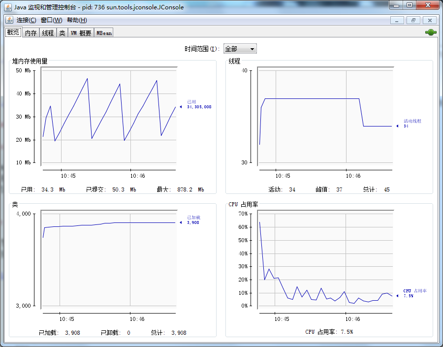

# 虚拟机性能监控与故障处理工具 #

[1.概述](#概述)

[2.JDK的命令行工具](#jdk的命令行工具)

[2.1.jps：虚拟机进程状况工具](#jps虚拟机进程状况工具)

[2.2.jstat：虚拟机统计信息监视工具](#jstat虚拟机统计信息监视工具)

[2.3.jinfo：Java配置信息工具](#jinfojava配置信息工具)

[2.4.jmap：Java内存映像工具](#jmapjava内存映像工具)

[2.5.jhat：虚拟机堆转储快照分析工具](#jhat虚拟机堆转储快照分析工具)

[2.6.jstack：Java堆栈跟踪工具](#jstackjava堆栈跟踪工具)

[2.7.HSDIS：JIT生成代码反汇编](#hsdisjit生成代码反汇编)

[3.JDK可视化工具](#jdk可视化工具)

[3.1.JConsole：Java监控与管理控制台](#jconsolejava监控与管理控制台)

[3.1.1.启动JConsole](#启动jconsole)

[3.1.2.内存监控](#内存监控)

[3.1.3.线程监控](#线程监控)

[3.2.VisualVM：多合一故障处理工具](#visualvm多合一故障处理工具)

[3.2.1.VisualVM兼容范围与插件安装](#visualvm兼容范围与插件安装)

[3.2.2.生成、浏览堆转储快照](#生成浏览堆转储快照)

[3.2.3.分析程序性能](#分析程序性能)

[3.2.4.BTrace动态日志追踪](#btrace动态日志追踪)

## 概述 ##

给一个系统定位问题的时候，**知识、经验**是关键基础，**数据**是依据，**工具**是运用知识处理数据的手段。这里说的**数据**包括：运行日志、异常堆栈、GC日志、线程快照（threaddump/javacore文件）、堆转储快照（headdump/hprof文件）等。

经常使用适当的虚拟机监控和分析工具可以加快分析数据、定位解决问题的速度，但在学习工具前，也应当意识到**工具永远都是知识技能的一层包装**。

## JDK的命令行工具 ##

这些工具比较小巧，只因这些命令行工具大多数是JDK/lib/tools.jar类库的一层薄包装而已

**JDK开发团队选择采用Java代码来实现这些监控工具是有特别用意的**：当应用程序部署到生产环境后，无论是直接接触物理服务器还是远程Telnet到服务器上都可能会受到限制。借助tools.jar类库里面的接口，我们可以直接在应用程序中实现功能强大的监控分析功能。

---

**下表是Sun JDK监控和故障处理工具**

名称|主要作用
---|---
jps|JVM Process Status Tool，显示指定系统内所有的HotSpot虚拟机进程
jstat|JVM Statistics Monitoring Tool，用于收集HotSpot虚拟机各方面的运行数据
jinfo|Configuration Info for Java，显示虚拟机配置信息
jmap|Memory Map for Java，生成虚拟机的内存转储快照（Heapdump文件）
jhat|JVM Heap Dump Browser，用于分析heapdump文件，它会建立一个HTTP/HTML服务器，让用户可以在浏览器上查看分析结果
jstack|Stack Trace for Java，显示虚拟机的线程快照

### jps：虚拟机进程状况工具 ###

JVM Process Status Tool，命名、功能都与Unix的ps类似

可列出正在运行的虚拟机进程，并显示虚拟机执行主类（Main Class，main()函数所在的类）名称以及这些进程的本地虚拟机唯一ID（Local Virtual Machine Identifier，LVMID）。

**虽然功能比较单一，但它是使用频率最高的JDK命令行工具**，因为其他的JDK命令行工具大多需要输入它查询到LVMID来确定要监控的是哪一个虚拟机进程。对于本地虚拟机进程来说，LVMID与操作系统的进程ID（Process Identifier，PID）是一致的，使用Windows的任务管理器或者unix的ps命令也可以查询到虚拟机进程的LVMID，但如果同时启动了多个虚拟机进程，无法根据进程名称定位时，那就只能依赖jps命令来显示主类的功能才能区分了

**jps命令格式**：

	jps [ option ] [ hostid ]

**jps工具主要选项**

选项|作用
---|---
-q|只输出LVMID，省略主类的名称
-m|输出虚拟机进程启动时传递给主类main()函数的参数     
-l|输出主类的全名，如果进程执行的是Jar包，输出Jar路径
-v|输出虚拟机进程启动时JVM参数

### jstat：虚拟机统计信息监视工具 ###

**jstat（JVM Statistics Monitoring Tool）是用于监视虚拟机各种运行状态信息的命令行工具**。它可以显示本地或者远程虚拟机进程中的类装载、内存、垃圾收集、JIT编译等运行数据，在没有GUI图形界面，只提供了纯文本控制台环境的服务器上，它将是运行期定位虚拟机性能问题的首先工具。

jstat命令格式为：

	jstat [ option vmid [ interval [ s | ms ] [ count ] ]  ]

对于命令格式中的VMID与LVMID需要特别说明一下：如果是本地虚拟机进程，VMID与LVMID是一致的，如果是远程虚拟机进程，那VMID的格式应当是：

	[ protocol :] [ // ] lvmid [ @hostname [ ：port] /servername] 

参数interval和count代表查询间隔和次数，如果省略这两个参数，说明只查询一次。假设需要每250毫秒查询一次进程2764垃圾收集状况，一共查询20次，那命令应当是：

	 jstat -gc 2764 250 20

---

**jstat工具主要选项**

选项option代表着用户希望查询的虚拟机信息，主要分为3类：类装载、垃圾收集、运行期编译状况，具体选项及作用请参考表中的描述：

选项|作用
---|--
-class|监视类装载、卸载数量、总空间以及类装载所耗费的时间
-gc|监视Java堆状况，包括Eden区、两个survivor区、老年代、永久代等的容量、已用空间、GC时间合计等信息  
-gccapacity|监视内容与-gc基本相同，但输出主要关注Java堆各个区域使用到的最大。最小空间
-gcutil|监视内容与-gc基本相同，但输出主要关注已使用空间占总空间的百分比
-gccause|与-gcutil功能一样，但是会额外输出导致上一次GC产生的原因
-gcnew|监视新生代GC状况
-gcnewcapacity|监视内容与-gcnew基本相同，输出主要关注使用到的最大、最小空间
-gcold|监视老年代GC状况
-gcoldcapacity|监视内容与-gcold基本相同，输出主要关注使用到的最大、最小空间
-gcpermcapacity|输出永久代使用到的最大、最小空间
-compiler|输出JIT编译器编译过的方法、耗时等信息
-printcompilation|输出已经被JIT编译的方法

---

**示例**

列举刚刚启动GlassFish v3服务器的内存状况，来演示如何查看监视结果。

查询结果表明：新生代Eden区（E，表示Eden）使用了6.2%的空间，两个Survivor区（S0、S1，表示Survivor0、Survivor1）里面都是空的，老年代（O，表示Old）和永久代（P，表示Permanent）则分别使用了41.42%和47.20%的空间。程序运行以来共发生Minor GC（YGC，表示Young GC）16次，总耗时0.105秒，发生Full GC（FGC，表示Full GC）3次，Full GC总耗时（FGCT，表示Full GC Time）为0.472秒，所有GC总耗时（GCT，表示GC Time）为0.577秒。

### jinfo：Java配置信息工具 ###

**jinfo ( Configuration Info for Java ) 的作用是实时地查看和调整虚拟机各项参数**。使用jps命令的-v参数可以查看虚拟机启动时显式指定的参数列表,但如果想知道未被显式指定的参数的系统默认值,除了去找资料外,就只能使用jinfo的-flag选项进行查询了(如果只限于 JDK 1.6或以上版本的话,使用java-XX : +PrintFlagsFinal查看参数默认值也是一个很好的选择 ),jinfo还可以使用-sysprops选项把虚拟机进程的System.getProperties() 的内容打印出来。

这个命令在JDK 1.5时期已经随着Linux版的JDK发 布 ,当时只提供了信息查询的功能 ,JDK 1.6之后,jinfo在Windows和Linux平台都有提供,并且加入了运行期修改参数的能力 ,可以使用-flag[+|-jname或者-flag name=value修改一部分运行期可写的虚拟机参数值。 JDK 1.6中,jinfo对于Windows平台功能仍然有较大限制,只提供了最基本的-flag选项。

jinfo命令格式:

	 jinfo [ option ] pid

执行样例:查询CMSInitiatingOccupancyFraction参数值。

### jmap：Java内存映像工具 ###

**jmap（Memory Map for Java）命令用于生成堆转储快照（一般称为headdump或dump文件）**。如果不使用jmap命令，要想获取Java堆转储快照，还有一些比较“暴力”的手段：譬如在第2章中用过的-XX:+HeapOnOutOfMemoryError参数，可以让虚拟机在OOM异常出现之后自动生成dump文件，通过-XX:+HeapDumpOnCtrlBreak参数则可以使用[ Ctrl ] + [ Break ]键让虚拟机生成dump文件，又或者在Linux系统下通过Kill -3命令发送进程退出信号“吓唬”一下虚拟机，也能拿到dump文件。

jmap的作用并不仅仅是为了获取dump文件，它可以查询finalize执行队列、Java堆和永久代的信息信息，如空间使用率、当前用的是哪种收集器等。

和jinfo命令一样，jmap有不少功能在Windows平台下都是受限的，除了生成dump文件的-dump选项和用于查看每个类的实例、空间占用统计的-histo选项在所有操作系统都提供之外，其余选项都只能在Linux/Solaris下使用。

jmap命令格式：

	jmap [ option ] vmid

 option选项的合法值与具体含义见下表：

选项|作用
---|---
-dump|生成Java堆转储快照。格式为：-dump:[ live, ] format=b, file=<filename>,其中live子参数说明是否只dump出存活的对象 
-finalizerinfo|显示在F-Queue中等待Finalizer线程执行finalize方法的对象。只在Linux/Solaris平台下有效
-heap|显示Java堆详细信息，如使用哪种回收器、参数配置、分代状况等。只在Linux/Solaris平台下有效
-histo|显示堆中对象统计信息，包括类、实例数量、合计容量
-permstat|以ClassLoader为统计口径显示永久代内存状态。只在Linux/Solaris平台下有效
-F|当虚拟机进程对-dump选项没有响应时，可使用这个选项强制生成dump快照。只在Linux/Solaris平台下有效

---

使用jmap生成一个正在运行的Eclipse的dump快照文件的例子,例子中的3500是通过jps命令查询到的LVMID。

### jhat：虚拟机堆转储快照分析工具 ###

**Sun JDK提供jhat(JVM Heap Analysis Tool)命令与jmap搭配使用，来分析jmap生成的堆转储快照**。jhat内置了一个微型的HTTP/HTML服务器 ，生成dump文件的分析结果后，可以在浏览器中查看。

不过实事求是地说，在实际工作中，除非笔者手上真的没有别的工具可用， 否则一般都不会去直接使用jhat命令来分析dump文件 ，主要原因有二:

1. 一般不会在部署应用程序的服务器上直接分析dump文件，即使可以这样做，也会尽量将dump文件复制到其他机器上进行分析，因为分析工作是一个耗时而且消耗硬件资源的过程，既然都要在其他机器进行，就没有必要受到命令行工具的限制了
2. jhat的分析功能相对来说比较简陋，VisualVM ， 以及专业用于分析dump文件的Eclipse Memory Analyzer、 IBM HeapAnalyzer等工具，都能实现比jhat更强大更专业的分析功能。

---

使用jhat分析上节中采用jmap生成的Eclipse IDE的内存快照文件。

屏幕显不“Server is ready.”的提示后,用户在浏览器中键入http://localhost:7000/就可以 看到分析结果

分析结果默认是以包为单位进行分组显示,分析内存泄漏问题主要会使用到其中 的“Heap Histogram” (与jmap-histo功能一样)与OQL页签的功能,前者可以找到内存中总容量最大的对象,后者是标准的对象查询语言,使用类似SQL的语法对内存中的对象进行查询统计

### jstack：Java堆栈跟踪工具 ###

**jstack(Stack Trace for Java)命令用于生成虚拟机当前时刻的线程快照(一般称为 threaddump或者javacore文件 )**。线程快照就是当前虚拟机内每一条线程正在执行的方法堆栈的集合 ,生成线程快照的主要目的是定位线程出现长时间停顿的原因,如线程间死锁、死循环、请求外部资源导致的长时间等待等都是导致线程长时间停顿的常见原因。**线程出现停顿的时候通过jstack来查看各个线程的调用堆栈,就可以知道没有响应的线程到底在后台做些什么事情,或者等待着什么资源**。

jstack命令格式:

	jstack [option] vmid

option选项的合法值与具体含义

选项|作用
-F|当正常输出的请求不被响应时，强制输出线程堆栈 
-l|除堆栈外，显示关于锁的附加信息
-m|如果调用到本地方法的话，可以显示C/C++的堆栈

---

使用jstack查看Eclipse线程堆栈的例子,例子中的3500是通过jps命令查询到的LVMID。

使用jstack查看线程堆栈(部分结果)

在JDK 1.5中 ,java.lang.Thread类新增了一个getAllStackTraces()用于获取虚拟机中所有线程的StackTraceElement对象。使用这个方法可以通过简单的几行代码就完成jstack的大部分功能,在实际项目中不妨调用这个方法做个管理员页面,可以随时使用浏览器来查看线程堆栈。

[查看线程状况的JSP页面](jstack.jsp)

//TODO:HSDIS
### HSDIS：JIT生成代码反汇编 ###

**在JVM规范中，详细描述了虚拟机指令集中每条指令的执行过程、执行前后对操作数栈、局部变量表的影响等细节**。这些细节描述与Sun的早期虚拟机( Sun Classic VM)高度吻合 ，但随着技术的发展，高性能虚拟机真正的细节实现方式已经渐渐与虚拟机规范所描述的内容产生了越来越大的差距，虚拟机规范中的描述逐渐成了虚拟机实现的“概念模型”— 即实现只能保证规范描述等效。基于这个原因，我们分析程序的执行语义问题(**虚拟机做了什么**)时 ，在字节码层面上分析完全可行，但分析程序的执行行为问题(**虚拟机是怎样做的、性能如何**)时 ，在字节码层面上分析就没有什么意义了，需要通过其他方式解决。

**分析程序如何执行**，通过软件调试工具(GDB、Windbg等 )来断点调试是最常见的手段 ，但是这样的调试方式在Java虚拟机中会遇到很大困难，因为大量执行代码是通过JIT编译器动态生成到CodeBuffer中的 ，没有很简单的手段来处理这种混合模式的调试(不过相信虚拟机开发团队内部肯定是有内部工具的)。因此，不得不通过一些特别的手段来解决问题， 基于这种背景，本节的主角——HSDIS插件就正式登场了。

HSDIS是一个Sun官方推荐的HotSpot虚拟机JIT编译代码的反汇编插件，它包含在HotSpot虚拟机的源码之中，但没有提供编译后的程序。在Project Kerni的网站也可以下载到单独的源码。**它的作用是让HotSpot的-XX : +PrintAssembly指令调用它来把动态生成的本地代码还原为汇编代码输出，同时还生成了大量非常有价值的注释，这样我们就可以通过输出的代码来分析问题**。读者可以根据自己的操作系统和CPU类型从Project Kenai的网站上下载编译好的插件，直接放到JDK_HOME/jre/bin/client和JDK_HOME/jre/bin/server目录中即可。如果没有找到所需操作系统(譬如Windows的就没有 )的成品 ，那就得自己使用源码编译一下。

还需要注意的是，如果读者使用的是**Debug或者FastDebug版**的HotSpot，那可以直接通过-XX : +PrintAssembly指令使用插件;如果使用的是**Product版**的HotSpot，那还要额外加入一个-XX : +UnlockDiagnosticVMOptions参数。

---

事先要有jdk1.8.xxx\jre\bin\server\hsdis-amd64.dll文件[下载链接](https://github.com/doexit/hsdis.dll)

用简单测试代码为例演示一下这个插件的使用。

[Bar](Bar.java)

编译这段代码

	javac Bar.java

然后执行命令（在JDK 1.8环境下）

	java -XX:+UnlockDiagnosticVMOptions -XX:+DebugNonSafepoints -XX:+PrintAssembly -Xcomp -XX:CompileCommand=dontinline,*Bar.sum -XX:CompileCommand=compileonly,*Bar.sum test.Bar

其中 ,参数-Xcomp是让虚拟机以编译模式执行代码,这样代码可以“偷懒”,不需要执行足够次数来预热就能触发JIT编译。两个-XX : CompileCommand意思是让编译器不要内联sum()并且只编译sum() , -XX : +PrintAssembly就是输出反汇编内容。

输出的部分结果

书上的结果：

## JDK可视化工具 ##

### JConsole：Java监控与管理控制台 ###

JConsole ( Java Monitoring and Management Console ) 是—种基于**JMX**的可视化监视管理工具。它管理部分的功能是针对JMX MBean进行管理,MBean可以使用代码、中间件服务器的管理控制台或者所有符合JMX规范的软件进行访问。

#### 启动JConsole ####

**通过JDK/bin目录下的“jconsole.exe”启动JConsole后** ，将自动搜索出本机运行的所有虚拟机进程，不需要用户自己再使用jps来查询了

#### 内存监控 ####

“内存”页签相当于可视化的jstat命令,用于监视受收集器管理的虚拟机内存(Java堆和永久代)的变化趋势。

[LearnJConsole代码来体验一下它的监视功能](LearnJConsole.java)

运行时设置的虚拟机参数为: -Xms100m -Xmx100m -XX:+UseSerialGC，这段代码的作用是以 64KB/50毫秒的速度往Java堆中填充数据，一共填充1000次，使用JConsole的“内存”页签进行监视，观察曲线和柱状指示图的变化。

程序运行后,在“内存”页签中可以看到内存池Eden区的运行趋势呈现折线状。而监视范围扩大至整个堆后，会发现曲线是一条向上增长的平滑曲线。

并且从柱状图可以看出,在1000次循环执行结束，运行了 System.gc()后，虽然整个新生代Eden和Survivor区都基本被清空了，但是代表老年代的柱状图仍然保持峰值状态，说明被填充进堆中的数据在System.gc()方法执行之后仍然存活。

#### 线程监控 ####

如果上面的“ 内存”页签相当于可视化的jstat命令的话，“线程”页签的功能相当于可视化的jstack命令 ，遇到线程停顿时可以使用这个页签进行监控分析。

前面讲解jstack命令的时候提到过线程长时间停顿的主要原因主要有：

1. 等待外部资源(数据库连接、网络资源、设备资源等)
2. 死循环
3. 锁等待(活锁和死锁)

---

[线程等待LearnJConsole2](LearnJConsole2.java)

程序运行后，首先在“ 线程”页签中选择main线程，如上图所示。堆栈追踪显示BufferedReader在readBytes方法中等待System.in的键盘输入 ，这时线程为Runnable状态 ，Runnable状态的线程会被分配运行时间，但readBytes方法检查到流没有更新时会立刻归还执行令牌，**这种等待只消耗很小的CPU资源**。

---

接着监控testBusyThread线程，如上图所示，testBusyThread线程一直在执行空循环，从堆栈追踪中看到一直在代码的14行停留，14行为:while(true)。这时候线程为Runnable状态，而且没有归还线程执行令牌的动作，会在空循环上用尽全部执行时间直到线程切换，**这种等待会消耗较多的CPU资源**。

---

上图显示testLockThread线程在等待着lock对象的notify或notifyAll方法的出现，线程这时候处于WAITING状态，在被唤醒前不会被分配执行时间。

testLockThread线程正在处于正常的活锁等待，只要lock对象的notify()或notifyAll()方法被调用，这个线程便能激活以继续执行。

---

[LearnJConsole3](LearnJConsole3.java)

这段代码开了200个线程去分别计算1+2以及2+1的值，其实for循环是可省略的，两个线程也可能会导致死锁，不过那样概率太小，需要尝试运行很多次才能看到效果。一般的话，带for循环的版本最多运行2〜3次就会遇到线程死锁，程序无法结束。

造成死锁的原因是 Integer.valueOf()方法基于减少对象创建次数和节省内存的考虑， [-128 ， 127]之间的数字会被**缓存**，当valueOf()方法传入参数在这个范围之内，将直接返回缓存中的对象。也就是说，代码中调用了200次Interger.valueOf()方法一共就只返回了两个不同的对象。假如在某个线程的两个synchronized块之间发生了一次线程切换，那就会出现线程A等着被线程B持有的Integer.valueOf(1)，线程B又等着被线程A持有的Integer.valueOf(2)，结果出现大家都跑不下去的情景。

出现线程死锁之后，点击JConsole线程面板的“**检测到死锁**”按钮，将出现一个新的“死锁”页签，如下图所示。

上图中很清晰地显示了线程Thread-37在等待一个被线程Thread-50持有Integer对象，而点击线程Thread-50则显示它也在等待一个Integer对象，被线程Thread-37持有，这样两个线程就互相卡住，都不存在等到锁释放的希望了

### VisualVM：多合一故障处理工具 ###

VisualVM(All-in-One Java Troubleshooting Tool)是到目前为止随JDK发布的功能最强大的运行监视和故障处理程序，并且可以预见在未来一段时间内都是官方主力发展的虚拟机故障处理工具。

官方在VisualVM的软件说明中写上了“All-in-One” 的描述字样，预示着它除了运行监视、故障处理外，还提供了很多其他方面的功能。

如性能分析(Profiling)，VisualVM的性能分析功能甚至比起JProfiler、YourKit等专业且收费的Profiling工具都不会逊色多少，而且VisualVM的还有一个**很大的优点**:**不需要被监视的程序基于特殊Agent运行，因此它对应用程序的实际性能的影响很小，使得它可以直接应用在生产环境中**。

#### VisualVM兼容范围与插件安装 ####

VisualVM基于NetBeans平台开发，因此它一开始就具备了插件扩展功能的特性，通过插件扩展支持，VisualVM可以做到:

- 显示虚拟机进程以及进程的配置、环境信息(jps、 jinfo)。
- 监视应用程序的CPU、GC、堆、方法区以及线程的信息(jstat、jstack)。
- dump以及分析堆转储快照(jmap、jhat)。
- 方法级的程序运行性能分析，找出被调用最多、运行时间最长的方法。
- 离线程序快照:收集程序的运行时配置、线程dump、内存dump等信息建立个快照，可以将快照发送开发者处进行Bug反馈。
- 其他plugins的无限的可能性……

VisualVM在JDK 1.6 update 7中才首次出现,但并不意味着它只能监控运行于JDK 1.6上 的程序,它具备很强的向下兼容能力,甚至能向下兼容至近10年前发布的JDK 1.4.2平台,这对无数已经处于实施、维护的项目很有意义。当然,并非所有功能都能完美地向下兼容, 主要特性的兼容性见下表

启动方式**JDK/bin/jvisualvm.exe**

首次启动VisualVM后，不必着急找应用程序进行检测，因为现在VisualVM还没有加载任何插件，虽然基本的监视、线程面板的功能都以默认插件的形式提供了，但是不给VisualVM装任何扩展插件，就相当于放弃了他最精华的功能，和没有安装任何应用软件操作系统差不多。

插件可以进行手工安装，在相关网站上下载*.nbm包后，点击“工具”→“插件”→“已下载”菜单，然后在弹出的对话框中指定nbm包路径便可进行安装，插件按照后存放在JDK_HOME/lib/visumalvm/visualvm中。

不过手工安装并不常用，使用VisualVM的自动安装功能已经可以找到大多数所需的插件，在有网络连接的环境下，点击“工具”→“插件菜单”，弹出下图所示的插件页面，在页签的“可用插件”中列举了当前版本VisualVM可以使用的插件，选中插件后在右边窗口将显示这个插件的基本信息，如开发者、版本、功能描述等。

按需下载

#### 生成、浏览堆转储快照 ####

在VisualVM中生成dump文件有两种方式，可以执行下列任一操作：

- 在“应用程序”窗口中右键点击应用程序节点，然后选择“堆Dump”。
- 在“应用程序”窗口中双击应用程序节点以打开应用程序标签，然后在“监视”标签中单机“堆Dump”。

生成了dump文件之后，应用程序页签将在该堆的应用程序下增加一个以[heapdump]开头的子节点，并且在主页签中打开了该转储快照，如下图所示。如果需要把dump文件保存或发送出去，要在heapdump节点上右键选择“另存为”菜单，否则当VisualVM关闭时，生成的dump文件会被当作临时文件删除掉。要打开一个已经存在的dump文件，通过文件菜单中的“装入”功能，选择硬盘的dump文件即可。

从堆页签中的“摘要”面板可以看到应用程序dump时的运行时参数、System.getProperties()的内容、线程堆栈等信息，“类”面板则是以类为统计口径统计类的实例数量、容量信息。

“实例”面板不能直接使用，因为不能确定用户想查看哪个类的实例，所以需要通过“类”面板进入，在“类”中选择一个关心的类后双击鼠标，即可在“实例”里面看见此类中500个实例的具体属性信息。“OQL控制台”面板中就是运行OQL查询语句的。

#### 分析程序性能 ####

在Profiler页签中，VisualVM提供了程序运行期间方法级的CPU执行时间分析以及内存分析，做Profiling分析肯定会对程序运行性能有比较大的影响，所以一般不在生产环境中使用这项功能。

要开始分析，先选择“CPU”和“内存”按钮中的一个，然后切换到应用程序中对程序进行操作，VisualVM会记录到这段时间中应用程序执行过的方法。

- 如果是CPU分析，将会统计每个方法的执行次数、执行耗时；

- 如果是内存分析，则会统计每个方法关联的对象数以及这些对象所占的空间。分析结束后，点击“停止”按钮结束监控过程，如下图所示。

> 注意，在JDK 1.5之后，在Client模式下的虚拟机加入并且自动开启了类共享——这是一个在多虚拟机进程中共享rt.jar中类数据以提高加载速度和节省内存的优化，而根据相关Bug报告的反映，VisualVM的Profiler功能可能会因为类共享而导致被监视的应用程序崩溃，所以进行Profiling前，最好在被监视程序中使用-Xshare : off参数来关闭类共享优化。

#### BTrace动态日志追踪 ####

BTrace是一个很“有趣”的VisualVM插件，本身也是可以独立运行的程序。**它的作用是在不停止目标程序运行的前提下，通过HotSpot虚拟机的HotSwap技术（代码热替换技术，HotSpot虚拟机允许在不停止运行的情况下，更新已经加载的类的代码）动态加入原本并不存在的调试代码**。

这项功能对实际生产中的程序很有意义：经常遇到程序出现问题，但排查错误的一些必要信息，譬如方法参数、返回值等，在开发时并没有打印到日志之中，以至于不得不停掉服务，通过调试增量来加入日志代码以解决问题。当遇到生产环境无法随便停止时，缺一两句日志导致排错进行不下去是一件非常郁闷的事情。

在VisualVM中安装了BTrace插件后，在应用程序面板中右键点击要调试的程序，会出现“Trace Application......”菜单，点击将进入BTrace面板。这个面板里面看起来就像一个简单地Java程序开发环境，里面还有一小段Java代码，如下图所示

这里准备了一段很简单的Java代码来演示BTrace的功能：产生两个1000以内的随机整数，输出这两个数字相加的结果。

[BTraceTest](BTraceTest.java)

程序运行后，在VisualVM中打开该程序的监视，在BTrace页签填充TracingScript的内容，输入的调试代码如下所示。

	/* BTrace Script Template */
	import com.sun.btrace.annotations.*;
	import static com.sun.btrace.BTraceUtils.*;
	
	@BTrace
	public class TracingScript {
		@OnMethod(
		    clazz="com.lun.c04.BTraceTest",
		    method="add",
		    location=@Location(Kind.RETURN)
		)
	
		public static void func(@Self com.lun.c04.BTraceTest instance,int a,int b,@Return int result) {
		    println("调用堆栈:");
		    jstack();
		    println(strcat("方法参数A:",str(a)));
		    println(strcat("方法参数B:",str(b)));
		    println(strcat("方法结果:",str(result)));
		}
	}

点击“Start”按钮后稍等片刻，编译完成后，可见Output面板中出现“BTrace code successfuly deployed”的字样。程序运行的时候在Output面板将会输出下图所示的调试信息。

BTrace的用法还有很多，打印调用堆栈、参数、返回值只是最基本的应用，在他的网站上使用BTrace进行性能监视、定位连接泄漏和内存泄漏、解决多线程竞争问题等例子。
