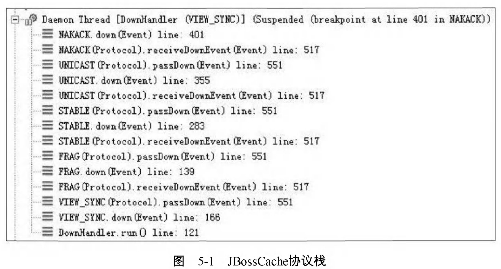
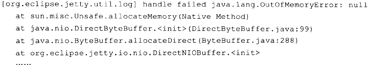
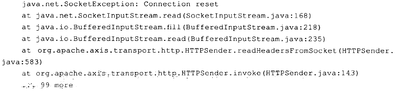
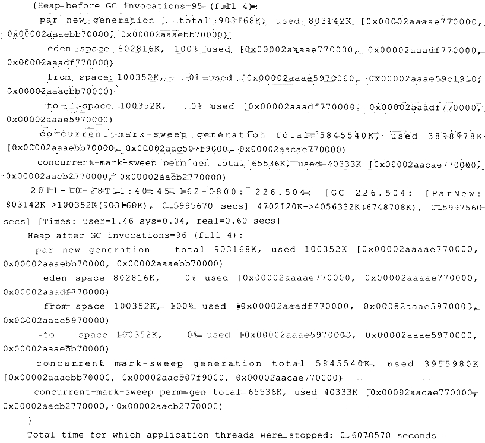
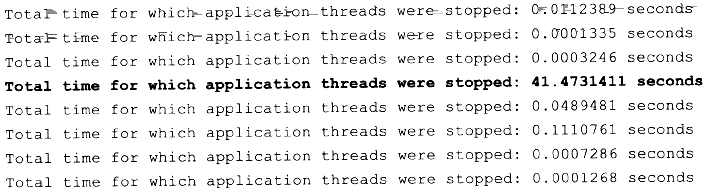
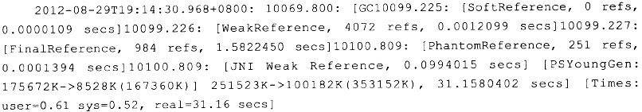
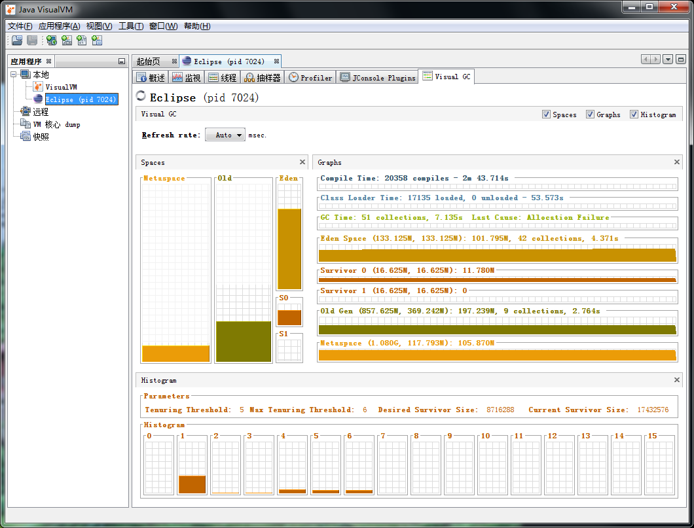

# 调优案例分析与实战 #

[1.概念](#概念)

[2.案例分析](#案例分析)

[2.1.高性能硬件上的程序部署策略](#高性能硬件上的程序部署策略)

[2.1.1.情景再现1](#情景再现1)

[2.1.2.问题分析1](#问题分析1)

[2.1.3.关于Full GC](#关于fullgc)

[2.1.4.使用64位JDK来管理大内存可能遇到问题](#使用64位jdk来管理大内存可能遇到问题)

[2.1.5.建立逻辑集群](#建立逻辑集群)

[2.1.6.使用逻辑集群可能遇到的问题](#使用逻辑集群可能遇到的问题)

[2.1.7.最后解决方案](#最后解决方案)

[2.2.集群间同步导致的内存溢出](#集群间同步导致的内存溢出)

[2.2.1.情景再现2](#情景再现2)

[2.2.2.问题分析2](#问题分析2)

[2.3.堆外内存导致的溢出错误](#堆外内存导致的溢出错误)

[2.3.1.情景再现3](#情景再现3)

[2.3.2.问题分析3](#问题分析3)

[2.4.外部命令导致系统缓慢](#外部命令导致系统缓慢)

[2.4.1.情景再现4](#情景再现4)

[2.4.2.问题分析4](#问题分析4)

[2.5.服务器JVM进程崩溃](#服务器jvm进程崩溃)

[2.5.1.情景再现5](#情景再现5)

[2.5.2.问题分析5](#问题分析5)

[2.6.不恰当数据结构导致内存占用过大](#不恰当数据结构导致内存占用过大)

[2.6.1.情景再现6](#情景再现6)

[2.6.2.问题分析6](#问题分析6)

[2.7.由Windows虚拟内存导致的长时间停顿](#由windows虚拟内存导致的长时间停顿)

[2.7.1.情景再现7](#情景再现7)

[2.7.2.问题分析7](#问题分析7)

[3.实战：Eclipse运行速度调优](#实战eclipse运行速度调优)

[3.1.调优前的程序运行状态](#调优前的程序运行状态)

[3.1.1.简单eclipse插件开发：eclipse启动时间显示器](#简单eclipse插件开发eclipse启动时间显示器)

[3.2.升级JDK1.6的性能变化及兼容问题](#升级jdk16的性能变化及兼容问题)

[3.3.编译时间和类加载时间的优化](#编译时间和类加载时间的优化)

[3.3.1.Compile Time](#compiletime)

[3.4.调整内存设置控制垃圾收集频率](#调整内存设置控制垃圾收集频率)

[3.5.选择收集器降低延迟](#选择收集器降低延迟)

## 概念 ##

实践是检验真理的唯一标准

## 案例分析 ##

### 高性能硬件上的程序部署策略 ###

#### 情景再现1 ####

一个15万PV/天左右的在线文档类型网站最近更换了硬件系统，新的硬件为4个CPU、16GB物理内存，操作系统为64位CentOS 5.4， Resin作为Web服务器。

整个服务器暂时没有部署别的应用，所有硬件资源都可以提供给这访问量并不算太大的网站使用。管理员为了尽量利用硬件资源选用了64位的JDK 1.5，并通过-Xmx和-Xms参数将Java堆固定在12GB。使用一段时间后发现使用效果并不理想，网站经常不定期出现长时间失去响应的情况。

#### 问题分析1 ####

监控服务器运行状况后发现网站失去响应是由GC停顿导致的，虚拟机运行在Server模式 ，默认使用吞吐量优先收集器，回收12GB的堆 ，一次Full GC的停顿时间高达14秒。并且由于程序设计的关系，访问文档时要把文档从磁盘提取到内存中，导致内存中出现很多由文档序列化产生的大对象，这些大对象很多都进入了老年代，没有在Minor GC中清理掉。

这种情况下即使有12GB的堆，内存也很快被消耗殆尽，由此导致每隔十几分钟出现十几秒的停顿，令网站开发人员和管理员感到很沮丧。

这里先不延伸讨论程序代码问题，**程序部署上的主要问题显然是过大的堆内存进行回收时带来的长时间的停顿**。硬件升级前使用32位系统1.5GB的堆，用户只感觉到使用网站比较缓慢，但不会发生十分明显的停顿，因此才考虑升级硬件以提升程序效能，如果重新缩小给Java堆分配的内存，那么硬件上的投资就显得很浪费。

---

在**高性能硬件上部署程序，目前主要有两种方式**:

- 通过64位JDK来使用大内存。
- 使用若干个32位虚拟机建立逻辑集群来利用硬件资源。

#### 关于Full GC ####

此案例中的管理员采用了第一种部署方式。对于用户交互性强、对停顿时间敏感的系统，可以给Java虚拟机分配超大堆的前提是有把握把应用程序的Full GC频率控制得足够低， 至少要低到不会影响用户使用，譬如十几个小时乃至一天才出现一次Full GC，这样可以通过在深夜执行定时任务的方式触发Full GC甚至自动重启应用服务器来保持内存可用空间在一个稳定的水平。

**控制Full GC频率的关键是看应用中绝大多数对象能否符合“朝生夕灭”的原则**，即大多数对象的生存时间不应太长，尤其是不能有成批量的、长生存时间的大对象产生，这样才能保障老年代空间的稳定。

在大多数网站形式的应用里，主要对象的生存周期都应该是请求级或者页面级的，会话级和全局级的长生命对象相对很少。只要代码写得合理，应当都能实现在超大堆中正常使用而没有Full GC ，这样的话，使用超大堆内存时，网站响应速度才会比较有保证。

#### 使用64位JDK来管理大内存可能遇到问题 ####

除此之外， 如果读者计划使用64位JDK来管理大内存，还需要考虑下面可能面临的问题:

- 内存回收导致的长时间停顿。
- 现阶段 ，64位JDK的性能测试结果普遍低于32位JDK。
- 需要保证程序足够稳定，因为这种应用要是产生堆溢出几乎就无法产生堆转储快照(因为要产生十几GB乃至更大的Dump文件 )，哪怕产生了快照也几乎无法进行分析。
- 相同程序在64位JDK消耗的内存一般比32位JDK大 ，这是由于**指针膨胀**，以及数据类型**对齐补白**等因素导致的。

#### 建立逻辑集群 ####

上面的问题听起来有点吓人，所以现阶段不少管理员还是选择第二种方式:**使用若干个32位虚拟机建立逻辑集群来利用硬件资源**。具体做法是在一台物理机器上启动多个应用服务器进程 ，每个服务器进程分配不同端口 ，然后在前端搭建一个负载均衡器 ，以反向代理的方式来分配访问请求。读者不需要太过在意均衡器转发所消耗的性能，即使使用64位JDK ，许多应用也不止有一台服务器，因此在许多应用中前端的均衡器总是要存在的。

**考虑到在一台物理机器上建立逻辑集群的目的仅仅是为了尽可能利用硬件资源**，并不需要关心状态保留、热转移之类的高可用性需求，也不需要保证每个虚拟机进程有绝对准确的均衡负载，因此使用无Session复制的亲合式集群是一个相当不错的选择。我们仅仅需要保障集群具备亲合性，也就是均衡器按一定的规则算法(一般根据SessionID分配)将一个固定的用户请求永远分配到固定的一个集群节点进行处理即可，这样程序开发阶段就基本不用为集群环境做什么特别的考虑了。

#### 使用逻辑集群可能遇到的问题 ####

当然 ，很少有没有缺点的方案，如果使用逻辑集群的方式来部署程序，可能会遇到下面一些问题:

- **尽量避免节点竞争全局的资源**，最典型的就是磁盘竞争，各个节点如果同时访问某个磁盘文件的话(尤其是并发写操作容易出现问题)，很容易导致IO异常。
- **很难最高效率地利用某些资源池**，譬如连接池，一般都是在各个节点建立自己独立的连接池 ，这样有可能导致一些节点池满了而另外一些节点仍有较多空余。尽管可以使用集中式的JNDI，但这个有一定复杂性并且可能带来额外的性能开销。
- **各个节点仍然不可避免地受到32位的内存限制**，在32位Windows平台中每个进程只能使用2GB的内存，考虑到堆以外的内存开销，堆一般最多只能开到1.5GB。在某些Linux或UNIX系统(如Solaris)中 ，可以提升到3GB乃至接近4GB的内存，但32位中仍然受最高4GB(232)内存的限制。
- **大量使用本地缓存(如大量使用HashMap作为K/V缓存 )的应用** ，在逻辑集群中会造成较大的内存浪费，因为每个逻辑节点上都有一份缓存，这时候可以考虑把本地缓存改为集中式缓存。

#### 最后解决方案 ####

介绍完这两种部署方式，再重新回到这个案例之中，最后的部署方案调整为

1. 建立5个32位JDK的逻辑集群，每个进程按2GB内存计算(其中堆固定为1.5GB )，占用了10GB内存。
2. 另外建立一个Apache服务作为前端均衡代理访问门户。
3. 考虑到用户对响应速度比较关心，并且文档服务的主要压力集中在磁盘和内存访问，CPU资源敏感度较低，因此改为[CMS收集器](../c03#cms)进行垃圾回收。
 
部署方式调整后，服务再没有出现长时间停顿，速度比硬件升级前有较大提升。

### 集群间同步导致的内存溢出 ###

#### 情景再现2 ####

有一个基于B/S的MIS系统，硬件为两台2个CPU、8GB内存的HP小型机，服务器是WebLogic 9.2 ，每台机器启动了3个WebLogic实例 ，构成一个6个节点的亲合式集群。

由于是亲合式集群，节点之间没有进行Sessurn同步，但是有一些需求要实现部分数据在各个节点间共享。开始这些数据存放在数据库中，但由于**读写频繁竞争很激烈**，性能影响较大，后面使用JBossCache构建了 一个全局缓存。

全局缓存启用后，服务正常使用了一段较长的时间， 但**最近却不定期地出现了多次的内存溢出问题**。

#### 问题分析2 ####

在内存溢出异常不出现的时候，服务内存回收状况一直正常，每次内存回收后都能恢复到一个稳定的可用空间，开始怀疑是程序某些不常用的代码路径中存在内存泄漏，但管理员反映最近程序并未更新、升级过，也没有进行什么特别操作。只好让服务带着-XX : +HeapDumpOnOutOfMemoryError參数运行了一段时间。在最近一次溢出之后，管理员发回了 heapdump文件，发现里面存在着大量的org.jgroups.protocols.pbcast.NAKACK对象。

JBossCache是基于自家的JGroups进行集群间的数据通信，JGroups使用协议栈的方式来实现收发数据包的各种所需特性自由组合，数据包接收和发送时要经过每层协议栈的up()和down()方法，**其中的NAKACK栈用于保障各个包的有效顺序及重发**。JBossCache协议栈如下图所示。

由于信息有传输失败需要重发的可能性，在确认所有注册在GMS ( Group Membership Service ) 的节点都收到正确的信息前，发送的信息必须在内存中保留。而此MIS的服务端中有一个负责安全校验的全局Filter ， 每当接收到请求时，均会更新一次最后操作时间，并且将这个时间同步到所有的节点去，使得一个用户在一段时间内不能在多台机器上登录。在服务使用过程中，往往一个页面会产生数次乃至数十次的请求，因此这个过滤器导致集群各个节点之间网络交互非常频繁。**当网络情况不能满足传输要求时，重发数据在内存中不断堆积，很快就产生了内存溢出**。

**这个案例中的问题，既有JBossCache的缺陷，也有MIS系统实现方式上缺陷**。 JBossCache官方的maillist中讨论过很多次类似的内存溢出异常问题，据说后续版本也有了改进。而更重要的缺陷是这一类被集群共享的数据要使用类似JBossCache这种集群缓存来同步的话 ，可以允许读操作频繁，因为数据在本地内存有一份副本，读取的动作不会耗费多少资源 ，但不应当有过于频繁的写操作，那样会带来很大的网络同步的开销。

### 堆外内存导致的溢出错误 ###

#### 情景再现3 ####

一个学校的小型项目:基于B/S的电子考试系统，为了实现客户端能实时地从服务器端接收考试数据 ， 系统使用了逆向AJAX技术(也称为Comet或者Server Side Push) ，选用CometD 1.1.1作为服务端推送框架，服务器是Jetty 7.1.4 ，硬件为一台普通PC机 ， Core i5 CPU ， 4GB内存，运行32位Windows操作系统。

测试期间发现服务端不定时拋出内存溢出异常，服务器不一定每次都会出现异常，但假如正式考试时崩溃一次，那估计整场电子考试都会乱套，网站管理员尝试过把堆开到最大， 而32位系统最多到1.6GB就基本无法再加大了，而且开大了基本没效果，拋出内存溢出异常好像还更加频繁了。加入-XX :+HeapDumpOnOutOfMemoryError，居然也没有任何反应，拋出内存溢出异常时什么文件都没有产生。无奈之下只好挂着jstat并一直紧盯屏幕，发现GC并不频繁 ，Eden区、Survivor区、老年代以及永久代内存全部都表示“情绪稳定，压力不大”， 但就是照样不停地拋出内存溢出异常，管理员压力很大。最后 ，在内存溢出后从系统日志中找到异常堆栈，如代码下面所示。

#### 问题分析3 ####

操作系统对每个进程能管理的内存是有限制的，这台服务器使用的32位 Windows平台的限制是2GB ，其中划了1.6GB给Java堆 ，而Direct Memory内存并不算入1.6GB的堆之内，因此它最大也只能在剩余的0.4GB空间中分出一部分。在此应用中导致溢出的关键是:垃圾收集进行时，虚拟机虽然会对Direct Memory进行回收，**但是Direct Memory却不能像新生代、老年代那样，发现空间不足了就通知收集器进行垃圾回收**，它只能等待老年代满了后Full GC ， 然后“顺便地”帮它清理掉内存的废弃对象。

否则它只能一直等到拋出内存溢出异常时，先catch掉 ，再在catch块里面“大喊声:“System.gc()! ”。要是虚拟机还是不听 ( 譬如打开了-XX:+DisableExplicitGC开关)，那就只能眼睁睁地看着堆中还有许多空闲内存 ，自己却不得不拋出内存溢出异常了。**而本案例中使用的CometD 1.1.1框架，正好有大量 的NIO操作需要使用到Direct Memory内存**。

从实践经验的角度出发，除了Java堆和永久代之外，我们注意到下面这些区域还会占用较多的内存，这里所有的内存总和受到操作系统进程最大内存的限制。

- **Direct Memory**:可通过-XX:MaxDirectMemorySize调整大小，内存不足时拋出OutOfMemoryError或者OutOfMemoryError : Direct buffer memory。
- **线程堆栈**:可通过-Xss调整大小，内存不足时拋出StackOverflowError (纵向无法分配， 即无法分配新的栈帧)或者OutOfMemoryError : unable to create new native thread (横向无法分配 ，即无法建立新的线程)。
- **Socket缓存区**:每个Socket连接都Receive和Send两个缓存区，分别占大约37KB和25KB内存，连接多的话这块内存占用也比较可观。如果无法分配，则可能会拋出IOException : Too many open files异常。
- **JNI代码** :如果代码中使用JNI调用本地库，那本地库使用的内存也不在堆中。
- **虚拟机和GC**:虚拟机、GC的代码执行也要消耗一定的内存。

### 外部命令导致系统缓慢 ###

#### 情景再现4 ####

一个数字校园应用系统，运行在一台4个CPU的Solaris 10操作系统上，中间件为GlassFish服务器。系统在做大并发压力测试的时候，发现请求响应时间比较慢 ，通过操作系统的mpstat工具发现CPU使用率很高 ，并且系统占用绝大多数的CPU资源的程序并不是应用系统本身。这是个不正常的现象，通常情况下用户应用的CPU占用率应该占主要地位，才能说明系统是正常工作的。

通过Solaris 10的Dtrace脚本可以查看当前情况下哪些系统调用花费了最多的CPU资源 ，Dtrace运行后发现最消耗CPU资源的竟然是“fork”系统调用。众所周知，“fork”系统调用 是Linux用来产生新进程的，在Java虚拟机中，用户编写的Java代码最多只有线程的概念，不应当有进程的产生。

#### 问题分析4 ####

这是个非常异常的现象。通过本系统的开发人员，最终找到了答案:每个用户请求的处 理都需要执行一个外部shell脚本来获得系统的一些信息。执行这个shell脚本是通过Java的 Runtime.getRuntime().exec()方法来调用的。这种调用方式可以达到目的，但是它在Java 虚拟机中是非常消耗资源的操作，即使外部命令本身能很快执行完毕，频繁调用时创建进程 的开销也非常可观。Java虚拟机执行这个命令的过程是:首先克隆一个和当前虚拟机拥有一样环境变量的进程，再用这个新的进程去执行外部命令，最后再退出这个进程。如果频繁执 行这个操作，系统的消耗会很大，不仅是CPU， 内存负担也很重。

用户根据建议去掉这个Shell脚本执行的语句，改为使用Java的API去获取这些信息后， 系统很快恢复了正常。

### 服务器JVM进程崩溃 ###

#### 情景再现5 ####

一个基于B/S的MIS系统，硬件为两台2个CRJ、8GB内存的HP系统，服务器是WebLogic 9.2 。正常运行一段时间后，最近发现在运行期间频繁出现集群节点的虚拟机进程自动关闭的现象，留下了一个hs_err_pid###.log文件后 ，进程就消失了，两台物理机器里的每个节点都出现过进程崩溃的现象。

从系统日志中可以看出， 每个节点的虚拟机进程在崩溃前不久，都发生过大量相同的异常，见代码如下

这是一个远端断开连接的异常，通过系统管理员了解到系统最近与一个OA门户做了集成 ，在MIS系统工作流的待办事项变化时，要通过Web服务通知0A门户系统，把待办事项的变化同步到OA门户之中。通过SoapU测试了一下同步待办事项的几个Web服务，发现调用后竟然需要长达3分钟才能返回，并且返回结果都是连接中断。

#### 问题分析5 ####

由于MIS系统的用户多，待办事项变化很快，为了不被OA系统速度拖累，使用了异步的方式调用Web服务，但由于两边服务速度的完全不对等，时间越长就累积了越多Web服务没有调用完成，导致在等待的线程和Socket连接越来越多，最终在超过虚拟机的承受能力后使得虚拟机进程崩溃。**解决方法**:通知OA门户方修复无法使用的集成接口，并将异步调用改为生产者/消费者模式的消息队列实现后，系统恢复正常。

### 不恰当数据结构导致内存占用过大 ###

#### 情景再现6 ####

有一个后台RPC服务器，使用64位虚拟机，内存配置为-Xms4g -Xmx8g-Xmn1g， 使用ParNew+CMS的收集器组合。平时对外服务的Minor GC时间约在30毫秒以内，完全可以接受。但业务上需要每10分钟加载一个约80MB的数据文件到内存进行数据分析，这些数据会在内存中形成超过100万个HashMap<Long，Long>Entry，在这段时间里面Minor GC就会造成超过500毫秒的停顿，对于这个停顿时间就接受不了了，具体情况如下面GC日志所示。

#### 问题分析6 ####

观察这个案例，发现平时的Minor GC时间很短，原因是新生代的绝大部分对象都是可清除的， 在Minor GC之后Eden和Survivor基本上处于完全空闲的状态。而在分析数据文件期间，800MB的Eden空间很快被填满从而引发GC ，但Minor GC之后，新生代中绝大部分对象依然是存活的。我们知道ParNew收集器使用的是复制算法，这个算法的高效是建立在大部分对象都“朝生夕灭”的特性上的，如果存活对象过多，把这些对象复制到Survivor并维持这些对象引用的正确就成为一个沉重的负担，因此导致GC暂停时间明显变长。

如果不修改程序，仅从GC调优的角度去解决这个问题，可以考虑将Survivor空间去掉(加入参数-XX:SurvivorRatio=65536、 -XX:MaxTenuringThreshold=0或者-XX:+AlwaysTenure ) ， 让新生代中存活的对象在第一次Minor GC后立即进入老年代，等到Major GC的时候再清理它们。这种措施可以治标，但也有很大副作用，治本的方案需要修改程序，**因为这里的问题产生的根本原因是用HashMap<Long，Long&gt;结构来存储数据文件空间效率太低**。

下面具体分析一下空间效率。在HashMap<Long，Long&gt;结构中，只有Key和Value所存放的两个长整型数据是有效数据，共16B(2x8B)。这两个长整型数据包装成java.lang.Long对象之后，就分别具有8B的MarkWord、8B的Klass指针 ，在加8B存储数据的long值。在这两个Long对贏组成Map.Entry之后 ，又多了 16B的对象头，然后一个8B的next字段和4B的int型的hash字段 ，为了对齐，还必须添加4B的空白填充，最后还有HashMap中对这个Entry的8B的引用 ，这样增加两个长整型数字，实际耗费的内存为 (Long(24B)x2)+Entry(32B)+HashMap Ref(8B)=88B，空间效率为16B/88B=18%，**实在太低了**。

### 由Windows虚拟内存导致的长时间停顿 ###

#### 情景再现7 ####

有一个带心跳检测功能的GUI桌面程序，每15秒会发送一次心跳检测信号，如果对方30秒以内都没有信号返回，那就认为和对方程序的连接已经断开。程序上线后发现心跳检测有误报的概率，查询日志发现误报的原因是程序会偶尔出现间隔约一分钟左右的时间完全无日志输出，处于停顿状态。

因为是桌面程序，所需的内存并不大(-Xmx256m)， 所以开始并没有想到是GC导致的程序停顿，但是加入參数-XX:+PrintGCApplicationStoppedTime -XX:+PrintGCDateStamps -Xloggc:gclog.log后 ，从GC日志文件中确认了停顿确实是由GC导致的，大部分GC时间都控制在100毫秒以内，但偶尔就会出现一次接近1分钟的GC。

从GC日志中找到长时间停顿的具体日志信息(添加了-XX:+PrintReferenceGC参数)， 找到的日志片段如下所示。从日志中可以看出，真正执行GC动作的时间不是很长，但从准备开始GC ，到真正开始GC之间所消耗的时间却占了绝大部分。

#### 问题分析7 ####

除GC日志之外，还观察到这个GUI程序内存变化的一个特点，当它最小化的时候，资源管理中显示的占用内存大幅度减小，但是虚拟内存则没有变化，因此怀疑程序在最小化时它的工作内存被自动交换到磁盘的页面文件之中了，这样发生GC时就有可能因为恢复页面文件的操作而导致不正常的GC停顿。

在MSDN上查证后确认了这种猜想，因此，**在Java的GUI程序中要避免这种现象，可以加入参数“-Dsun.awt.keepWorkingSetOnMinimize=true”来解决**。这个参数在许多AWT的程序上都有应用，例如JDK自带的Visual VM，用于保证程序在恢复最小化时能够立即响应。在这个案例中加入该参数后，问题得到解决。

## 实战：Eclipse运行速度调优 ##

由于环境相差较大，所以不具体重现实验，只记录相关要点

### 调优前的程序运行状态 ###

VisualVM的VisualGC插件

---

#### 简单eclipse插件开发：eclipse启动时间显示器 ####

[Link](http://www.blogjava.net/shenh062326/archive/2011/10/16/361360.html)

1.**下载并安装jdk和eclipse** 这里强调一下: 需要下载Eclipse for RCP and RAP Developers， 否则无法新建Plug-in Development 项目.

2.**新建项目** 安装好之后打开eclipse， 点击 File->NewProject。选择Plug-in Project，点击Next。新建一个名为com.developer.showtime的项目，所有参数采用默认值.

3.在com.developer.showtime项目的src下**新建一个类**: ShowTime，代码如下:

	package com.developer.showtime;
	
	import org.eclipse.jface.dialogs.MessageDialog;
	import org.eclipse.swt.widgets.Display;
	import org.eclipse.swt.widgets.Shell;
	import org.eclipse.ui.IStartup;
	
	public class ShowTime implements IStartup {
	    public void earlyStartup() {
	        Display.getDefault().syncExec(new Runnable() {
	            public void run(){
	                long eclipseStartTime = Long.parseLong(System.getProperty("eclipse.startTime"));
	                long costTime = System.currentTimeMillis() - eclipseStartTime;
	                Shell shell = Display.getDefault().getActiveShell();
	                String message = "Eclipse start in " + costTime + "ms";
	                MessageDialog.openInformation(shell， "Information"， message);
	            }
	        });
	    }
	}

4.修改plugin.xml文件如下：

	<?xml version="1.0" encoding="UTF-8"?>
	<?eclipse version="3.4"?>
	
	<plugin>
	   <extension point="org.eclipse.ui.startup">
	         <startup class="com.developer.showtime.ShowTime"/>
	   </extension>
	</plugin>

5.试运行

右键点击Run as -> Eclipse Application. 此时会运行一个eclipse， 启动之后就能显示启动所需时间.

6.导出插件.

右键Export -> Deployable plug-ins and fragments. 在Directory中输入需要导出的路径， 点击finish后会在该目录下产生一个plugins的目录， 里面就是插件包:com.developer.showTime_1.0.0.201110161216.jar. 把这个包复制到eclipse目录下的plugin目录下. 然后再启动eclipse 便可以看到eclipse启动所花的时间.

### 升级JDK1.6的性能变化及兼容问题 ###

从JDK 1.5升级到1.6并不一定带来性能的提升。

### 编译时间和类加载时间的优化 ###

-Xverify:none禁止掉字节码验证过程进行优化

---

#### Compile Time ####

编译时间是指虚拟机的JIT编译器(Just In Time Compiler)编译热点代码(Hot Spot Code)的耗时。

我们知道Java语言为了实现跨平台的特性，Java代码编译出来后形成的Class文件中存储的是字节码(ByteCode)，虚拟机通过解释方式执行字节码命令，**比起C/C++编译成本地二进制代码来说，速度要慢不少**。

**为了解决程序解释执行的速度问题**， JDK 1.2以后，虚拟机内置了两个运行时编译器1 ，如果一段Java方法被调用次数达到一定程度，就会被判定为**热代码**交给JIT编译器即时编译为**本地代码**，提高运行速度(这就是HotSpot虚拟机名字的由来 )。

甚至有可能在运行期动态编译比C/C++的编译期静态译编出来的代码**更优秀**，因为运行期可以收集很多编译器无法知道的信息，甚至可以采用一些很激进的优化手段，在优化条件不成立的时候再逆优化退回来。所以Java程序只要代码没有问题(主要是泄漏问题，如内存泄漏、连接泄漏)，随着代码被编译得越来越彻底，运行速度应当是越运行越快的。

Java的运行期**编译最大的缺点**就是它进行编译需要消耗程序正常的运行时间，这也就是上面所说的“**编译时间**”。

---

虛拟机提供了一个参数-Xint禁止编译器运作，强制虚拟机对字节码采用纯解释方式执行。

但这样的优化效果中看不中用

---

与解释执行相对应的另一方面，虚拟机还有力度更强的编译器:当虚拟机运行在-client 模式的时候，使用的是一个代号为C1的轻量级编译器，另外还有一个代号为C2的相对重量级的编译器能提供更多的优化措施。

如果使用-server模夫的虚拟机启动Eclipse将会使用到C2 编译器 ，这时从VisualGC可以看到启动过程中虚拟机使用了超过15秒的时间去进行代码编译。如果读者的工作习惯是长时间不关闭Eclipse的话 ，C2编译器所消耗的额外编译时间最终还是会在运行速度的提升之中赚回来，这样使用-server模式也是一个不错的选择。

### 调整内存设置控制垃圾收集频率 ###

可通过以下参数要求虚拟机生成GC日志：

- -XX:+PrintGCTimeStamps 打印GC停顿时间
- -XX:+PrintGCDetails 打印GC详细信息
- -verbose:gc 打印GC信息，输出内容已被前一个参数包括，可以不写
- -Xloggc:gc.log

---

Full GC大多数是由于老年代容量扩展而导致的，由永久代空间扩展而导致的也有一部分

-Xms/-Xmx
-XX:PermSize/-XX:MaxPermSize

上面参数将老年代和永久代的容量固定下来，避免运行时自动扩展

---

-XX:+DisableExplicitGC屏蔽掉System.gc()显示触发的GC

### 选择收集器降低延迟 ###

一边编译，一边继续其它编码工作

[CMS](../c03#cms)是最符合这情景的收集器

-XX:+UseConcMarkSweepGC
-XX:+UseParNewGC

(ParNew收集器是使用CMS收集器后的默认新生代收集器，写上仅是为了配置更加清晰)，要求虚拟机在新生代和老年代分别使用ParNew和CMS收集器进行垃圾回收。

