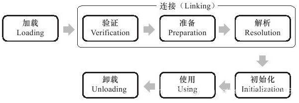
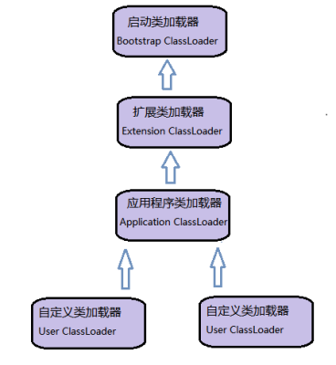

# 虚拟机类加载机制 #

[1.概述](#概述)

[2.类加载的时机](#类加载的时机)

[2.1.被动引用例一](#被动引用例一)

[2.2.被动引用例二](#被动引用例二)

[2.3.被动引用例三](#被动引用例三)

[2.4.接口的加载过程](#接口的加载过程)

[3.类加载的过程](#类加载的过程)

[3.1.加载](#加载)

[3.2.验证](#验证)

[3.2.1.文件格式验证](#文件格式验证)

[3.2.2.元数据验证](#元数据验证)

[3.2.3.字节码验证](#字节码验证)

[3.2.4.符号引用验证](#符号引用验证)

[3.3.准备](#准备)

[3.4.解析](#解析)

[3.4.1.类或接口的解析](#类或接口的解析)

[3.4.2.字段解析](#字段解析)

[3.4.3.类方法解析](#类方法解析)

[3.4.4.接口方法解析](#接口方法解析)

[3.5.初始化](#初始化)

[4.类加载器](#类加载器)

[4.1.类与类加载器](#类与类加载器)

[4.2.双亲委派模型](#双亲委派模型)

[4.3.破坏双亲委派模型](#破坏双亲委派模型)

[4.3.1.第一次被破坏](#第一次被破坏)

[4.3.2.第二次被破坏](#第二次被破坏)

[4.3.3.第三次被破坏](#第三次被破坏)

## 概述 ##

**虚拟机把描述类的数据从Class文件加载到内存，并对数据进行校验、转换解析和初始化，最终形成可以被虚拟机直接使用的Java类型，这就是虚拟机的类加载机制**。

与那些在编译时需要进行连接工作的语言不同，在Java语言里面，类型的加载、连接和初始化过程都是在程序运行期间完成的，这种策略虽然会令类加载时稍微**增加一些性能开销**，但是会为Java应用程序**提供高度的灵活性**，Java里天生可以**动态扩展的语言特性**就是依赖运行期动态加载和动态连接这个特点实现的。例如：

- 若编写一个面向接口的应用程序，可等到运行时再指定其实际的实现类。
- 用户可以通过 Java 预定义的和自定义类加载器，**让一个本地的应用程序可以在运行时从网络或其他地方加载一个二进制流作为程序代码的一部分**，这种组装应用程序的方式目前已广泛应用于Java程序之中。从最基础的Applet、JSP 到相对复杂的 OSGI 技术，都使用了Java语言运行期类加载的特性。

为了避免语言表达可能产生的偏差，先设定两个语言上的约定：

- 在实际情况中，每个Class文件都有可能代表着Java语言中的一个类或者接口，后文直接对“类”的描述都包括了类和接口的可能性，而对类和接口需要分开描述的场景会特别指明；
- 这里所指的“Class文件”是指的一串二进制字节流，无论以何种形式存在都可以。

## 类加载的时机 ##

类从被加载到虚拟机内存中开始，到卸载出内存为止，它的整个生命周期包括：

1. 加载（Loading）
2. 验证（Verification）
3. 准备（Preparation）
4. 解析（Resolution）
5. 初始化（Initialization）
6. 使用（Using）
7. 卸载（Unloading）

其中验证、准备、解析3个部分统称为连接（Linking），这7个阶段的发生顺序如下图所示。

加载、验证、准备、初始化和卸载这5个阶段的顺序是确定的，类的加载过程必须按照这种顺序按部就班地开始。

而**解析阶段则不一定**：它在某些情况下可以在初始化阶段之后再开始，这是为了支持Java语言的运行时绑定（也称为动态绑定或晚期绑定）

**注意**！，这里说的是按部就班地“开始”，而不是按部就班地“进行”或“完成”，强调这点是因为这些阶段通常都是互相交叉地混合式进行的，通常会在一个阶段执行的过程中调用、激活另外一个阶段。

什么情况下需要开始类加载过程的第一个阶段：**加载**？Java虚拟机规范中并没有进行强制约束，这点可以交给虚拟机的具体实现来**自由把握**。但是对于**初始化阶段**，虚拟机规范则是严格规定了有且只有**5种**情况必须立即对类进行“**初始化**”（而加载、验证、准备自然需要在此之前开始）：

1. 遇到new、getstatic、putstatic或invokestatic这4条字节码指令时，如果类没有进行过初始化，则需要先触发其初始化。生成这4条指令的最常见的Java代码场景是：
	- 使用new关键字实例化对象的时候；
	- 读取或设置一个类的静态字段（被final修饰、已在编译期把结果放入常量池的静态字段除外）的时候；
	- 调用一个类的静态方法的时候。

2. 使用**java.lang.reflect包**的方法对类进行反射调用的时候，如果类没有进行过初始化，则需要先触发其初始化。

3. 当初始化一个类的时候，如果发现其**父类**还没有进行过初始化，则需要先触发其父类的初始化。

4. 当虚拟机启动时，用户需要指定一个**要执行的主类**（包含main()方法的那个类），虚拟机会先初始化这个主类。

5. 当使用JDK 1.7的动态语言支持时，如果一个java.lang.invoke.MethodHandle实例最后的解析结果REF_getStatic、REF_putStatic、REF_invokeStatic的方法句柄，并且这个方法句柄所对应的类没有进行过初始化，则需要先触发其初始化。

对于这5种会触发类进行初始化的场景，虚拟机规范中使用了一个很强烈的限定语：“有且只有”，这5种场景中的行为称为对一个类进行**主动引用**。

此之外，所有引用类的方式都不会触发初始化，称为**被动引用**。

举3个例子说明被动引用

### 被动引用例一 ###

	/**
	 * 被动使用类字段演示一：
	* 通过子类引用父类的静态字段，不会导致子类初始化
	 **/
	public class SuperClass {
	
		static {
			System.out.println("SuperClass init!");
		}
	
		public static int value = 123;
	}
	
	public class SubClass extends SuperClass {
	
		static {
			System.out.println("SubClass init!");
		}
	}
	
	/**
	 * 非主动使用类字段演示
	 **/
	public class NotInitialization {
	
		public static void main(String[] args) {
			System.out.println(SubClass.value);
		}
	
	}

[NotInitialization](NotInitialization.java)

上述代码运行之后，只会输出有“SuperClass init！”，而不会输出“SubClass init！”。

**对于静态字段，只有直接定义这个字段的类才会被初始化，因此通过其子类来引用父类中定义的静态字段，只会触发父类的初始化而不会触发子类的初始化**。

至于是否要触发子类的加载和验证，在虚拟机规范中并未明确规定，这点取决于虚拟机的具体实现。

### 被动引用例二 ###

	/**
	 * 被动使用类字段演示二：
	 * 通过数组定义来引用类，不会触发此类的初始化
	 **/
	public class NotInitialization2 {
	
		public static void main(String[] args) {
			SuperClass[] sca = new SuperClass[10];
		}
	
	}

[NotInitialization2](NotInitialization2.java)

上面代码运行之后发现没有输出“SuperClass init”，说明并没有触发类com.lun.c07.SuperClass的初始化阶段。但是这段代码里面触发了另外一个名为“Lcom.lun.c07.SuperClass”的类的初始化阶段，对于用户代码来说，这并不是一个合法的类名称，它是一个由虚拟机自动生成的、直接继承于java.lang.Object的子类，创建动作由字节码指令**newarray**触发。

这个类代表了一个元素类型为com.lun.c07.SuperClass的一维数组，数组中应有的属性和方法，用户可直接使用的只有被修饰为public的length属性和clone()方法）都实现在这个类里。

Java语言中对数组的访问比C/C++ **相对安全**是因为这个类封装了数组元素的访问方法，而C/C++ 直接翻译为对数组指针的移动。在Java中，当检查到发生数组越界就会跑出**java.lang.ArrayIndexOutOfBoundsExecption**异常。

### 被动引用例三 ###

	/**
	 * 被动使用类字段演示三：
	 * 常量在编译阶段会存入调用类的常量池中，本质上没有直接引用到定义常量的类，因此不会触发定义常量的类的初始化。
	 **/
	public class ConstClass {
	
		static {
			System.out.println("ConstClass init!");
		}
	
		public static final String HELLOWORLD = "hello world";
	}
	
	/**
	 * 非主动使用类字段演示
	 **/
	public class NotInitialization3 {
	
		public static void main(String[] args) {
			System.out.println(ConstClass.HELLOWORLD);
		}
	}

[NotInitialization3](NotInitialization3.java)

上述代码运行之后，也没有输出“ConstClass init!”，这是因为虽然在Java源码中引用ConstClass类中的常量HELLOWORLD，但其实**在编译阶段通过常量传播优化**，已经将此常量"hello world"存储到了NotInitialization3的常量池中，以后NotInitialization3对常量ConstClass.HELLOWORLD的引用实际上被转化为NotInitialization3对自身常量池的引用了。

也就是说，实际上主类的Class文件之中并没有ConstClass类的符号引用入口，这两个类在编译成Class之后就不存在任何联系了。

### 接口的加载过程 ###

接口的加载过程与类加载过程稍有一些不同，针对接口需要做一些特殊说明：接口也有初始化过程，这点与类是一致的，上面的代码都是用静态语句块“static{}”来输出初始化信息的，而**接口中不能使用“static{}”语句块，但编译器仍然会为接口生成“<client&gt;()”类构造器**，用于初始化接口中所定义的成员变量。

接口与类真正有所区别的是前面讲述的5种“有且仅有”需要开始初始化场景中的第三种：当一个类在初始化时，要求其父类全部都已经初始化过了，但是一个接口在初始化时，并**不需要其父接口全部都完成初始化**，只有在真正使用到父接口的时候才会初始化。

## 类加载的过程 ##

### 加载 ###

“加载”是“类加载”（Class Loading）过程的一个阶段。在加载阶段，虚拟机需要完成以下3件事情：

- 通过一个类的全限定名来获取定义此类的二进制字节流
- 将这个字节流所代表的静态存储结构转化为**方法区**的运行时数据结构
- 在内存中生成一个代表这个类的java.lang.Class对象，作为**方法区**这个类的各种数据的访问入口

虚拟机规范的这3点要求其实并不算具体，因此虚拟机实现与具体应用的灵活度都是相当大的。例如“**通过一个类的全限定名来获取定义此类的二进制字节流**”这条，它没有指明二进制字节流要从一个Class文件中获取，准确的说是根本没有指明要从哪里获取、怎样获取。

虚拟机设计团队在加载阶段搭建了一个相当开放的、广阔的舞台，Java发展历程中，充满创造力的开发人员则在这个舞台上，玩出了各种花样，许多举足轻重的Java技术都建立在这个基础知识，例如：

- 从ZIP包中读取，折痕常见，最终成为日后的JAR、EAR、WAR格式的基础
- 从网络中获取，这种场景最典型的应用就是Applet
- 运行时计算生成，这种场景使用得最多的就是动态代理技术，在java.lang.reflect.Proxy中，就是用了ProxyGenerator.generateProxyClass来为特定接口生成形式为“*.Proxy”的代理类的二进制字节流。
- 由其他文件生成，典型场景是JSP应用，即由JSP文件生成对应的Class类。
- 从数据库读取，这种场景相对少见些，例如有些中间件服务器（SAP Netweaver）可以选择把程序安装到数据库中来完成程序代码在集群间的分发。
- ...

相对于类加载过程的其他阶段，一个**非数组类的加载阶段**（准确的说，是加载阶段中获取类的二进制字节流的动作）是开发人员可控性最强的，因为加载阶段既可以使用系统提供的引导类加载器来完成，也**可以由用户自定义的类加载器去完成**，开发人员可以通过定义自己的类夹杂去去控制字节流的获取方式，即重写一个类加载器的loadClass()方法。

对于数组类而言，情况就有所不同，**数组类本身不通过类加载器创建，它是由Java虚拟机直接创建的**。但是数组类与加载器仍然有很密切的关系，因为数组类的元素类型（Element Type指的是数组去掉所有维度的类型）最终是靠类加载器去创建，一个数组类创建的过程遵循以下规则：

- 如果数组的组件类型是引用类型，数组将在加载该组件类型的加载器的类名称空间上被标识。

- 如果数组的组件类型不是引用类型，例如int[]数组，JVM会将数组标记为与引导类加载器关联。

- 数组类的可见性与它的组件类型的可见性一致，如果组件类型不是引用类型，那数组类的可见性将默认为public

加载阶段完成之后，虚拟机外部的二进制字节流就按照虚拟机所需的格式存储在方法区之中，方法区中的数据存储格式的存储格式由虚拟机实现自行定义，虚拟机规范未规定此区域的具体数据结构。然后在内存中实例化一个java.lang.Class类的对象（并没有明确规定是在Java堆中，对于HotSpot虚拟机而言，**Class对象**比较特殊，它虽然是对象，但是存放在**方法区**里），这个对象将作为程序访问方法区中的这些类型数据的外部接口。

加载阶段与连接阶段的部分内容（如一部分字节码文件格式验证动作）是交叉进行的，加载阶段尚未完成，连接阶段可能已经开始，但这些夹在加载阶段之中进行的动作，仍然属于连接阶段的内容，这两个阶段的开始时间仍然保持着固定的先后顺序。

### 验证 ###

验证是连接阶段的第一步，这一阶段的目的是为了确保Class文件的字节流中包含的信息符合当前虚拟机的要求，并且不会危害虚拟机自身的安全。

Java语言相对于C和C++来说，本身是**相对安全**的语言，使用纯粹的Java代码无法做到诸如访问数组便捷以外的数据、将一个对象转型为它并未实现的类型、跳转到不存在的代码行之类的事情，如果这样做了，编译器将拒绝编译。但是Class文件不一定是Java源码编译出来，可以使用任何途径产生，甚至包括用十六进制编辑器直接编写来产生Class文件。在字节码语言层面上，上述Java代码无法做到的实际情况都是可以实现的，至少在语义上是可以表达出来的。虚拟机如果不检查输入的字节流，对其完全信任的话，很可能会因为载入了有害的字节流而导致系统崩溃，所以**验证是虚拟机对自身保护的一项重要工作**。

验证阶段是非常重要的，这个阶段是否严谨，直接决定了Java虚拟机是否能承受恶意代码的攻击，从执行性能的角度上讲，验证阶段的工作量在虚拟机的类加载子系统中又占了相当大的一部分。 《 Java虚拟机规范(第2版 )》对这个阶段的限制、指导还是比较**笼统**的， 规范中列举了一些Class文件格式中的静态和结构化约束，如果验证到输入的字节流不符合Class文件格式的约束，虚拟机就应抛出一个java.lang.VerifyError异常或其子类异常，但具体应当检查哪些方面，如何检查，何时检查，都没有足够具体的要求和明确的说明。

直到2011 年发布的《Java虚拟机规范(Java SE 7版)》，大幅增加了描述验证过程的篇幅(从不到10 页增加到130页 )，这时约束和验证规则才变得具体起来。受篇幅所限，本书无法逐条规则 去讲解，**但从整体上看，验证阶段大致上会完成下面4个阶段的检验动作:文件格式验证、元数据验证、字节码验证、符号引用验证**。

从整体上看，验证阶段大致分为4个阶段性的验证动作：文件格式验证、元数据验证、字节码验证、符号引用验证。

#### 文件格式验证 ####

第一阶段要验证字节流是否符合Class文件格式的规范，并且能被当前版本的虚拟机处理。这一阶段可能包括下面这些验证点:

- 是否以魔数0xCAFEBABE开头。
- 主、次版本号是否在当前虚拟机处理范围之内。
- 常量池的常量中是否有不被支持的常量类型(检查常量tag标志)。
- 指向常量的各种索引值中是否有指向不存在的常量或不符合类型的常量。
- CONSTANT_Utf8_info型的常量中是否有不符合UTF8编码的数据。
- Class文件中各个部分及文件本身是否有被删除的或附加的其他信息。
- ...

实际上 ，第一阶段的验证点还远不止这些，上面这些只是从HotSpot虚拟机源码中摘抄的一小部分内容，**该验证阶段的主要目的是保证输入的字节流能正确地解析并存储于方法区之内** ，格式上符合描述一个Java类型信息的要求。这阶段的验证是基于二进制字节流进行的 ，只有通过了这个阶段的验证后，字节流才会进入内存的方法区中进行存储，所以后面的3个验证阶段全部是基于方法区的存储结构进行的，不会再直接操作字节流。

#### 元数据验证 ####

第二阶段是对字节码描述的信息进行语义分析，以保证其描述的信息**符合Java语言规范**的要求，这个阶段可能包括的验证点如下:

- 这个类是否有父类(除了java.lang.Object之 外 ，所有的类都应当有父类)。
- 这个类的父类是否继承了不允许被继承的类(被final修饰的类)。
- 如果这个类不是抽象类，是否实现了其父类或接口之中要求实现的所有方法。
- 类中的字段、方法是否与父类产生矛盾(例如覆盖了父类的final字段 ，或者出现不符合规则的方法重载，例如方法参数都一致，但返回值类型却不同等)。
- ...

第二阶段的主要目的是对类的元数据信息进行语义校验，保证不存在不符合Java语言规范的元数据信息。

#### 字节码验证 ####

第三阶段是整个验证过程中最复杂的一个阶段，**主要目的是通过数据流和控制流分析，确定程序语义是合法的、符合逻辑的**。在第二阶段对元数据信息中的数据类型做完校验后， 这个阶段将对类的方法体进行校验分析，保证被校验类的方法在运行时不会做出危害虚拟机安全的事件，例如 :

- 保证任意时刻操作数栈的数据类型与指令代码序列都能配合工作，例如不会出现类似这样的情况:在操作栈放置了一个int类型的数据，使用时却按long类型来加载入本地变量表中。
- 保证跳转指令不会跳转到方法体以外的字节码指令上。
- 保证方法体中的类型转换是有效的，例如可以把一个子类对象赋值给父类数据类型，这是安全的，但是把父类对象赋值给子类数据类型，甚至把对象赋值给与它毫无继承关系、完全不相干的一个数据类型，则是危险和不合法的。
-...

如果一个类方法体的字节码没有通过字节码验证，那肯定是有问题的；但如果一个方法体通过了字节码验证，也不能说明其一定就是安全的。即使字节码验证之中进行了大量的检查，也不能保证这一点。这里涉及了离散数学中一个很著名的问题“**Halting Problem**”（停机问题就是判断任意一个程序是否会在有限的时间之内结束运行的问题。如果这个问题可以在有限的时间之内解决,可以有一个程序判断其本身是否会停机并做出相反的行为。这时候显然不管停机问题的结果是什么都不会符合要求,所以这是一个不可解的问题）。

通俗一点的说法就是，**通过程序去校验程序逻辑是无法做到绝对准确的——不能通过程序准确地检查出程序是否能在有限的时间之内结束运行**。

由于数据校验的高复杂性，虚拟机设计团队为了避免过多的时间消耗在字节码验证阶段 ，在JDK 1.6之后的Javac编译器和Java虚拟机中进行了一项优化，给方法体的Code属性的属性表中增加了一项名为“**StackMapTable**”的属性，这项属性**描述**了方法体中所有的基本块(Basic Block，按照控制流拆分的代码块)**开始时本地变量表和操作栈应有的状**态，在字节码验证期间，就不需要根据程序推导这些状态的合法性，只需要检查StackMapTable属性中的记录是否合法即可。这样将字节码验证的类型推导转变为**类型检查从而节省一些时间**。

理论上StackMapTable属性也存在错误或被篡改的可能，所以是否有可能在恶意篡改了Code属性的同时，也生成相应的StackMapTable属性来骗过虚拟机的类型校验则是虚拟机设计者值得思考的问题。

在JDK1.6的HotSpot虚拟机中提供了-XX:-UseSplitVerifier选项来关闭这项优化，或者使用参数-XX : +FailOverTo0ldVerifier要求在类型校验失败的时候退回到旧的类型推导方式进行校验。而在JDK 1.7之 后 ，对于主版本号大于50的Class文件 ，使用类型检查来完成数据流分析校验则是唯一的选择，不允许再退回到类型推导的校验方式。

#### 符号引用验证 ####

最后一个阶段的校验发生在虚拟机将符号引用转化为直接引用的时候，这个转化动作将在连接的第三阶段——**解析阶段**中发生。符号引用验证可以看做是对类自身以外(常量池中的各种符号引用)的信息进行匹配性校验，通常需要校验下列内容:

- 符号引用中通过字符串描述的全限定名是否能找到对应的类。
- 在指定类中是否存在符合方法的字段描述符以及简单名称所描述的方法和字段。
- 符号引用中的类、字段、方法的访问性(private、protected、public、default)是否可被当前类访问。
-...

**符号引用验证的目的是确保解析动作能正常执行**，如果无法通过符号引用验证，那么将会拋出一个java.lang.IncompatibleClassChangeError异常的子类，如 java.lang.IllegalAccessError、 java.lang.NoSuchFieldError、 java.lang.NoSuchMethodError。

对于虚拟机的类加载机制来说，验证阶段是一个非常重要的、但不是一定必要(因为对程序运行期没有影响)的阶段。如果所运行的全部代码(包括自己编写的及第三方包中的代码)都已经被反复使用和验证过，那么在实施阶段就可以考虑使用**-Xverify:none**参数来关闭大部分的类验证措施，以缩短虚拟机类加载的时间。

### 准备 ###

**准备阶段是正式为类变量分配内存并设置类变量初始值的阶段，这些变量所使用的内存都将在方法区中进行分配**。这个阶段中有两个容易产生混淆的概念需要强调一下，首先，这时候进行内存分配的仅包括**类变量(被static修饰的变量**)，而不包括**实例变量**，实例变量将会在对象实例化时随着对象一起分配在Java堆中。其次，这里所说的初始值“通常情况”下是数据类型的零值，假设一个类变量的定义为:

	public static int value = 123;

**那变量value在准备阶段过后的初始值为0而不是123**，因为这时候尚未开始执行任何Java方法，而把value賦值为123的putstatic指令是程序被编译运，存放于类构造器<clinit&gt;()方法之中，所以把value賦值为123的动作将在初始化阶段才会执行。下表列出了Java中所有基本数据类型的零值。

Primitive type|Default
---|---
boolean|false
char|‘\u0000’ (null) 
byte|(byte)0
short|(short)0
int|0
long|0L
float|0.0f
double|0.0d

上面提到，在“通常情况”下初始值是零值，那相对的会有一些“**特殊情况**”：如果类字段的字段属性表中存在ConstantValue属性 ，那在准备阶段变量value就会被初始化为ConstantValue属性所指定的值，假设上面类变量value的定义变为:

	public static final int value = 123;

编译时Javac将会为value生成ConstantValue属性 ，在准备阶段虚拟机就会根据 ConstantValue的设置将value赋值为123。

### 解析 ###

**解析阶段是虚拟机将常量池内的符号引用替换为直接引用的过程**，符号引用在前一章讲解Class文件格式的时候已经出现过多次，在Class文件中它以CONSTANT_Class_info、 CONSTANT_Fieldref_info、CONSTANT_Methodref_info等类型的常量出现，**那解析阶段中所说的直接引用与符号引用又有什么关联呢**?

- 符号引用(Symbolic References):符号引用以一组符号来描述所引用的目标，符号可以是任何形式的字面量，只要使用时能无歧义地定位到目标即可。**符号引用与虚拟机实现的内存布局无关**，引用的目标并不一定已经加载到内存中。各种虛拟机实现的内存布局可以各不相同 ，但是它们能接受的符号引用必须都是一致的，因为符号引用的字面量形式明确定义在Java虚拟机规范的Class文件格式中。

- 直接引用(DirectReferences): 直接引用可以是直接指向目标的指针、相对偏移量或是一个能间接定位到目标的句柄。**直接引用是和虚拟机实现的内存布局相关的**，同一个符号引用在不同虚拟机实例上翻译出来的直接引用一般不会相同。如果有了直接引用，那引用的目标必定已经在内存中存在。

虚拟机规范之中并未规定解析阶段发生的具体时间，只要求了在执行anewarray、 checkcast、getfield、getstatic、instanceof、invokedynamic、invokeinterface、invokespecial、invokestatic、invokevirtual、ldc、ldc_w、multianewarray、new、putfield和putstatic这16个用于操作符号引用的字节码指令**之前**，先对它们所使用的符号引用进行解析。所以虚拟机实现可以根据需要来判断到底是在类被加载器加载时就对常量池中的符号引用进行解析，还是等到一个符号引用将要被使用前才去解析它。

对同一个符号引用进行多次解析请求是很常见的事情，除invokedynamic指令以外，虚拟机实现可以对第一次解析的结果进行**缓存**(在运行时常量池中记录直接引用，并把常量标识为已解析状态)从而**避免解析动作重复进行**。无论是否真正执行了多次解析动作，虚拟机需要保证的是在同一个实体中，如果一个符号引用之前已经被成功解析过，那么后续的引用解析请求就应当一直成功;同样的，如果第一次解析失败了，那么其他指令对这个符号的解析请求也应该收到相同的异常。

对于invokedynamic指令，上面规则则不成立。当碰到某个前面已经由invokedynamic指令触发过解析的符号引用时，并不意味着这个解析结果对于其他也invokedynamic指令也同样生效。**因为invokedynamic指令的目的本来就是用于动态语言支持**(目前仅使用Java语言不会生成这条字节码指令)，它所对应的引用称为“动态调用点限定符” ( Dynamic Call Site Specifier ) ，这里“动态”的含义就是必须等到程序实际运行到这条指令的时候，解析动作才能进行。相对的，其余可触发解析的指令都是“静态”的 ，可以在刚刚完成加载阶段，还没有开始执行代码时就进行解析。

解析动作主要针对类或接口、字段、类方法、接口方法、方法类型、方法句柄和调用点限定符7类符号引用进行，分别对应于常量池的CONSTANT_Class_info、 CONSTANT_Fieldref_info、CONSTANT_Methodref_info、 CONSTANT_InterfaceMethodref_info、CONSTANT_MethodType_info、 CONSTANT_MethodHandle_info和CONSTANT_invokeDynamic_info 7种常量类型。下面将讲解前面**4种**引用的解析过程，对于后面3种 ，与JDK 1.7新增的动态语言支持息息相关，由于Java语言是一门静态类型的语言，因此在没有介绍invokedynamic指令的语义之前，没有办法将它们和现在的Java语言对应上。

#### 类或接口的解析 ####

假设当前代码所处的类为D，如果要把一个从未解析过的符号引用N解析为一个类或接口C的直接引用，那虚拟机完成整个解析的过程需要以下3个步骤: 

1. **如果C不是一个数组类型**，那虚拟机将会把代表N的全限定名传递给D的**类加载器**去加载这个类C。在加载过程中，由于元数据验证、字节码验证的需要，又可能触发其他相关类的加载动作，例如加载这个类的父类或实现的接口。一旦这个加载过程出现了任何异常， 解析过程就宣告失败。 

2. **如果C是一个数组类型**，并且数组的元素类型为对象，也就是N的描述符会是类似“[Ljava/lang/Integer”的形式，那将会按照第1点的规则加载数组元素类型。如果N的描述符如前面所假设的形式，需要加载的元素类型就是“java.lang.Integer”，接着由**虚拟机**生成一个代表此数组维度和元素的数组对象。 

3. 如果上面的步骤没有出现任何异常，那么C在虚拟机中实际上已经成为一个有效的类或接口了，但在解析完成之前还要进行符号引用验证，确认D是否具备对C的访问权限。如果发现不具备访问权限，将拋出java.lang.IllegalAccessError异常。

#### 字段解析 ####

要解析一个未被解析过的字段符号引用，首先将会对字段表内class_index项中索引的CONSTANT_Class_info符号引用进行解析，也就是字段所属的类或接口的符号引用。如果在解析这个类或接口符号引用的过程中出现了任何异常，都会导致字段符号引用解析的失败。如果解析成功完成，那将这个字段所属的类或接口用C表示 ，虚拟机规范要求按照如下步骤对C进行后续字段的搜索。

1. 如果C本身就包含了简单名称和字段描述符都与目标相匹配的字段，则返回这个字段的直接引用，查找结束。

2. 否则，如果在C中实现了接口，将会按照继承关系从下往上递归搜索各个接口和它的父接口，如果接口中包含了简单名称和字段描述符都与目标相匹配的字段，则返回这个字段的直接引用，查找结束。

3. 否则，如果C不是java.lang.Object的话，将会按照继承关系从下往上递归搜索其父类 ，如果在父类中包含了简单名称和字段描述符都与目标相匹配的字段，则返回这个字段的直接引用，查找结束。

4. 否则，查找失败，拋出java.lang.NoSuchFieldError异常。
如果查找过程成功返回了引用，将会对这个字段进行权限验证，如果发现不具备对字段的访问权限，将拋出java.lang.IllegalAccessError异常。

在实际应用中，虚拟机的编译器实现可能会比上述规范要求得更加严格一些，如果有一个同名字段同时出现在C的接口和父类中，或者同时在自己或父类的多个接口中出现，那编译器将可能拒绝编译。在下列代码中 ，如果注释了Sub类中的“public static int A=4 ; ”， 接口与父类同时存在字段A ，那编译器将提示“The field Sub.A is ambiguous” ，并且拒绝编译这段代码。

[FieldResolution](FieldResolution.java)

PS.JDK1.8环境下没有报错，并且输出“4”

#### 类方法解析 ####

类方法解析的第一个步骤与字段解析一样 ，也需要先解析出类方法表的class_index项中索引的方法所属的类或接口的符号引用，如果解析成功，我们依然用C表示这个类，接下来虚拟机将会按照如下步骤进行后续的类方法搜索。

1. 类方法和接口方法符号引用的常量类型定义是分开的，如果在类方法表中发现class_index中索引的C是个接口，那就直接拋出java.lang.IncompatibleClassChangeError异常。

2. 如果通过了第1步 ，在类C中查找是否有简单名称和描述符都与目标相匹配的方法， 如果有则返回这个方法的直接引用，查找结束。

3. 否则，在类C的父类中递归查找是否有简单名称和描述符都与目标相匹配的方法，如果有则返回这个方法的直接引用，查找结束。

4. 否则，在类C实现的接口列表及它们的父接口之中递归查找是否有简单名称和描述符都与目标相匹配的方法，如果存在匹配的方法，说明类C是一个抽象类，这时查找结束，拋出Java.lang.AbstractMethodError异常。

5. 否则，宣告方法查找失败，拋出java.lang.NoSuchMethodError。

最后 ，如果查找过程成功返回了直接引用，将会对这个方法进行权限验证，如果发现不具备对此方法的访问权限，将拋出java.lang.IllegalAccessError异常

#### 接口方法解析 ####

接口方法也需要先解析出接口方法表的class_index项中索引的方法所属的类或接口的符号引用 ，如果解析成功，依然用C表示这个接口，接下来虚拟机将会按照如下步骤进行后续的接口方法搜索。

1. 与类方法解析不同，如果在接口方法表中发现class_index中的索引C是个类而不是接口 ，那就直接拋出java.lang.IncompatibleClassChangeError异常。

2. 否则，在接口C中查找是否有简单名称和描述符都与目标相匹配的方法，如果有则返回这个方法的直接引用，查找结束。

3. 否则，在接口C的父接口中递归查找，直到java.lang.Object类(查找范围会包括Object类 )为止 ，看是否有简单名称和描述符都与目标相匹配的方法，如果有则返回这个方法的直接引用，查找结束。

4. 否则，宣告方法查找失败，拋出java.lang.NoSuchMethodError异常。

由于接口中的所有方法默认都是public的 ，所以不存在访问权限的问题，因此接口方法的符号解析应当不会拋出java.langIllegalAccessError异常。

### 初始化 ###

**跟static有关的**

类初始化阶段是类加载过程的最后一步，前面的类加载过程中，除了在加载阶段用户应用程序可以通过自定义类加载器参与之外，其余动作完全由虚拟机主导和控制。**到了初始化阶段，才真正开始执行类中定义的Java程序代码**(或者说是字节码)。

在准备阶段，变量已经赋过一次系统要求的初始值，而在初始化阶段，则根据程序员通过程序制定的主观计划去初始化类变量和其他资源，或者可以从另外一个角度来表达:初始化阶段是执行类构造器<clinit&gt;()方法的过程。在下文会讲解<clinit&gt;()方法是怎么生成的，先看一下<clinit&gt;()方法执行过程中一些可能会影响程序运行行为的**特点和细节**，这部分相对更贴近于普通的程序开发人员。

- **<clinit&gt;()方法是由编译器自动收集类中的所有类变量的賦值动作和静态语句块(static{}块)中的语句合并产生的**，编译器收集的顺序是由语句在源文件中出现的顺序所决定的，静态语句块中只能访问到定义在静态语句块之前的变量，定义在它之后的变量，在前面的静态语句块可以賦值，但是不能访问，如代码

	public class Test {
	    static {
	        i = 0;  //  给变量复制可以正常编译通过
	        System.out.print(i);  // 这句编译器会提示“非法向前引用”  
	    }
	    static int i = 1;
	}

- <clinit&gt;()方法与类的构造函数(或者说实例构造器<init&gt;() 方法)不同，它不需要显式地调用父类构造器，虚拟机会保证在子类的<cinit&gt;( ) 方法执行之前，父类的<clinit&gt;()方法已经执行完毕。因此在虚拟机中第一个被执行的<clinit&gt;()方法的类肯定是java.lang.Object。

- 由于父类的<clinit&gt;()方法先执行，也就意味着父类中定义的静态语句块要优先于子类的变量赋值操作，下面代码 ，字段B的值将会是2而不是1。

	static class Parent {
			public static int A = 1;
			static {
				A = 2;
			}
	}

	static class Sub extends Parent {
			public static int B = A;
	}

	public static void main(String[] args) {
			System.out.println(Sub.B);
	}

	
- <clinit&gt;() 方法对于类或接口来说并不是必需的，如果一个类中没有静态语句块，也没有对变量的赋值操作，那么编译器可以不为这个类生成<clinit&gt;() 方法。

- **接口中不能使用静态语句块**，但仍然有变量初始化的赋值操作，因此接口与类一样都会生成<clinit&gt;() 方法。但接口与类不同的是，执行接口的<clinit&gt;()方法不需要先执行父接口的<clinit&gt;() 方法。只有当父接口中定义的变量使用时，父接口才会初始化。另外，接口的实现类在初始化时也一样不会执行接口的<clinit&gt;() 方法。

- 虚拟机会保证一个类的<clinit&gt;() 方法在**多线程环境中**被正确地加锁、同步 ，如果多个线程同时去初始化一个类，那么只会有一个线程去执行这个类的<clinit&gt;()方法，其他线程都需要阻塞等待，直到活动线程执行<clinit&gt;()方法完毕。如果在一个类的<clinit&gt;() 方法中有耗时很长的操作，就可能造成多个进程阻塞(需要注意的是，其他线程虽然会被阻塞，但如果执行<clinit&gt;()方法的那条线程退出<clinit&gt;()方法后，其他线程唤醒之后不会再次进入<clinit&gt;()方法。同一个类加载器下，一个类型只会初始化一次)，在实际应用中这种阻塞往往是很隐蔽的。
	
代码如下：

[DeadLoopClass](DeadLoopClass.java)

运行结果如下，即一条线程在死循环以模拟长时间操作，另外一条线程在阻塞等待。

	Thread[Thread-0,5,main]start 
	Thread[Thread-1,5,main]start 
	Thread[Thread-0,5,main]init DeadLoopClass

## 类加载器 ##

虚拟机设计团队把类加载阶段中的 “**通过一个类的全限定名来获取描述此类的二进制字节流**” 这个动作放到 Java 虚拟机外部去实现，以便让应用程序自己决定如何去获取所需要的类。实现这个动作的代码模块称为“**类加载器**”。

类加载器可以说是 Java 语言的一项创新，也是 Java 语言流行的重要原因之一，它最初是为了满足 Java Applet 的需求而开发出来的。虽然目前 Java Applet 技术基本上已经“死掉”（指在浏览器上，其他领域如智能卡，它仍有广阔市场），但类加载器却在类层次划分、OSGI、热部署、代码加密等领域大放异彩，成为了 Java 技术体系中一块重要的基石，可谓是失之桑榆，收之东隅。

### 类与类加载器 ###

类加载器虽然只用于实现类的加载动作，但它在 Java程序中起到的作用却远远不限于类加载阶段。对于任意一个类，都需要由加载它的类加载器和这个类本身一同确立其在 Java 虚拟机中的唯一性，每一个类加载器，都拥有一个独立的类名称空间。这句话可以表达得更通俗一些：**比较两个类是否 “相等”，只有在这两个类是由同一个类加载器加载的前提下才有意义**，否则，即使这两个类来源于同一个 Class 文件，被同一个虚拟机加载，只要加载它们的类加载器不同，那这两个类就必定不相等。

这里所指的 “相等”，包括代表类的 Class 对象的 equals() 方法、isAssignableFrom() 方法、isInstance() 方法的返回结果，也包括使用instanceof 关键字做对象所属关系判定等情况。**如果没有注意到类加载器的影响，在某些情况下可能会产生具有迷惑性的结果**，下面中演示了不同的类加载器对 instanceof 关键字运算的结果的影响。

[ClassLoaderTest](ClassLoaderTest.java)

运行结果

	class com.lun.c07.ClassLoaderTest
	false//不同的类加载器加载的缘故

代码中构造了一个简单的类加载器，尽管很简单，但是对于这个演示来说还是够用了。它可以加载与自己在同一路径下的 Class 文件。我们使用这个类加载器去加载了一个名为 “com.lun.c07.ClassLoaderTest” 的类，并实例化了这个类的对象。两行输出结果中，从第一句可以看出，这个对象确实是类 com.lun.c07.ClassLoaderTest实例化出来的对象，

但从第二句可以发现，这个对象与类 com.lun.c07.ClassLoaderTest 做所属类型检查的时候却返回了 false，**这是因为虚拟机中存在了两个 ClassLoaderTest 类，一个是由系统应用程序类加载器加载的，**另外一个是由我们自定义的类加载器加载的，虽然都来自同一个 Class 文件，但依然是两个独立的类，做对象所属类型检查时结果自然为 false。

### 双亲委派模型 ###

从 Java 虚拟机的角度来讲，只存在两种不同的类加载器：

1. 启动类加载器（Bootstrap ClassLoader），这个类加载器使用C++ 语言实现（注：这里只限于 HotSpot，像MRP、Maxnie 等虚拟机，整个虚拟机本身都是由 Java 编写的，自然 Bootstrap ClassLoader 也是由 Java 语言而不是 C++ 实现的。退一步讲，除了 HotSpot 以外的其他两个高性能虚拟机 JRockit 和 J9 都有一个代表 Bootstrap ClassLoader 的 Java 类存在，但是关键方法的实现仍然是使用 JNI 回调到 C（注意不是C++）的实现上，这个 Bootstrap ClassClassLoader 的实例也无法被用户获取到。），是虚拟机自身的一部分
2. 所有其他的类加载器，这些类加载器都由 Java 语言实现，独立于虚拟机外部，并且全都继承自抽象类 java.lang.ClassLoader。

从 Java 开发人员的角度来看，类加载器还可以划分得更细致一些，绝大多数 Java 程序都会使用到以下3种系统提供的类加载器。

- **启动类加载器**（Bootstrap ClassClassLoader：这个类加载器负责将存放在 <JAVA_HOME>\lib 目录中的，或者被 -Xbootclasspath 参数所指定的路径中的，并且是虚拟机识别的（仅按照文件名识别，如 rt.jar，名字不符合的类库即使放在 lib 目录中也不会被加载）类库加载到虚拟机内存中。**启动类加载器无法被 Java 程序直接引用**，用户在编写自定义类加载器时，如果需要把加载请求委派给引导类加载器，那直接使用 null 代替即可，如下面所示为 java.lang.ClassLoader.getClassLoader() 方法的代码片段。

- **扩展类加载器**（Extension ClassLoader）：这个加载器由 sun.misc.Launcher$ExtClassLoader 实现，它负责加载<JAVA_HOME>\lib\ext 目录中的，或者被java.ext.dirs 系统变量所指定的路径中的所有类库，开发者可以直接使用扩展类加载器。

- **应用程序类加载器**（Application ClassLoader）：这个类加载器由 sun.misc.Launcher$AppClassLoader 实现。由于这个类加载器是 ClassLoader 中的 getSystemClassLoader() 方法的返回值，所以一般也称为系统类加载器。它负责加载用户类路径（ClassPath）上所指定的类库，开发者可以直接使用这个类加载器，如果应用程序中没有自定义过自己的类加载器，一般情况下这个就是程序中默认的类加载器。

应用程序都是由这 3 种类加载器互相配合进行加载的，如果有必要，还可以加入自己定义的类加载器。

上图展示的类加载器之间的这种层次关系，称为类加载器的双亲委派模型（Parents Delegation Model）。双亲委派模型要求除了顶层的启动类加载器外，其余的类加载器都应当有自己的父类加载器。这里类加载器之间的父子关系一般不会以继承（Inheritance）的关系来实现，而是都使用**组合**（Composition）关系来复用父加载器的代码。

>PS.我觉得这 双亲委派模型 改为 父子相助模型 更妥

类加载器的双亲委派模型在 JDK 1.2 期间被引入并被广泛应用于之后几乎所有的 Java 程序中，但**它并不是一个强制性的约束模型**，而是 Java 设计者推荐给开发者的一种类加载器实现方式。

双亲委派模型的**工作过程**是：如果一个类加载器收到了类加载的请求，它首先不会自己去尝试加载这个类，而是把这个请求委派给父类加载器去完成，每一个层次的类加载器都是如此，因此所有的加载请求最终都应该传送到顶层的启动类加载器中，只有当父加载器反馈自己无法完成这个加载请求（它的搜索范围中没有找到所需的类）时，子加载器才会尝试自己去加载。

>PS. 儿子：爸爸，你帮帮我吧，不行的话，我自己干吧！

	protected Class<?> loadClass(String name, boolean resolve) throws ClassNotFoundException {

        synchronized (getClassLoadingLock(name)) {
            // 首先，检查请求的类是否已经被加载过了
            Class c = findLoadedClass(name);
            if (c == null) {
                long t0 = System.nanoTime();
                try {
                    if (parent != null) {
                        c = parent.loadClass(name, false);
                    } else {
                        c = findBootstrapClassOrNull(name);
                    }
                } catch (ClassNotFoundException e) {
                    // 如果父类加载器抛出 ClassNotFoundException
                    // 说明父类加载器无法完成加载请求
                }

                if (c == null) {
                    // 在父类加载器无法加载的时候
                    // 再调用本身的 findClass 方法来进行类加载
                    long t1 = System.nanoTime();
                    c = findClass(name);

                    // this is the defining class loader; record the stats
                    sun.misc.PerfCounter.getParentDelegationTime().addTime(t1 - t0);
                    sun.misc.PerfCounter.getFindClassTime().addElapsedTimeFrom(t1);
                    sun.misc.PerfCounter.getFindClasses().increment();
                }
            }
            if (resolve) {
                resolveClass(c);
            }
            return c;
        }
    }

使用双亲委派模型来组织类加载器之间的关系，有一个显而易见的**好处**就是Java 类随着它的类加载器一起具备了一种带有优先级的层次关系。例如类 java.lang.Object，它存放在 rt.jar 之中，无论哪一个类加载器要加载这个类，最终都是委派给处于模型最顶端的启动类加载器进行加载，因此 Object 类在程序的各种类加载器环境中都是同一个类。

相反，如果没有使用双亲委派模型，由各个类加载器自行去加载的话，如果用户自己编写一个称为 java.lang.Object 的类，并放在程序的 ClassPath 中，那系统中将会出现多个不同的 Object 类，Java 类型体系中最基础的行为也就无法保证，应用程序也将会变得一片混乱。

如果有兴趣的话，可以尝试去编写一个与 rt.jar 类库中已有类重名的 Java 类，将会发现可以正常编译，但永远无法被加载运行（注：即使自定义了自己的类加载器，强行用 defineClass() 方法去加载一个以 “java.lang” 开头的类也不会成功。如果尝试这样做的话，将会收到一个由虚拟机自己抛出的 “java.lang.SecurityException: Prohibited package name:java.lang” 异常）。

### 破坏双亲委派模型 ###

双亲委派模型并不是一个强制性的约束模型，而是 Java 设计者推荐给开发者的类加载器实现方式。在 Java 的世界中大部分的类加载器都遵循这个模型，但也有例外，到目前为止，双亲委派模型主要出现过 3 次较大规模的 “被破坏” 情况。

#### 第一次被破坏 ####

双亲委派模型的第一次 “被破坏” 其实发送在双亲委派模型出现之前——即 JDK 1.2 发布之前。由于双亲委派模型在 JDK 1.2 之后才被引入，而类加载器和抽象类 java.lang.ClassLoader 则再 JDK 1.0 时代就已经存在，面对已经存在的用户自定义类加载器的实现代码，Java 设计者引入双亲委派模型时不得不做出一些妥协。为了向前兼容，JDK 1.2 之后的 java.lang.ClassLoader 添加了一个新的 protected 方法 findClass()，在此之前，用户去继承 java.lang.ClassLoader 的**唯一目的**就是为了重写 loadClass() 方法，因为虚拟机在进行类加载的时候会调用加载器的私有方法 loadClassInternal() ，而这个方法的唯一逻辑就是取调用自己的 loadClass()。

上面loadClass() 方法的代码，双亲委派的具体逻辑就实现在这个方法之中，**JDK 1.2 之后已不提倡用户再去覆盖 loadClass() 方法**，而应当把自己的类加载逻辑写到 findClass() 方法中，在 loadClass() 方法，而应当把自己的类加载逻辑写到 findClass() 方法中，在 loadClass() 方法的逻辑如果父类加载失败，则会调用自己的 findClass() 方法来完成加载，这样就可以保证新写出来的类加载器是符合双亲委派规则的。

#### 第二次被破坏 ####

双亲委派模型的第二次 “被破坏” 是由这个模型自身的缺陷所导致的，双亲委派很好地解决了各个类加载器的基础类的统一问题（越基础的类由越上层的加载器进行加载），基础类之所以成为 “基础”，是因为它们总是作为被用户代码调用的 API，但世事往往没有绝对的完美，**如果基础类又要调用回用 户的代码，那该怎么办**？

这并非是不可能的事情，**一个典型的例子便是 JNDI 服务**，JNDI 现在已经是 Java 的标准服务，它的代码由启动类加载器去加载（在 JDK 1.3 时放进去的 rt.jar），但 JNDI 的目的就是对资源进行集中管理和查找，它需要调用由独立厂商实现并部署在应用程序的 ClassPath 下的 JNDI 接口提供者（SPI，Service Provider Interface）的代码，但启动类加载器不可能 “认识” 这些代码啊！那该怎么办？

为了解决这个问题，Java 设计团队只好引入了一个不太优雅的设计：线程上下文类加载器（Thread Context ClassLoader）。这个类加载器可以通过 java.lang.Thread 类的 setContextClassLoader() 方法进行设置，如果创建线程时还未设置，它将会从父线程中继承一个，如果在应用程序的全局范围内都没有设置过的话，那这个类加载器默认就是应用程序类加载器。

有了线程上下文类加载器，就可以做一些 “舞弊” 的事情了，JNDI 服务使用这个线程上下文类加载器去加载所需要的 SPI 代码，也就是父类加载器请求子类加载器去完成类加载的动作，这种行为实际上就是打通了双亲委派模型的层次结构来逆向使用类加载器，实际上已经违背了双亲委派模型的一般性原则，但这也是无可奈何的事情。Java 中所有涉及 SPI 的加载动作基本都采用这种方式，例如 JNDI、JDBC、JCE、JAXB 和 JBI 等。

#### 第三次被破坏 ####

双亲委派模型的第三次 “被破坏” 是由于用户对程序动态性的追求而导致的，这里所说的 “动态性” 指的是当前一些非常 “热门” 的名词：**代码热替换**（HotSwap）、**模块热部署**（Hot Deployment）等，说白了就是希望应用程序能像我们的计算机外设那样，接上鼠标、U 盘，不用重启机器就能立即使用，鼠标有问题或要升级就换个鼠标，不用停机也不用重启。对于个人计算机来说，重启一次其实没有什么大不了的，但对于一些生产系统来说，关机重启一次可能就要被列为生产事故，这种情况下热部署就对软件开发者，尤其是企业级软件开发者具有很大的吸引力。

Sun 公司所提出的 JSR-294、JSR-277 规范在于 JCP 组织的模块化规范之争中落败给 JSR-291（即 OSGi R4.2），虽然 Sun 不甘失去 Java 模块化的主导权，独立在发者 Jigsaw 项目，但目前 OSGi 已经成为了业界 “事实上” 的 Java 模块化标准，而 OSGi 实现模块化热部署的关键则是它自定义的类加载器机制的实现。每一个程序模块（OSGi 中成为 Bundle）都有一个自己的类加载器，当需要更换一个 Bundle 时，就把 Bundle 连同类加载器一起换掉以实现代码的热替换。

在 OSGi 环境下，类加载器不再是双亲委派模型中的树状结构，而是进一步发展为更加复杂的网状结构，当收到类加载请求时，OSGi 将按照下面的顺序进行类搜索：

1. 将以 java.* 开头的类委派给父类加载器加载。
2. 否则，将委派列表名单内的类委派给父类加载器加载。
3. 否则，将 Import 列表中的类委派个诶 Export 这个类的 Bundle 的类加载器加载。
4. 否则，查找当前 Bundle 的 ClassPath，使用自己的类加载器加载。
5. 否则，查找类是否在自己的 Fragment Bundle 中，如果在，则委派给 Fragment Bundle 的类加载器加载。
6. 否则，查找 Dynamic Import 列表的 Bundle，委派给对应 Bundle 的类加载器加载。
7. 否则，类查找失败。

上面的查找顺序中只有开头两点仍然符合双亲委派规则，其余的类查找都是在平级的类加载器中进行的。

虽然使用了 “被破坏” 这个词来形容上述不符合双亲委派模型原则的行为，但这里 “被破坏” 并不带有贬义的感情色彩。**只要有足够意义和理由，突破已有的原则就可认为是一种创新**。正如 OSGi 中的类加载器并不符合传统的双亲委派的类加载器，并且业界对其为了实现热部署而带来的额外的高复杂度还存在不少争议，但在 Java 程序员中基本有一个共识：OSGi 中对类加载器的使用是很值得学习的，弄懂了 OSGi 的实现，就可以算是掌握了类加载器的精髓。

