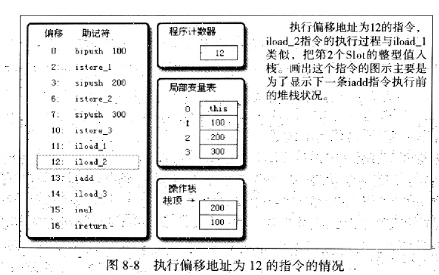

# 虚拟机字节码执行引擎 #

[1.概述](#概述)

[2.运行时栈帧结构](#运行时栈帧结构)

[2.1.局部变量表](#局部变量表)

[2.1.1.重用栈帧节省空间伴随的副作用](#重用栈帧节省空间伴随的副作用)

[2.1.2.局部变量必须亲手初始化](#局部变量必须亲手初始化)

[2.2.操作数栈](#操作数栈)

[2.3.动态链接](#动态链接)

[2.4.方法返回地址](#方法返回地址)

[2.5.附加信息](#附加信息)

[3.方法调用](#方法调用)

[3.1.解析](#解析)

[3.2.分派](#分派)

[3.2.1.静态分派](#静态分派)

[3.2.2.重载方法匹配优先级](#重载方法匹配优先级)

[3.2.2.1.例程分析](#例程分析)

[3.2.3.动态分配](#动态分配)

[3.2.4.单分派与多分派](#单分派与多分派)

[3.2.5.虚拟机动态分配的实现](#虚拟机动态分配的实现)

[3.3.动态类型语言支持](#动态类型语言支持)

[3.3.1.动态类型语言](#动态类型语言)

[3.3.1.1.什么是编译器/运行期进行](#什么是编译器/运行期进行)

[3.3.1.2.什么是类型检查](#什么是类型检查)

[3.3.2.JDK1.7与动态类型](#jdk17与动态类型)

[3.3.3.java.lang.invoke包](#javalanginvoke包)

[3.3.3.1.MethodHandle与Reflection区别](#methodhandle与reflection区别)

[3.3.4.invokedynamic指令](#invokedynamic指令)

[3.3.5.掌控方法分派规则](#掌控方法分派规则)

[4.基于栈的字节码解释执行引擎](#基于栈的字节码解释执行引擎)

[4.1.解释执行](#解释执行)

[4.2.基于栈的指令集与寄存器的指令集](#基于栈的指令集与寄存器的指令集)

[4.2.1.基于栈的指令集与基于寄存器的指令集这两者之间的不同](#基于栈的指令集与基于寄存器的指令集这两者之间的不同)

[4.2.2.基于栈的指令集与基于寄存器的指令集的特点](#基于栈的指令集与基于寄存器的指令集的特点)

[4.3.基于栈的解释器执行过程](#基于栈的解释器执行过程)

## 概述 ##

执行引擎是Java虚拟机最核心的组成部分之一。“虚拟机”是一个相对于“物理机”的概念，这两种机器都有代码执行能力，其**区别**是

- 物理机的执行引擎是直接建立在处理器、硬件、指令集和操作系统的层面上的，
- 虚拟机的执行引擎则是由自己实现的，因此可以自行制定指令集与执行引擎的结构体系，并且能够执行那些不被硬件直接支持的指令集格式。

在Java虚拟机规范中制定了虚拟机字节码执行引擎的概念模型，这个概念模型称为各种虚拟机执行引擎的**统一外观Facade**。

在不同的虚拟机实现里面，执行引擎在执行Java代码的时候可能会有解释执行（通过解释器执行）和编译执行（通过即时编译器产生本地代码执行）两种选择，也可能两者兼备，甚至是还可能会包含几个不同级别的编译器执行引擎。

但从外观上看起来，所有的Java虚拟机的执行引擎都是一致的：输入的是字节码文件，处理过程是字节码解析的等效过程，输出的是执行结果，本章将主要从概念模型的角度来讲解虚拟机的方法调用和字节码执行。

## 运行时栈帧结构 ##

栈帧Stack Frame是用于支持虚拟机进行方法调用和方法执行的数据结构，它是虚拟机运行时数据区中的虚拟机栈的栈元素。栈帧存储了方法的

1. 局部变量表、
2. 操作数栈、
3. 动态连接
4. 方法返回地址
5. ...

**每一个方法从调用开始至执行完成的过程，都对应着一个栈帧在虚拟机栈里面从入栈到出栈的过程**。

每一个栈帧都包括了局部变量表、操作数栈、动态连接、方法返回地址和一些额外的附加信息。在编译程序代码的时候，栈帧中需要多大的局部变量表，多深的操作数栈都是完全确定的，并且写入到方法表的Code属性之中，因此**一个栈帧需要分配多少内存，不会受到程序运行期变量数据的影响，而仅仅取决于具体的虚拟机实现**。

一个线程中方法的调用链可能会很长，很多方法都同时处于执行状态。对于执行引擎来说，在活动线程中，只有位于**栈顶**的栈帧才是有效的，称为**当前栈帧Current Stack Frame**，与这个栈帧相关联的方法，称为**当前方法Current Method**。

执行引擎运行的所有字节码指令都只针对当前栈帧进行操作，在概念模型上，典型的栈帧结构如下图所示：

### 局部变量表 ###

局部变量表Local Variable Table是一组值的存储空间，用于存放方法参数和方法内部定义的局部变量表。在Java程序编译为Class文件时，就在方法的Code属性的max_locals数据项中确定了该方法所需要分配的局部变量表的最大容量。

局部变量表的容量以(变量槽Variable Slot，下称**Slot**)为最小单位，虚拟机范围中**并没有明确指明一个Slot应占用的内存空间大小**，只是很有导向性地说到每个Slot都应该能存放一个boolean、byte、char、short、int、float、reference或returnAddress类型的数据，这8种数据类型，都可以使用32位或更小的物理内存来存放，但这种描述与明确指出“每个Slot占用32位长度的内存空间”是有一些差别的，它允许Slot的长度可以随着处理器、操作系统或虚拟机的不同而发生变化。

只要保证即使在64位虚拟机中使用了64位的物理内存空间取实现一个Slot，**虚拟机仍要使用对齐和补白的手段让Slot在外观上看起来与32位虚拟机中的一致**。

>PS.这显得很浪费

---

Java虚拟机的数据类型：一个Slot可以存放一个32位以内的数据类型，Java中占用32位以内的数据类型有boolean、byte、char、short、int、float、reference和returnAddress 8种类型。

**前面6种**boolean、byte、char、short、int、float我们可以按照Java语言中对应的数据类型的概念去理解它们（注意：仅是这样理解而已，Java语言与Java虚拟机中的基本数据类型是存在本质差别的）。

而**第7种**reference（32位和64位都有可能）类型表示对一个对象实例的引用，虚拟机规范既没有说明它的长度，也没有明确指出这种引用应有怎样的结构。但一般来说，虚拟机实现至少都应当能通过这个引用做到两点：

1. 是从此引用中直接或间接地查找到对象在**Java堆**中的数据存放的起始地址的索引
2. 是此引用中直接或间接地查找到对象所属数据类型在**方法区**中的存储的类型信息，否则无法实现Java语言规范中定义的语法约束。

**第8种**即returnAddress类型目前已经**很少见**了，它是为字节码指令jsr、jsr_w和ret服务的，指向了一条字节码指令的地址，很古老的JVM曾经使用这几条指令来实现异常处理，现在已经由**异常表**代替。

对于64位的数据类型，**虚拟机会以高位对齐的方式为其分配两个连续的Slot空间**。Java语言中明确的64位类型只有long和double两种，把long和double数据类型分割存储的做法与“long和double的非原子性协定”中把一次long和double数据类型读写分割为两次32位读写的做法有些类似，可以与Java内存模型做一个对比。

不过，由于**局部变量表建立在线程的堆栈**上，是线程私有的数据，无论读写两个连续的Slot是否为原子操作，都**不会**引起数据安全问题。

---

虚拟机通过索引定位的方式使用**局部变量表**，索引值的范围是从0开始至局部变量表最大的Slot数量。如果访问的是32位数据类型的变量，索引n就代表了使用第n个Slot，如果是64位数据类型的变量，则说明会同时使用n和n+1两个Slot。对于两个相邻的共同存放一个**64位数据的两个Slot**，**不允许采用任何方式单独访问其中的某一个**，Java虚拟机规范中明确要求了如果遇到进行这种操作的字节码序列，虚拟机应该在类加载的校验阶段抛出异常。

>PS. 64位数据的两个Slot是**命运共同体**

在方法执行时，虚拟机是使用局部变量表完成参数值到参数变量列表的传递过程的，如果执行的是实例方法（非static的方法），那局部变量表中的**第0位索引的Slot默认是用于传递方法所属对象实例的引用，在方法中可以通过关键字“this”来访问到这个隐含的参数**。其余参数则按照参数表顺序排列，占用从1开始的局部变量Slot，参数表分配完毕后，再根据方法体内部定义的变量顺序和作用域分配其余的Slot。

#### 重用栈帧节省空间伴随的副作用 ####

为了尽可能节省栈帧空间，**局部变量表中的Slot是可以重用的**，方法体中定义的变量，其作用域不一定会覆盖整个方法体，如果当前字节码PC计数器的值已经超出了某个变量的作用域，那这个变量对应的Slot就可以交给其他变量使用。不过，这样的设计出了节省栈帧空间以外，还会**伴随一些额外的副作用**，例如，在某些情况下，Slot的复用会直接影响到系统的垃圾收集行为，请看下面3个Demo

	public static void main(String []args){
		byte[] placeholder = new byte[64 * 1024 * 1024];
		System.gc();
	}

如上代码清单中的代码很简单，向内存填充了64MB的数据，然后通知虚拟机进行垃圾收集。我们在虚拟机运行参数中加上“-verbose:gc”来看看垃圾收集的过程，发现在System.gc()运行后并没有回收掉这64MB的内存，下面是运行的结果： 

	[GC 66846K->65824K（125632K），0.0032678 secs]
	[Full GC 65824K->65746K（125632K），0.0064131 secs]

---

没有回收placeholder所占的内存能说得过去，因为在执行System.gc（）时，变量placeholder还处于作用域之内，虚拟机自然不敢回收placeholder的内存。那我们把代码修改一下，变成下面代码。

	public static void main(String []args){
	{
			byte[] placeholder = new byte[64 * 1024 * 1024];
		}
		System.gc();
	}

加入了花括号之后，placeholder的作用域被限制在花括号之内，从代码逻辑上讲，在执行System.gc()的时候，placeholder已经不可能再被访问了，但执行一下这段程序，会发现运行结果如下，还是有64MB的内存**没有被回收掉**，这又是为什么呢？ 

	[GC 66846K->65888K（125632K），0.0009397 secs]
	[Full GC 65888K->65746K（125632K），0.0051574 secs]

---

在解释为什么之前，我们先对这段代码进行第二次修改，在调用System.gc()之前加入一行代码“int a = 0;”，变成如下代码清单的样子：

	public static void main（String[] args）{
		{
			byte[] placeholder = new byte[64*1024*1024];
		}
		
		int a=0;
		System.gc();
	}

这个修改看起来很莫名其妙，但运行一下程序，却发现**这次内存真的被正确回收了**。

	[GC 66401K->65778K（125632K），0.0035471 secs]
	[Full GC 65778K->218K（125632K），0.0140596 secs]

在上面的3个代码清单中，placeholder能否被回收的根本原因是：**局部变量表中的Slot是否还存有关于placeholder数组对象的引用**。在第一次修改中，代码虽然已经离开了placeholder的作用域，但在此后，没有任何对局部变量表的读写操作，placeholder原本所占用的Slot还没有被其他变量所复用，所以作为GC Roots一部分的局部变量表仍然保持着对它的关联。**这种关联没有被及时打断，在绝大部分情况下影响都是很轻微的**。

但如果遇到一个方法，其后面的代码有一些耗时很长的操作，而前面又定义了占用了大量内存、实际上已经不会在使用的变量，手动将其设置为null值（用来代替那句int a = 0，把变量对应的局部变量表Slot清空）便不见得是一个绝对无意义的操作，这种操作可以作为一种在极特殊情形（对象占用内存大、此方法的栈帧长时间不能被回收、方法调用次数达不到JIT的编译条件）下的“奇技”来使用。

Java语言的一本非常著名的书籍《Practical Java》中把“**不使用的对象手动赋值为null**”作为一条推荐的编码规则，但是并没有解释具体原因，很长时间之内都有读者对这条规则感到疑惑。

---

虽然上面的3个代码示例说明了赋null值的操作在某些情况下确实是有用的，但JVM作者观点是不应当对赋null值的操作有过多的依赖，**更没有必要把它当做一个普遍的编码规则来推广**。

原因有两点：

1. 从编码的角度讲，以恰当的变量作用域来控制变量回收时间才是最优雅的解决方法（代码3的场景并不多见且不优雅）。

2. 更关键的是，从执行角度来讲，使用赋null值的操作来优化内存回收是建立在对字节码执行引擎概念模型的理解之上的。在虚拟机使用解释器执行时，通常与概念模型还比较接近，但经过JIT编译器后，才是虚拟机执行代码的主要方式，**赋null值的操作在经过JIT编译优化后就会被消除掉**，这时候将变量设置为null就是没有意义的。
 
**字节码被编译为本地代码后**，对GC Roots的枚举也与解释执行时期有巨大的差别，以前面的例子来看，代码2在经过JIT编译后，System.gc()执行时就可以正确地回收掉内存，无须写成代码清单3的样子。

#### 局部变量必须亲手初始化 ####

关于局部变量表，还有一点可能会对实际开发产生影响，就是局部变量不像前面介绍的类变量那样存在“准备阶段”。已经知道类变量有两次赋初始值的过程，

- 一次在准备阶段，赋予系统初始值；
- 另一次在初始化阶段，赋予程序员定义的初始值。
 
因此，即使在初始化阶段程序员没有为类变量赋值也无关，类变量仍然具有一个确定的初始值。**但局部变量就不一样**，如果一个局部变量定义了但没有赋予初始值是不能使用的，不要认为Java中任何情况下都存在诸如整形变量默认为0，布尔变量默认为false等这样类似的默认值初始化。

在下面代码中，程序其实并不能运行，还好编译器能在编译期间就检查到并提示这一点，即便编译能通过或者手动生成字节码的方式制造出下面代码的效果，字节码检验的时候也会被虚拟机发现而导致类加载失败。

	public static void main(String []args){
		int a;//未赋值的局部变量
		System.out.println(a);
	}

### 操作数栈 ###

操作数栈也常称为操作栈，它是一个后入先出（Last In First Out，LIFO）栈。同局部变量表一样，操作数栈的最大深度也在编译的时候写入到Code属性的max_stacks数据项中。操作数栈的每一个元素可以是任意的Java数据类型，包括long和double。32位数据类型所占的栈容量为1，64位数据类型所占的栈容量为2。在方法执行的任何时候，操作数栈的深度都不会超过在max_stacks数据项中设定的最大值。

**当一个方法刚刚开始执行的时候，这个方法的操作数栈是空的**，在方法的执行过程中，会有各种字节码指令往操作数栈中写入和提取内容，**也就是出栈/入栈操作**。例如，在做算术运算的时候是通过操作数栈来进行的，又或者在调用其他方法的时候是通过操作数栈来进行参数传递的。

**举个例子**，整数加法的字节码指令iadd在运行的时候操作数栈中最接近栈顶的两个元素已经存入了两个int型的数值，当执行这个指令时，会将这两个int值出栈并相加，然后将相加的结构入栈。

---

**操作数栈中元素的数据类型必须与字节码指令的序列严格匹配**，在编译程序代码的时候，编译器要严格保证这一点，在类校验阶段的数据流分析中还要再次验证这一点。再以上面的iadd指令为例，这个指令用于整型数加法，它在执行时，最接近栈顶的两个元素的数据类型必须为int型，不能出现一个long和一个float使用iadd命令相加的情况。

另外，在概念模型中，两个栈帧作为虚拟机栈的元素，是完全相互独立的。但在大多虚拟机的实现里都会做一些优化处理，令两个栈帧出现一部分重叠。让下面栈帧的部分操作数栈与上面栈帧的部分局部变量表重叠在一起，这样在进行方法调用时就可以共用一部分数据，无须进行额外的参数复制传递，重叠过程如下图所示：

Java虚拟机的解释执行引擎称为“基于栈的执行引擎”，其中所指的“栈”就是操作数栈。

### 动态链接 ###

每个栈帧都包含一个指向运行时**常量池**中该栈帧所属方法的引用，持有这个引用是为了支持方法调用过程中的动态连接（Dynamic Linking）。Class文件的常量池中存放有大量的符号引用，字节码中的方法调用指令就以常量池中指向方法的符号引用作为参数。

这些符号引用一部分会在类加载阶段或者第一次使用的时候就转化为直接引用，这种转化称为**静态解析**。

另外一部分将在每一次运行期间转化为直接引用，这部分称为**动态连接**。

### 方法返回地址 ###

当一个方法开始执行后，只有两种方式可以退出这个方法。

1. 第一种方式是执行引擎遇到任意一个方法返回的字节码指令，这时候可能会有返回值传递给上层的方法调用者（调用当前方法的方法称为调用者），是否有返回值和返回值的类型将根据遇到何种方法返回指令来决定，这种退出的方式成为**正常完成出口**（Normal Method Invocation Completion）。

2. 另外一种退出方式是：在方法执行过程中遇到了异常，并且这个异常没有在方法体内得到处理，无论是Java虚拟机内部产生的异常，还是代码中使用athrow字节码指令产生的异常，只要在本方法的异常表中没有搜索到匹配的异常处理器，就会导致方法退出，这种退出方法的方式称为**异常完成出口**（Abrupt Method Invocation Completion）。一个方法使用异常完成出口的方式退出，是不会给它的上层调用者产生任何返回值的。

无论采用何种退出方式，在方法退出之后，**都需要返回到方法被调用的位置**，程序才能继续执行，方法返回时可能需要在栈帧中保存一些信息，用来帮助恢复它的上层方法的执行状态。一般来说，方法正常退出时，调用者的PC计数器的值可以做诶返回地址，栈帧中很可能会保存这个计数器值。而方法异常退出时，返回地址是要通过异常处理器表来确定的，栈帧中一般不会保存这部分信息。

方法退出的过程实际上就等同于把当前**栈帧出栈**，因此退出时可能执行的操作有：恢复上层方法的局部变量表和操作数栈，把返回值（如果有的话）压入调用者栈帧的操作数栈中，调整PC计数器的值以指向方法调用指令后面的一条指令等。

### 附加信息 ###

虚拟机规范允许具体的虚拟机实现增加一些规范里没有描述的信息到栈帧之中，例如与调试相关的信息，这部分信息完全取决于具体的虚拟机实现，这里不再详述。在实际开发中，一般会把动态连接、方法返回地址与其他附加信息完全归为一类，称为栈帧信息。

## 方法调用 ##

**方法调用并不等同于方法执行，方法调用阶段唯一的任务就是确定被调用方法的版本（即调用哪一个方法），暂时还不涉及方法内部的具体运行过程**。在程序运行时，进行方法调用是最普遍、最频繁的操作，但前面已经说过，Class文件的编译过程中不包含传统编译中的连接步骤，一切方法调用在Class文件里面存储的都**只是符号引用**，而不是方法在实际运行时内存布局中的入口地址（相当于之前说的直接引用）。这个特性给Java带来了更强大的动态扩展能力，但也使得Java方法调用过程变得相对复杂起来，需要在类加载期间，甚至到运行期间才能确定目标方法的直接引用。

### 解析 ###

所有方法调用中的目标方法在Class文件里面都是一个常量池中的符号引用，**在类加载的解析阶段，会将其中的一部分符号引用转化为直接引用**，这种解析能成立的前提是：方法在程序真正运行之前就有一个可确定的调用版本，并且这个方法的调用版本在运行期是不可能改变的。**换句话说，调用目标在程序代码写好、编译器进行编译时就必须确定下来**。这类方法的调用称为解析（Resolution）

>PS. 与重载和重写的对比理解

在Java语言中符合“编译期可知，运行期不可变”这个要求的方法，主要包括静态方法和私有方法两大类，前者与类型直接关联，后者在外部不可被访问，这两种方法各自的特点决定了它们都不可能通过集成或别的方式重写其他版本，因此它们都适合在类加载阶段进行解析。

与之相对应的是，在Java虚拟机里面提供了5条方法调用字节码指令，分别如下。

1. invokestatic：调用静态方法；

2. invokespecial：调用实例构造器<init>方法、私有方法和父类方法；

3. invokevirtual：调用所有的虚方法；

4. invokeinterface：调用接口方法，会在运行时再确定一个实现此接口的对象；

5. invokedynamic：先在运行时动态解析出调用掉限定符所引用的方法，然后再执行该方法，在此之前的4条调用指令，分派逻辑是固化在Java虚拟机内部的，而invokedynamic指令的分派逻辑是由用户所设定的引导方法决定的。

[Link](../c06#方法调用和访问指令)

只要能被invokestatic和invokespecial指令调用的方法，都可以在解析阶段中确定唯一的调用版本，符合这个条件的有4类：

1. 静态方法、
2. 私有方法、
3. 实例构造器、
4. 父类方法

它们在类加载的时候就会把符号引用解析为该方法的直接引用。这些方法可以称为非虚方法，

与之相反，其他方法称为虚方法（除去final方法，后文会提到）。下面代码演示了一个最常见的解析调用的例子，在此样例中，静态方法sayHello()只可能属于类型StaticResolution，没有任何手段可以覆盖或隐藏这个方法。

	public class StaticResolution {
	
		public static void sayHello(){
			System.out.println("hello world");
		}
		public static void main(String[] args) {
			StaticResolution.sayHello();
		}
	}

使用javap命令查看这字节码，会发现的确是通过invokestatic命令来调用sayHello()的

	...
	public static void main(java.lang.String[]);
	descriptor: ([Ljava/lang/String;)V
	flags: ACC_PUBLIC, ACC_STATIC
	Code:
	  stack=0, locals=1, args_size=1
	     0: invokestatic  #31                 // Method sayHello:()V
	     3: return
	  LineNumberTable:
	    line 10: 0
	    line 11: 3
	  LocalVariableTable:
	    Start  Length  Slot  Name   Signature
	        0       4     0  args   [Ljava/lang/String;
	...

Java中的非虚方法除了使用invokestatic、invokespecial调用的方法之外还有一种，就是被**final**修饰的方法。虽然final方法是使用**invokevirtual**指令来调用的，但是由于它无法被覆盖，没有其他版本，所以也无须对方法接收者进行多态选择，又或者说多态选择的结果肯定是唯一的。**在Java语言规范中明确说明了final方法是一种非虚方法**。

**解析调用一定是个静态的过程，在编译期间就完全确定，在类加载的解析阶段就会把涉及的符号引用全部转变为可确定的直接引用，不会延迟到运行期再去完成**。而分配（Dispatch）调用则可能是静态的也可能是动态的，根据分配依据的宗量数可分为单分派和多分派。这两类分配方式的两两组合就构成了静态单分派、静态多分派、动态单分派、动态多分派4种分配组合情况，下面看虚拟机中的方法分派是如何进行的。

### 分派 ###

本节讲解的分派调用过程将会揭示多态性特征的一些最基本的体现，如“重载”和“重写”在Java虚拟机之中是如何实现的。

#### 静态分派 ####

[方法静态分派演示代码](StaticDispatch.java)

运行结果：

	hello,guy!
	hello,guy!

**上面的代码为什么会选择执行参数类型为Human的重载呢？**在解决这个问题之前，我们先按如下代码定义两个重要的概念。

	//▼Static Type or Apparent Type
	Human man = new Man();
	//			▲Actual Type

上面的代码中的“Human”称为变量的静态类型（Static Type），或者叫做的外观类型（Apparent Type），后面的“Man”则称为变量的实际类型（Actual Type），静态类型和实际类型在程序中都可以发生一些变化，区别是静态类型的变化仅仅在使用时发生，变量本身的静态类型不会被改变，并且最终的静态类型是在编译期可知的；而实际类型变化的结果在运行期才可确定，**编译期在编译程序的时候并不知道一个对象的实际类型是什么**。例如下面代码：

	//实际类型变化
	Human man = new Man();
	man = new Woman();
	//静态类型变化
	sd.sayHello((Man)man);
	sd.sayHello((Woman)man);

[方法静态分派演示代码](StaticDispatch.java)的main()里面的两次sayHello()方法调用，在方法接收者已经确定是对象“sd”的前提下，使用哪个重载版本，就完全取决于传入参数的数量和数据类型。

代码中刻意地定义了两个静态类型相同但实际类型不同的变量，但虚拟机（准确地说是编译器）在重载时是通过参数的静态类型而不是实际类型作为判定依据的。并且静态类型是编译期可知的，因此，在编译阶段，**Javac编译期会根据参数的静态类型决定使用哪个重载版本**，所以选择了sayHello(Human)作为调用目标，并把这个方法的符号引用写到main()方法里的两条invokevirtual指令的参数中。

#### 重载方法匹配优先级 ####

所有依赖静态类型来定位方法执行版本的分派动作称为**静态分派**。静态分派的典型应用是**方法重载Overload**。**静态分派发生在编译阶段，因此确定静态分派的动作实际上不是由虚拟机来执行的**。

另外，编译器虽然能确定出方法的重载版本，但在很多情况下这个重载版本并不是“唯一的”，往往只能确定一个“更加合适的”版本。这种模糊的结论在由0和1构成的计算机世界中算是比较“稀罕”的事情，产生这种模糊结论的主要原因是字面量不需要定义，所以字面量没有显示的静态类型，它的静态类型只能通过语言上的规则去理解和推断。下面代码演示了何为“更加合适的”版本。

[Overload](Overload.java)

##### 例程分析 #####

###### 一 ######

上面程序运行结果

	hello char

因为‘a’是一个char类型的数据，自然会寻找参数类型为char的重载方法，

###### 二 ######

如果注释掉sayHello(char arg)方法，那输出会变为：

	hello int

这时发生了一次自动类型转化，‘a’除了可以代表一个字符串，还可以代表数字97（字符‘a’的Unicode数值为十进制数字97），因此参数类型为int的重载也是合适的。

###### 三 ######

继续注释掉sayHello(int arg)方法，那输出会变为：

	hello long

这时发生了两次自动类型转换，‘a’转型为整数97之后，进一步转型为长整数97L，匹配了参数类型为long的重载。笔者在代码中没有写其他的类型如float、double等的重载，不过实际上自动转型还能继续发生多次，按照char-&gt;int-&gt;long-&gt;float-&gt;double的顺序转型进行匹配。但不会匹配到byte和short类型的重载，因为char到byte或short的转型是不安全的。

###### 四 ######

继续注释掉sayHello(long arg)方法，那输出会变为：

	hello Character
        
这时发生了一次自动装箱，‘a’被包装为它的封装类型java.lang.Character，所以匹配到了参数类型为Character的重载

###### 五 ######

继续注释掉sayHello(Character arg)方法，那输出会变为：

	hello Serializable

这个输出可能会让人疑惑，**一个字符或数字与序列化有什么关系**？

出现hello Serializable，是因为java.lang.Serializable是java.lang.Character类出现的一个接口，当自动装箱之后，发现还是找不到装箱类，但是找到了装箱类实现了的接口类型，所以紧接着又发生一次自动转型。char可以转型成int，但是Character是绝对不会转型为Integer的，它只能安全地转型为它实现的接口或父类。

Character还实现了另外一个接口java.lang.Comparable<Character&gt;，如果同时出现两个参数分别为Serializable和Comparable<Character&gt;的重载方法，那它们在此时的优先级是一样的。

编译器无法确定要自动转型为哪种类型，会提示类型模糊，拒绝编译。程序必须在调用时显示地指令字面量的静态类型，如：sayHello((Comparable<Character&gt;)''a)，才能编译通过。

###### 六 ######

下面继续注释掉sayHello(Serializable arg)方法，输出会变为：

	hello Object

这时是char装箱后转型为父类了，如果有多个父类，那将在继承关系中从下往上开始搜索，越接近上层的优先级越低。即使方法调用传入的参数值为null时，这个规则仍然适用。

###### 七 ######

把sayHello(Object arg)也注释掉，输出将会变为：

	hello char...

###### 静态分配小结 ######

7个重载方法已经被注释得只剩一个了，可见变长参数的重载优先级是最低的，这时候字符‘a’被当做一个数组元素。JVM作者使用的是char类型的变长参数，读者在验证时还可以选择int类型、Character类型、Object类型等的变长参数重载来把上面的过程重新演示一遍。但要注意的是，有一些在单个参数中能成立的自动转型，如char转型为int，在变长参数中是不成立的。

上面的代码演示了编译期间选择**静态分派**目标的过程，这个过程也是Java语言实现方法重载的本质。演示所用的这段程序属于很**极端的例子**，除了用做面试题为难求职者以外，在实际工作中几乎不可能有实际用途。JVM笔者拿来做演示仅仅是用于讲解重载时目标方法选择的过程，大部分情况下进行这样极端的重载都可算是真正的“**关于茴香豆的茴有几种写法的研究**”。无论对重载的认识有多么深刻，一个合格的程序员都不应该在实际应用中写出如此极端的重载代码。

另外还有一点可能比较容易混淆：上述的**解析**与**分配**这两者之间的关系并不是二选一的排他关系，它们是在不同层次上去筛选、确定目标方法的过程。例如，前面说过，静态方法会在类加载期就进行**解析**，而静态方法显然也是可以拥有重载版本的，选择重载版本的过程也是通过静态分派完成的。

#### 动态分配 ####

动态分派的过程，它和多态性的另外一个重要体现——**重写**（Override）有着密切的关联。

[方法动态分派例程](DynamicDispatch.java)

运行结果

	man say hello
	woman say hello
	woman say hello

**虚拟机是怎样去调用哪个方法的**？显然这里是不能根据静态类型来决定的，因为静态类型同样都是Human的两个变量man和woman在调用sayHello()方法时执行了不同的行为，并且变量man在两次调用中执行了不同的方法。导致这个现象的原因很明显，是这两个变量的实际类型不同，**Java虚拟机是如何根据实际类型来分派方法执行版本的呢**？使用javap命令输出这段代码的字节码，尝试从中寻找答案。

	  public static void main(java.lang.String[]);
	    descriptor: ([Ljava/lang/String;)V
	    flags: ACC_PUBLIC, ACC_STATIC
	    Code:
	      stack=2, locals=3, args_size=1
	         0: new           #16                 // class com/lun/other/jvm/c08/DynamicDispatch$Man
	         3: dup
	         4: invokespecial #18                 // Method com/lun/other/jvm/c08/DynamicDispatch$Man."<init>":()V
	         7: astore_1
	         8: new           #19                 // class com/lun/other/jvm/c08/DynamicDispatch$Woman
	        11: dup
	        12: invokespecial #21                 // Method com/lun/other/jvm/c08/DynamicDispatch$Woman."<init>":()V
	        15: astore_2
			//-------------------------------------------
	        16: aload_1
	        17: invokevirtual #22                 // Method com/lun/other/jvm/c08/DynamicDispatch$Human.sayHello:()V
	        20: aload_2
	        21: invokevirtual #22                 // Method com/lun/other/jvm/c08/DynamicDispatch$Human.sayHello:()V
			//-------------------------------------------
	        24: new           #19                 // class com/lun/other/jvm/c08/DynamicDispatch$Woman
	        27: dup
	        28: invokespecial #21                 // Method com/lun/other/jvm/c08/DynamicDispatch$Woman."<init>":()V
	        31: astore_1
	        32: aload_1
	        33: invokevirtual #22                 // Method com/lun/other/jvm/c08/DynamicDispatch$Human.sayHello:()V
	        36: return
	      LineNumberTable:
	        line 23: 0
	        line 24: 8
	        line 25: 16
	        line 26: 20
	        line 27: 24
	        line 28: 32
	        line 29: 36
	      LocalVariableTable:
	        Start  Length  Slot  Name   Signature
	            0      37     0  args   [Ljava/lang/String;
	            8      29     1   man   Lcom/lun/other/jvm/c08/DynamicDispatch$Human;
	           16      21     2 woman   Lcom/lun/other/jvm/c08/DynamicDispatch$Human;

0 ~ 15行的字节码是准备动作，作用是建立man和woman的内存空间、调用Man和Woman类型的实例构造器，将这两个实例的引用存放在第1、2个局部变量表Slot之中，这个动作也就对应了代码中的这两句：

	Human man = new Man();
	Human woman = new Woman();

16 ~ 21行是关键部分，16、20两句分别把刚刚创建的两个对象的引用压倒栈顶，这两个对象是将要执行的sayHello()方法的所有者，称为接收者（Receiver）：

17和21局是方法调用指令，这两条调用指令单从字节码角度来看，无论是指令（都是invokevirtual）还是参数（都是常量池中第22项的常量，注释显示了这个常量是Human.sayHello()的符号引用）完全一样的，但是这两句指令最终执行的目标方法并不相同。

原因就需要从invokevirtual指令的多态查找过程说起，**invokevirtual指令的运行时解析过程大致分为以下几个步骤**：

1. 找到操作数栈顶的第一个元素所指向的对象的实际类型，记作C。

2. 如果在类型C中找到与常量中的描述符和简单名称都相符的方法，则进行访问权限校验，如果通过则返回这个方法的直接引用，查找过程结束：如果不通过，则返回java.lang.IllegalAccessError异常。

3. 否则，按照继承关系从下往上依次对C的各个父类进行第2步的搜索和校验过程。

4. 如果始终没有找到合适的方法，则抛出java.lang.AbstractMethodError异常。

由于invokevirtual指令执行的第一步就是在运行期确定接收者的实际类型，所以两次调用中的invokevirtual指令把常量池中的类方法符号引用解析到了不同的直接引用上，这个过程就是Java语言中方法**重写**的本质。我们把这种在运行期根据实际类型确定方法执行版本的分配过程称为**动态分派**。

#### 单分派与多分派 ####

**方法的接收者和方法的参数统称为方法的宗量**（该说法最早源于《Java与模式》一书）。

根据分派基于多少种宗量，可以将分派分为**单分派**和**多分派**两种。

- 单分派是根据一个宗量对目标方法进行选择，
- 多分派则是根据多于一个宗量对目标方法进行选择。

通过例程说明**单分派**和**多分派**

[Dispatch](Dispatch.java)

运行结果：

	father choose 360
	son choose qq

在main函数中调用了两次hardChoice()方法，这两次hardChoice()方法的选择结构在程序输出中已经显示得很清楚了。

编译阶段编译器的选择过程，也就是静态分派的过程。这时选择目标方法的依据有两点：一是静态类型是Father还是Son，二是方法参数是QQ还是360。

这次选择结果的最终产物是产生了两条invokevirtual指令，两条指令的参数分别为常量池中指向Father。hardChoice(360)及Father.hardChoice(QQ)方法的符号引用。因为是根据两次宗量进行选择，所以**Java语言的静态分派属于多分派类型**。

再看看运行阶段虚拟机的选择，也就是动态分派的过程。在执行“Son.hardChoice（new QQ()）”这句代码时，更准确地说，是在执行这句代码所对应的invokevirtual指令时，由于**编译期已经决定目标方法的签名**必须为hardChoice（QQ），虚拟机此时不会关心传递过来的参数“QQ”到底是“腾讯QQ”还是“奇瑞QQ”，因为这时参数的静态类型、实际类型都对方法的选择不会构成任何影响，唯一可以影响虚拟机选择的因此只有此方法的接受者的实际类型是Father还是Son。因为只有一个宗量作为选择依据，所以**Java语言的动态分配属于单分派类型**。

根据上述论证的结构，可总结一句：**今天的Java语言是一门静态多分派、动态单分派的语言**。强调“今天的Java语言”是因为这个结论未必会恒久不变，C#在3.0及之前的版本与Java一样是动态单分派语言，但在C#4.0中引入了dynamic类型后，就可以很方便地实现动态多分派。

按照目前Java语言的发展趋势，它并没有直接变为动态语言的迹象，而是通过内置动态语言（如JavaScript）执行引擎的方式来满足动态性的需求。但是Java虚拟机层面上则不是如此，在JDK1.7中实现的JSR-292里面就已经开始提高对动态语言的支持了，JDK1.7中新增的invokedynamic指令也成为了最复杂的一条方法调用的字节码指令。

#### 虚拟机动态分配的实现 ####

于动态分派是非常频繁的动作，而且动态分派的方法版本选择过程需要运行时在类的方法元数据中搜索合适的目标方法，因此在虚拟机的实际实现中基于性能的考虑，大部分实现都不会真正地进行如此频繁的搜索。

面对这种情况，最常用的“**稳定优化**”手段就是为类在方法区中建立一个虚方法表（Virtual Method Table，也称为vtable,与此对应的，在invokeinterface执行时也会用到接口方法表——Interface Method Table，简称itable），使用虚方法表索引来代替元数据查找以提高性能。

>PS.空间换时间

以上面代码清单所对应的虚方法表结构示例，如下图：

虚方法表中存放着各个方法的**实际入口地址**。如果某个方法在子类中没有被重写，那子类的虚方法表里面的地址入口和父类相同的地址入口是一致的，都指向父类的实现入口。如果子类中重写了这个方法，子类方法 表中的地址将会替换为指向子类实现版本的入口地址。

上图中，Son重写了来自Father的全部方法，因此Son的方法表没有指向Father类型数据的箭头。但是Son和Father都没有重写来自Object的方法，所以它们的方法表中所有从Object继承来自的方法都指向了Object的数据类型。

为了程序实现上的方便，具有相同签名的方法，在父类、子类的虚方法表中都应当具有一样的索引序号，这样当类型变换时，仅需要变更查找的方法表，就可以从不同的虚方法表中按索引转换出所需的入口地址。

方法表一般在类加载的连接阶段进行初始化，准备了类的变量初始值后，虚拟机会把该类的方法表也初始化完毕。

方法表还是分派调用的“**稳定优化**”手段，虚拟机除了使用方法表之外，在条件允许的情况下，还会使用**内联缓存**（Inline Cache）和基于“**类型继承关系分析**”（Class Hierarchy Analysis，CHA）技术的守护内联（Guarded Inlining）两种非稳定的“**激进优化**”手段来获得更高的性能。

### 动态类型语言支持 ###

随着JDK 7的发布，字节码指令集终于迎来了第一位新成员——invokedynamic指令。这条新增的指令是JDK 7实现“动态类型语言”（Dynamically Typed Language）支持而进行的改进之一，也是为JDK 8可以顺利实现Lambda表达式做技术准备。

#### 动态类型语言 ####

动态类型语言的关键特征是它的**类型检查**的主题过程是在**运行期**而不是**编译期**，满足这个特征的语言有很多，常用的包括：APL、Clojure、Erlang、Groovy、JavaScript、Jython、Lisp、Lua、PHP、Prolog、Python、Ruby、Smalltalk和Tcl等。相对的，在编译期就进行类型检查过程的语言（如C++和Java等）就是最常用的静态类型语言。

##### 什么是编译器/运行期进行 #####

	public static void main(String []args){
		int[][][] array = new int[1][0][-1];
	}

这段代码能够正常编译，但**运行的时候**会报NegativeArraySizeException异常。在Java虚拟机规范中明确规定了NegativeArraySizeException是一个运行时异常，通俗一点来说，运行时异常就是只要代码不运行到这一行就不会有问题。

与运行时异常相对应的是连接时异常，例如很常见的NoClassDefFoundError便属于连接时异常，即使会导致连接时异常的代码放在一条无法执行到的分支路径上，类加载时（**Java的连接过程不在编译阶段，而在类加载阶段**）也照样会抛出异常。

不过，在C语言中，含义相同的代码会在编译期报错：

	int main(void){
	        int i[1][0][-1]; //GCC拒绝编译，报“Size of array is negative”
	        return 0;
	}

由此看来，**一门语言的哪一种检查行为要在运行期进行，哪一种检查要在编译期进行并没有必然的因果逻辑关系，关键是语言规范中人为规定的**。

##### 什么是类型检查 #####

	obj.println("hello world");

上面代码对于计算机来说，这一行代码“没头没尾”是无法执行的，它需要一个具体的上下文才有讨论的意义。

现在假设这行代码是在Java语言中，并且变量obj的静态类型为java.io.PrintStream，那变量obj的实际类型就必须是PrintStream的子类（实现了PrintStream接口的类）才是合法的。否则，哪怕obj属于一个确实有用println(String)方法，但与PrintStream接口没有继承关系，代码依然不可能运行——因为类型检查不合法。

但是相同的代码在**ECMAScript**（JavaScript）中情况则不一样，无论obj具体是何种类型，只要这种类型的定义确实包含有print(String)方法，那方法便可调用成功。

**这种差别产生的原因**是Java语言在**编译期间**已将println(String)方法完整的符号引用（本例中为一个CONSTANT_InterfaceMethodref_info常量）生成出来的，作为方法调用指令的参数存储到Class文件中，例如下面这段代码：

	invokevirtual #4; //Method java/io/PrintStream.println:(Ljava/lang/String;)V 

这个符号引用包含了此方法定义在哪个具体类型之中、方法的名字以及参数顺序、参数类型和方法返回值等信息，通过这个符号引用，**虚拟机可以翻译出这个方法的直接引用**。

而在ECMAScript等动态类型语言中，变量obj本身是没有类型的，变量obj的值才具有类型，编译时最多只能确定方法名称、参数、返回值这些信息，而不会去确定方法所在的具体类型（**即方法接收者不固定**）。“变量无类型而变量值才有类型”这个特点也是动态类型语言的一个重要特征。

**静态类型**语言在编译期确定类型，最显著的**好处**是编译器可以提供严谨的类型检查，这样与类型相关的问题能在编码的时候就及时发现，利于**稳定**性及代码达到更**大规模**。

而**动态类型**语言在运行期确定类型，这可以为开发人员提供更大的灵活性，某些在静态类型语言中需用大量“臃肿”代码来实现的功能，由动态类型语言来实现可能会更加清晰和简洁，**清晰**和**简洁**通常也就意味着开发效率的提升。(灵活)

#### JDK1.7与动态类型 ####

JVM毫无疑问是Java语言的运行平台，但在1997年出版的《Java虚拟机规范》中就规划了这样一个愿景：“**在未来，我们会对Java虚拟机进行适当的扩展，以便更好地支持其他语言运行于JVM之上**”。而目前确实已经有许多动态类型语言运行于JVM之上，如Clojure、Groovy、Jython和JRuby等，能够在同一个虚拟机上可以达到**静态类型语言的严谨性**与**动态类型语言的灵活性**。

但遗憾的是，Java虚拟机层面对动态类型语言的支持一直都有所欠缺，主要变现在方法调用方面：JDK1.7以前的字节码指令集中，4条方法调用指令（invokevirtual、invokespecial、invokestatic、invokeinterface）的第一个参数都是被调用的方法的符号引用（CONSTANT_Methodref_info或者CONSTANT_InterfaceMethodref_info常量），前面已经提到过，方法的符号引用在编译时产生，而动态类型语言只有在运行期才能确定接收者类型。这样，在Java虚拟机上实现的动态类型语言就不得不使用其他方式（如编译时留个占位符，在运行时动态生成字节码实现具体类型到占位符类型的适配）来实现，这样势必让动态类型语言实现的复杂度增加，也可能带来额外的性能或者内存开销。

尽管可以利用一些办法（如Call Site Caching）让这些开销尽量变小，但这种底层问题终归是应当在虚拟机层次上去解决才最合适，因此在Java虚拟机层面上提供动态类型的直接支持就称为了Java平台的发展趋势之一，这就是JDK1.7（JSR-292）中**invokedynamic**指令以及java.lang.invoke包出现的技术背景。

#### java.lang.invoke包 ####

JDK1.7实现了JSR-292，新加入的java.lang.invoke包就是JSR-292的一个重要组成部分，这个包的主要目的是在之前单纯依靠符号引用来确定调用的目标的方法这种方式以外，提供一种新的动态确定目标方法的机制，称为MethodHandle。

把MethodHandle与C、C++中的Function Pointer，或者C#里面的Delegate类比一下。举个例子，如果我们要实现一个带谓语词的排序函数，在C、C++中常用的做法是把谓语词定义为函数，用函数指针把谓词传递到排序方法，如下：

	void sort(int list[], const int size, int (*compare)(int, int))

但Java语言做不到这一点，即没有办法单独地把一个函数作为参数进行传递。普遍的做法是设计一个带有compare()方法的Comparator接口，以实现了这个接口的对象作为参数，例如Collections.sort()就是这样定义的：

	void sort(List list, Comparator c)

不过，在拥有Method Handle之后，Java语言也可以拥有类似于函数指针或委托的方法别名的工具了。下面代码演示了MethodHandle的基本用途，无论obj是何种类型（临时定义的ClassA抑或是实现PrintStream接口的实现类System.out），都可以正确地调用到println()方法。

[MethodHandleTest](MethodHandleTest.java)

实际上，方法getPrintlnMH()中**模拟**了invokevirtual指令的执行过程，只不过它的分派逻辑并非固化在Class文件的字节码上，而是通过一个具体方法来实现。而这个方法本身的返回值（MethodHandle对象），可以视为对最终调用方法的一个“引用”。以此为基础，有了MethodHandle就可以写出类似于下面这样的函数声明：

	void sort(List list, MethodHandle compare)

从上面的例子可以看出，使用MethodHandle并没有什么困难，不过看完它的用法之后，用反射不是早就可以实现了吗？

##### MethodHandle与Reflection区别 #####

Java语言的角度来看，MethodHandle的使用方法和效果与Reflection有众多相似之处，不过，它们还是有一下这些区别：

1. 从本质上讲，Reflection和MethodHandle机制都是在模拟方法调用，但Reflection是在模拟**Java代码层次**的方法调用，而MethodHandle是在模拟**字节码层次**的方法调用。在MethodHandles.lookup中的3个方法——findStatic()、findVirtual()、findSpecial()正是为了对应于invokestatic、invokevirtual&invokeinterface和invokespecial这几条字节码指令的执行权限校验行为，而这些底层细节在使用Reflection API时是不需要关心的。

2. Reflection中的java.lang.reflect.Method对象远比MethodHandle机制中的java.lang.invoke.MethodHandle对象所包含的信息多。前者是方法在Java一端的全面映像，包含了方法的签名、描述符以及方法属性表中各种属性的Java端表示方式，还包含执行权限等的运行期信息。而后者仅仅包含于执行该方法相关的信息。用通俗的话来讲，Reflection是重量级的，而MethodHandle是轻量级的。

3. 由于MethodHandle是对字节码的方法指令调用的模拟，所以理论上虚拟机在这方面做的各种优化（如方法内联），在MethodHandle上也应当可以采用类似思路去支持（但目前实现还不完善）。而通过反射去调用方法则不行。

仅站在Java的角度来看：Reflection API的设计目标是只为Java语言服务的，而MethodHandle则设计成可服务于所有Java虚拟机之上的语言，其中也包括Java语言。

#### invokedynamic指令 ####

>PS. 本章节有点难懂

在某种程度上，invokedynamic指令与MethodHandle机制的作用是一样的，都是为了解决原有4条“invoke*”指令方法分派规则固化在虚拟机之中的问题，把如何查找木匾方法的决定权从虚拟机转嫁到具体用户代码之中，让用户（包含其他语言的设计者）有更高的自由度。而且，它们两者的思路也是可类比的，可以把它们想象成为了达成同一个目的，一个采用上层Java代码和API来实现，另一个用字节码和Class中其他属性、常量来完成。因此，如果理解了前面的MethodHandle例子，那么理解invokedynamic指令也并不困难。

每一处包含有invokedynamic指令的位置都称做“动态调用掉”（Dynamic Call Site），这条指令的第一个参数不再是代表方法符号引用的CONSTANT_Methodref_info常量，而是变为JDK 1.7新加入的CONSTANT_InvokeDynamic_info常量，从这个新常量中可以得到3项信息：**引导方法**（Bootstrap Method，此方法存放在新增的BootstrapMethods属性中）、**方法类型**（MethodType）和**名称**。

引导方法是有固定的参数，并且返回值是java.lang.invoke.CallSite对象，这个代表真正要执行的目标方法调用。根据CONSTANT_InvokeDynamic_info常量中提供的信息，虚拟机可以找到并且执行引导方法，从而获得一个CallSite对象，最终调用要执行的目标方法。下面代码来解释这个过程：

	import static java.lang.invoke.MethodHandles.lookup;
	
	import java.lang.invoke.CallSite;
	import java.lang.invoke.ConstantCallSite;
	import java.lang.invoke.MethodHandle;
	import java.lang.invoke.MethodHandles;
	import java.lang.invoke.MethodType;
	
	public class InvokeDynamicTest {
	
	    public static void main(String[] args) throws Throwable {
	        INDY_BootstrapMethod().invokeExact("icyfenix");
	    }
	
	    public static void testMethod(String s) {
	        System.out.println("hello String:" + s);
	    }
	    
	    public static CallSite BootstrapMethod(MethodHandles.Lookup lookup, String name, MethodType mt) throws Throwable {
	        return new ConstantCallSite(lookup.findStatic(InvokeDynamicTest.class, name, mt));
	    }
	
	    private static MethodType MT_BootstrapMethod() {
	        return MethodType
	                .fromMethodDescriptorString(
	                        "(Ljava/lang/invoke/MethodHandles$Lookup;Ljava/lang/String;Ljava/lang/invoke/MethodType;)Ljava/lang/invoke/CallSite;",
	                        null);
	    }
	
	    private static MethodHandle MH_BootstrapMethod() throws Throwable {
	        return lookup().findStatic(InvokeDynamicTest.class, "BootstrapMethod", MT_BootstrapMethod());
	    }
	
	    private static MethodHandle INDY_BootstrapMethod() throws Throwable {
	        CallSite cs = (CallSite) MH_BootstrapMethod().invokeWithArguments(lookup(), "testMethod",
	                MethodType.fromMethodDescriptorString("(Ljava/lang/String;)V", null));
	        return cs.dynamicInvoker();
	    }
	}

这段代码与前面MethodHandleTest的作用基本上是一样的。由于invokedynamic指令所面向的使用者并非Java语言，而是其他Java虚拟机之上的动态语言，因此紧靠Java语言的编译器Javac没有办法生成带有invokedynamic指令的字节码，所以要使用Java语言来演示invokedynamic指令只能用一些变通的办法。

John Rose编写了一个把程序的字节码转换为使用invokedynamic的简单工具INDY来完成这件事情，我们要使用这个工具来产生最终要的字节码，因此这个示例代码中的方法名称不能随意改动，更不能把几个方法合并到一起写，因为它们是要被INDY工具读取的。

把上面代码编译、再使用INDY转换后重新生成的字节码如下所示

	Constant pool: 
	    #121 = NameAndType #33:#30 // testMethod:(Ljava/lang/String;)V 
	    #123 = InvokeDynamic #0:#121 // #0:testMethod:(Ljava/lang/String;)V 
	    public static void main(java.lang.String[]) throws java.lang.Throwable; 
	Code: 
	    stack=2, locals=1, args_size=1 
	0: ldc #23 // String abc 
	2: invokedynamic #123, 0 // InvokeDynamic #0:testMethod:(Ljava/lang/String;)V 
	7: nop 
	8: return 
	    public static java.lang.invoke.CallSite BootstrapMethod(java.lang.invoke.MethodHandles$Lookup, java.lang.String, java.lang.invoke.MethodType) throws java.lang.Throwable; 
	Code: 
	    stack=6, locals=3, args_size=3 
	0: new #63 // class java/lang/invoke/ConstantCallSite 
	3: dup 
	4: aload_0 
	5: ldc #1 // class org/fenixsoft/InvokeDynamicTest 
	7: aload_1 
	8: aload_2 
	9: invokevirtual #65 // Method         java/lang/invoke/MethodHandles$Lookup.findStatic:(Ljava/lang/Class;Ljava/lang/String;Ljava/lang/invoke/MethodType;)Ljava/lang/invoke/MethodHandle; 
	12: invokespecial #71 // Method java/lang/invoke/ConstantCallSite."<init>":(Ljava/lang/invoke/MethodHandle;)V 
	15: areturn 

从 main() 方法的字节码中可见，原本的方法调用指令已经被替换为 invokedynamic 了，它的参数为第 123 项常量（第二个值为 0 的参数在 HotSpot 中用不到，与 invokeinterface 那个的值为 0 的参数一样是占位的）：

	2: invokedynamic #123, 0 // InvokeDynamic #0:testMethod:(Ljava/lang/String;)V 

从常量池中可见，第 123 项常量显示“#123 = InvokeDynamic #0:#121”说明它是一项 CONSTANT_InvokeDynamic_info 类型常量，常量值中前面“#0”代表引导方法取 BootstrapMethods 属性表的第 0 项（javap 没有列出属性表的具体内容，不过示例中仅有一个引导方法，即 BootstrapMethod()），**而后面的“#121”代表引用第 121 项类型为 CONSTANT_NameAndType_info 的常量，从个常量中可以获取方法名称和描述符，既后面输出的“testMethod:(Ljava/lang/String;)V”**。

再看 BootstrapMethod()，这个方法 Java 源码中没有，是 INDY 产生的，但是它的字节码很容易读懂，所有逻辑就是调用 MethodHandles$Lookup 的 findStatic() 方法，产生 testMethod() 方法的 MethodHandle，然后用它创建一个 ConstantCallSite 对象。最后，这个对象返回给 invokedynamic 指令实现对 testMethod() 方法的调用，invokedynamic 指令的调用过程到此就宣告完成了。

#### 掌控方法分派规则 ####

**invokedynamic指令与前面4条“invoke*”指令最大的差别就是它的分派逻辑不是由虚拟机决定的，而是由程序员决定的**。

通过一个简单例子，帮助理解程序员在可以掌控方法分派规则之后，能做什么以前无法做到的事情

在Java程序中，可以通过“super”关键字很方便地调用到父类中的方法，但是如果要访问祖类的方法呢？

	class GrandFather {
	    void thinking() {
	        System.out.println("i am grandfather");
	    }
	}
	
	class Father extends GrandFather {
	    void thinking() {
	        System.out.println("i am father");
	    }
	}
	
	class Son extends Father {
	    void thinking() {
	       // 请读者在这里填入适当的代码（不能修改其他地方的代码）
	       // 实现调用祖父类的thinking()方法，打印"i am grandfather"
	   }
	}

JDK1.7之前，使用纯粹的Java语言很难处理这个问题（直接生成字节码就很简单，如使用ASM等字节码工具），原因是在Son类的thinking()方法中无法获取一个实际类型是GrandFather的对象引用，而invokevirtual指令的分派逻辑就是按照方法接收者的实际类型进行分派，这个逻辑在是固化在虚拟机中的，程序员无法改变。上面代码中注释下的代码就是解决这个问题。

[SuperSuper](SuperSuper.java)

>PS.JDK1.8没有输出结果i am grandfather

## 基于栈的字节码解释执行引擎 ##

### 解释执行 ###

Java语言经常被人们定位为“解释执行”的语言，在Java初生的JDK1.0时代，这种定义还算是比较准确的，但当主流的虚拟机中都包含了即时编译器后，Class文件中的代码到底会被解释之星还是编译执行，就成了只有虚拟机自己才能准确判断的事情。再后来，**Java也发展出了可以直接生成本地代码的编译器**，而C、C++语言也出现了通过解释器执行的版本，这时候再笼统地说“解释执行”，对于整个Java语言来说就成了几乎是没有意义的概念，只有确定了谈论对象是某种具体的Java实现版本和执行引擎运行模式时，谈解释执行还是编译执行才会比较确切。

不论是解释还是编译，也不论是物理机还是虚拟机，对于应用程序，机器都不可能如人那样阅读、理解，然后就获得了执行能力。大部分的程序代码到物理机的目标代码或虚拟机能执行的指令集之前，都需要经过下图的各个步骤。下图中下面那条分支，就是传统编译原理中程序代码到目标机器代码的生成过程，而中间的那条分支，自然就是解释执行的过程。

如今，基于物理机、JVM，或者非Java的其他高级语言虚拟机（HLLVM）的语言，大多都会遵循这种基于现代经典编译原理的思路，在执行前先对程序源码进行词法分析和语法分析处理，把源码转化为抽象语法树（Abstract Syntax Tree，AST）。

对于一门具体语言的实现来说，词法分析、语法分析以至后面的优化器和目标代码生成器都可以选择独立于执行引擎，形成一个完整意义的编译器去实现，这类代表是C、C++语言。

也可以选择把其中一部分步骤（如生成抽象语法树之前的步骤）实现为一个半独立的编译器，这类代表是Java语言。又或者把这些步骤和执行引擎全部集中封装在一个封闭的黑匣子之中，如大多数的JavaScript执行器。

### 基于栈的指令集与寄存器的指令集 ###

Java编译器输出的指令流，基本上是一种基于栈的指令集架构（Instruction Set Architecture,ISA），指令流中的指令大部分都是零地址指令，它们依赖操作数栈进行工作。与之相对的另外一套常用的指令集架构是寄存器的指令集，做典型的就是x86的二地址指令集，说得通俗一些，就是现在我们主流PC机中直接支持的指令集架构，这些指令依赖寄存器进行工作。

#### 基于栈的指令集与基于寄存器的指令集这两者之间的不同 ####

举个最简单的例子，分别使用这两种指令集计算“1+1”的结果，基于栈的指令集会是这样子的：

	iconst_1
	iconst_1
	iadd
	istore_0

两条iconst_1指令连续把两个常量1压入栈后，iadd指令把栈顶的两个值出栈、相加，然后把结果放回栈顶，最后istore_0把栈顶的值放到局部变量表的第0个Slot中。

如果基于寄存器，那程序可能会是这个样子：

	mov  eax, 1
	add  exa, 1

mov指令把EAX寄存器的值设为1，然后add指令再把这个值加1，结果就保存在EAX寄存器里面。

#### 基于栈的指令集与基于寄存器的指令集的特点 ####

既然两套指令集会同时并存发展，那肯定是各有优势的，如果有一套指令集全面优于另一套的话，就不会存在选择问题了。

**基于栈的指令集主要的优点**就是**可移植**，寄存器由硬件直接提供，程序直接依赖这些硬件寄存器则不可避免地要收到硬件的约束。例如，现在32位80x86体系的处理器中提供了8个32位的寄存器，而ARM体系的CPU（在当前的手机、PDA中相当流行的一种处理器）则提供了16个32位的通用寄存器。如果使用栈架构的指令集，用户程序不会直接使用这些寄存器，就可以有虚拟机实现来自行决定把一些访问最频繁的数据（程序计数器、栈顶缓存等）方法寄存器中以获取尽量好的性能，这样实现起来也更加简单一些。**栈架构的指令集**还有一些其他的**优点**，如代码相对更加紧凑（字节码中每个字节就对应一条指令，而多地址指令集中还需要存放参数）、编译器实现更加简单（不需要考虑空间分配的问题，所需空间都在站上操作）等。

**栈架构指令集的主要缺点**是执行速度相对来说会**稍慢**一些。所有主流物理机的指令集都是寄存器架构也从侧面印证了这一点。

虽然栈架构指令集的代码非常紧凑，但是完成相同功能所需的指令数量一般会比寄存器架构多，因为出栈，入栈操作本身就产生了相当多的指令数量。更重要的是，栈实现在内存之中，频繁的栈访问也就意味着频繁的内存访问，相对于处理器来说，内存始终是执行那个速度的瓶颈。尽管虚拟机可以采取栈顶缓存的手段，把最常用的操作映射到寄存器中避免直接内存访问，但这也只能是优化措施而不是解决本质问题的方法。由于指令数量和内存访问的原因，所以导致了栈架构的指令集的执行速度会相对较慢。

### 基于栈的解释器执行过程 ###

准备了一段Java代码，看看在虚拟机中实际是如何执行的。

	public class Calc {
		public int calc(){
	        int a = 100;
	        int b = 200;
	        int c = 300;
	        return (a + b) * c;
		}
	}

javap命令看看它的字节码指令

	  public int calc();
	    descriptor: ()I
	    flags: ACC_PUBLIC
	    Code:
	      stack=2, locals=4, args_size=1
	         0: bipush        100
	         2: istore_1
	         3: sipush        200
	         6: istore_2
	         7: sipush        300
	        10: istore_3
	        11: iload_1
	        12: iload_2
	        13: iadd
	        14: iload_3
	        15: imul
	        16: ireturn
	      LineNumberTable:
	        line 5: 0
	        line 6: 3
	        line 7: 7
	        line 8: 11
	      LocalVariableTable:
	        Start  Length  Slot  Name   Signature
	            0      17     0  this   Lcom/lun/other/jvm/c08/Calc;
	            3      14     1     a   I
	            7      10     2     b   I
	           11       6     3     c   I

javap提示这段代码需要深度为2的操作数栈和4个Slot的局部变量空间，根据这些信息画了下面的图，用它们来描述上述执行过程中的代码、操作数栈和局部变量表的变化情况。

上面的执行过程仅仅是一种概念模型，虚拟机最终会对执行过程做一些优化来提高性能，实际的运作过程不一定完全符合概念模型的描述……更准确地说，实际情况会和上面描述的概念模型差距非常大，这种差距产生的原因是虚拟机中解析器和即时编译器都会对输入的字节码进行优化，例如，在 HotSpot 虚拟机中，有很多以 “fast_” 开头的非标准字节码指令用于合并、替换输入的字节码以提升解释执行性能，而即时编译器的优化手段更加花样繁多。

不过，从这段程序的执行中也可以看出栈结构指令集的一般运行过程，整个运算过程的中间变量都以操作数栈的出栈、入栈为信息交换途径，符合前面分析的特点。

