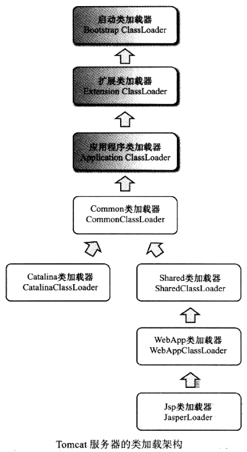
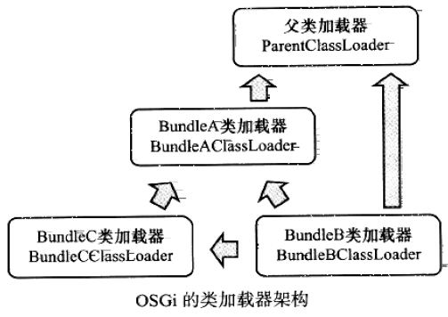
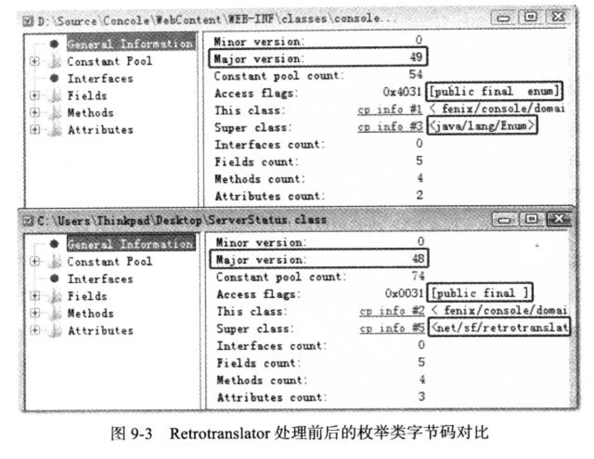

# 类加载及执行子系统的案例与实战 #

[1.概述](#概述)

[2.案例分析](#案例分析)

[2.1.类加载器相关的](#类加载器相关的)

[2.1.1.Tomcat:正统的类加载器架构](#tomcat正统的类加载器架构)

[2.1.2.OSGi:灵活的类加载器架构](#osgi灵活的类加载器架构)

[2.1.2.1.OSGi隐患———死锁](#osgi隐患死锁)

[2.2.字节码相关的](#字节码相关的)

[2.2.1.字节码生成技术与动态代理的实现](#字节码生成技术与动态代理的实现)

[2.2.2.Retrotranslator：跨越JDK版本](#retrotranslator跨越jdk版本)

[3.实战：自己动手实现远程执行功能](#实战自己动手实现远程执行功能)

[3.1.目标](#目标)

[3.2.思路](#思路)

[3.3.实现](#实现)

[3.4.验证](#验证)

[4.小结](#小结)

## 概述 ##

在Class文件格式与执行引擎这部分中，用户的程序能直接影响的内容并不太多，Class文件以何种格式存储，类型何时加载、如何连接，以及虚拟机如何执行字节码指令等都是由虚拟机直接控制的行为，**用户程序**无法对其进行改变。能通过程序进行操作的，主要是**字节码生成**与**类加载器**这两部分的功能，但仅仅在如何处理这两点上，就已经出现了许多值得欣赏和借鉴的思路，这些思路后来成为了许多常用功能和程序实现的基础。

## 案例分析 ##

### 类加载器相关的 ###

#### Tomcat:正统的类加载器架构 ####

主流的Java Web服务器 ，如Tomcat、Jetty、WebLogic、WebSphere等都实现了自己定义的类加载器(一般都不止一个)。因为一个功能健全的Web服务器，要解决如下几个问题:

- **部署在同一个服务器上的两个Web应用程序所使用的Java类库可以实现相互隔离**。这是最基本的需求，两个不同的应用程序可能会依赖同一个第三方类库的不同版本，不能要求一个类库在一个服务器中只有一份，服务器应当保证两个应用程序的类库可以互相独立使用。

- **部署在同一个服务器上的两个Web应用程序所使用的Java类库可以互相共享**。这个需求也很常见，例如，用户可能有10个使用Spring组织的应用程序部署在同一台服务器上，如果把10份Spring分别存放在各个应用程序的隔离目录中，将会是很大的资源浪费——这主要倒不是浪费磁盘空间的问题，而是指类库在使用时都要被加载到服务器内存，如果类库不能共享，虚拟机的方法区就会很容易出现过度膨胀的风险。

- **服务器需要尽可能地保证自身的安全不受部署的Web应用程序影响**。目前，有许多主流的Java Web服务器自身也是使用Java语言来实现的。因此 ，服务器本身也有类库依赖的问题，一般来说，基于安全考虑，服务器所使用的类库应该与应用程序的类库互相独立。

- **支持JSP应用的Web服务器 ，大多数都需要支持HotSwap功能**。我们知道，JSP文件最终要编译成Java Class才能由虚拟机执行，但JSP文件由于其纯文本存储的特性，运行时修改的概率远远大于第三方类库或程序自身的Class文件。而且ASP、PHP和JSP这些网页应用也把修改后无须重启作为一个很大的“优势”来看待，因此“主流”的Web服务器都会支持JSP生成类的热替换，当然也有“非主流”的 ，如运行在生产模式( Production Mode ) 下的WebLogic服务器默认就不会处理JSP文件的变化。

---

由于存在上述问题，在部署Web应用时，单独的一个ClassPath就无法满足需求了，所以各种Web服务器都“不约而同”地提供了好几个ClassPath路径供用户存放第三方类库，这些路径一般都以“lib”或“classes”命名。被放置到不同路径中的类库，具备不同的访问范围和服务对象，通常，每一个目录都会有一个相应的自定义类加载器去加载放置在里面的Java类库。现在，就以Tomcat服务器为例，看一看Tomcat具体是如何规划用户类库结构和类加载器的。

在Tomcat5目录结构中，有3组目录(“/common/\*”、“/server/\*”和“/shared/\*”)可以存放Java类库，另外还可以加上Web应用程序自身的目录“/WEB-INF/\*” ，一共4组，把Java类库放置在这些目录中的含义分别如下。

- 放置在/common目录中:类库可被Tomcat和所有的Web应用程序共同使用。
- 放置在/server目录中：类库可被Tomcat使用，对所有的Web应用程序都不可见。
- 放置在/shared目录中:类库可被所有的Web应用程序共同使用，但对Tomcat自己不可见。
- 放置在/WebApp/WEB-INF目录中:类库仅仅可以被此Web应用程序使用，对Tomcat和其他Web应用程序都不可见。

为了支持这套目录结构，并对目录里面的类库进行加载和隔离，Tomcat自定义了多个类加载器，这些类加载器按照经典的双亲委派模型来实现，其关系如下图所示。

灰色背景的3个类加载器是JDK默认提供的类加载器，这3个加载器的作用在第7章中已经介绍过了。而CommonClassLoader、CatalinaClassLoader、SharedClassLoader和WebappClassLoader则是Tomcat自己定义的类加载器，它们分别加载/common/\*、/server/\*、 /shared/\*和/WebApp/WEB-INF/*中的Java类库。其中WebApp类加载器和Jsp类加载器通常会存在多个实例，每一个Web应用程序对应一个WebApp类加载器，每一个JSP文件对应一个Jsp类加载器。

从上图的委派关系可以看出，CommonClassLoader能加载的类都可以被Catalina ClassLoader和SharedClassLoader使用 ，而CatalinaClassLoader和SharedClassLoader自己能加载的类则与对方相互隔离。WebAppClassLoader可以使用SharedClassLoader加载到的类，但各个WebAppClassLoader实例之间相互隔离。而JasperLoader的加载范围仅仅是这个JSP文件所编译出来的那一个Class ， 它出现的目的就是为了被丢弃:当服务器检测到JSP文件被修改时 ，会替掉目前的JasperLoader的实例，并通过再建立一个新的Jsp类加载器来实现JSP文件的HotSwap功能。

**对于Tomcat的6.x版本 **，只有指定了tomcat/conf/catalina.properties配置文件的server.loader和share.loader项后才会真正建立CatalinaClassLoader和SharedClassLoader的实例，否则会用到这两个类加载器的地方会用CommonClassLoader的实例代替，而默认的配置文件中没有设置这两个loader项 ，所以Tomcat 6.x顺理成章地把/common、/server和/shared三个目录默认合并到一起变成一个/lib目录，这个目录里的类库相当于以前/common目录中类库的作用。这是Tomcat设计团队为了简化大多数的部署场景所做的一项改进，如果默认设置不能满足需要， 用户可以通过修改配置文件指定server.loader和share.loader的方式重新启用Tomcat 5.x的加载器架构。

Tomcat加载器的实现清晰易懂，并且采用了官方推荐的“正统”的使用类加载器的方式。

---

**思考问题**:前面提到过一个场景，如果有10个Web应用程序都是用Spring来进行组织和管理的话 ，可以把Spring放到Common或Shared目录下让这些程序共享。Spring要对用户程序的类进行管理 ，自然要能访问到用户程序的类，而用户的程序显然是放在/WebApp/WEB-INF目录中的 ，那么被CommonClassLoader或SharedClassLoader加载的Spring如何访问不在其加载范围内的用户程序呢?

>根据[破坏双亲委派模型](../c07#破坏双亲委派模型)的第二次破坏，通过java.lang.Thread的setContextClassLoader()

#### OSGi:灵活的类加载器架构 ####

OSGi(Open Service Gateway Initiative)是OSGi联盟 ( OSGi Alliance ) 制定的一个基于Java语言的动态模块化规范，这个规范最初由Sun、IBM、爰立信等公司联合发起，目的是使服务提供商通过住宅网关为各种家用智能设备提供各种服务，后来这个规范在Java的其他技术领域也有相当不错的发展，现在已经成为Java世界中“事实上”的模块化标准，并且已经有了Equinox、Felix等成熟的实现。OSGi在Java程序员中最著名的应用案例就是Eclipse IDE，另 外还有许多大型的软件平台和中间件服务器都基于或声明将会基于OSGi规范来实现，如IBM Jazz平台、GlassFish服务器、jBossOSGi等。

>initiative
>
>英 [ɪˈnɪʃətɪv]   美 [ɪˈnɪʃətɪv]
>
>n.倡议;主动性;主动权;主动精神
>
>adj.自发的;创始的;初步的

OSGi中的每个模块(称为Bundle)与普通的Java类库区别并不太大，两者一般都以JAR格式进行封装，并且内部存储的都是Java Package和Class。但是一个Bundle可以声明它所依赖的Java Package(通过Import-Packagel描述)，也可以声明它允许导出发布的Java Package(通过Export-Package描述)。在OSGi里面，Bundle之间的依赖关系从传统的上层模块依赖底层模块转变为**平级模块之间的依赖**(至少外观上如此)，而且类库的可见性能得到非常精确的控制，一个模块里只有被Export过的Package才可能由外界访问，其他的Package和Class将会隐藏起来。**除了更精确的模块划分和可见性控制外，引入OSGi的另外一个重要理由是，基于OSGi的程序很可能(只是很可能，并不是一定会)可以实现模块级的热插拔功能 ，当程序升级更新或调试除错时，可以只停用、重新安装然后启用程序的其中一部分，这对企业级程序开发来说是一个非常有诱惑力的特性**。

OSGi之所以能有上述“诱人”的特点，要归功于它灵活的类加载器架构。OSGi的Bundle类加载器之间只有规则，没有固定的委派关系。例如 ，某个Bundle声明了一个它依赖的Package，如果有其他Bundle声明发布了这个Package，那么所有对这个Package的类加载动作都会委派给发布它的Bundle类加载器去完成。不涉及某个具体的Package时 ，各个Bundle加载器都是平级关系，只有具体使用某个Package和Class的时候，才会根据Package导入导出定义来构造Bundle间的委派和依赖。

另外，一个Bundle类加载器为其他Bundle提供服务时，会根据Export-Package列表严格控制访问范围。如果一个类存在于Bundle的类库中但是没有被Export，那么这个Bundle的类加载器能找到这个类，但不会提供给其他Bundle使用 ，而且OSGi平台也不会把其他Bundle的类加载请求分配给这个Bundle来办理。

---

我们可以举一个更具体一些的简单例子，假设存在Bundle A、 Bundle B、 Bundle C三个模 块 ，并且这三个Bundle定义的依赖关系如下。

- Bundle A : 声明发布了packageA，依赖了java.*的包。
- Bundle B : 声明依赖了packageA和packageC，同时也依赖了java.*的包。
- Bundle C : 声明发布了packageC ， 依赖了packageA。

那么，这三个Bundle之间的类加载器及父类加载器之间的关系如下图所示。

由于没有牵扯到具体的OSGi实现 ，所以上图中的类加载器都没有指明具体的加载器实现，只是一个体现了加载器之间关系的概念模型，并且只是体现了OSGi中最简单的加载器委派关系。一般来说，在OSGi中，加载一个类可能发生的查找行为和委派关系会比图9-2中 显示的复杂得多，类加载时可能进行的查找规则如下:

- 以java.*开头的类，委派给父类加载器加载。
- 否则 ，委派列表名单内的类，委派给父类加载器加载。
- 否则，Import列表中的类，委派给Export这个类的Bundle的类加载器加载。
- 否则，查找当前Bundle的Classpath，使用自己的类加载器加载。
- 否则，查找是否在自己的Fragment Bundle中，如果是，则委派给Fragment Bundle的类加载器加载。
- 否则，查找Dynamic Import列表的Bundle， 委派给对应Bundle的类加载器加载。
- 否则 ，类查找失败。

##### OSGi隐患———死锁 #####

上图中还可以看出，在OSGi里面，加载器之间的关系不再是双亲委派模型的树形结构 ，而是已经进一步发展成了一种更为复杂的、运行时才能确定的网状结构。这种网状的类加载器架构在带来更好的灵活性的同时，也可能会产生许多新的隐患。

**一个非OSGi的大型系统向Equinox OSGi平台迁移的项目**，由于历史原因，代码模块之间的依赖关系错综复杂，勉强分离出各个模块的Bundle后 ，发现在高并发环境下经常出现死锁。我们很容易地找到了死锁的原因:如果出现了Bundle A依赖Bundle B的Package B ， 而Bundle B又依赖了Bundle A的Package A ， 这两个Bundle进行类加载时就很容易发生死锁。具体情况是当 Bundle A加载Package B的类时，首先需要锁定当前类加载器的实例对象(java.lang.ClassLoader.loadClass()是一个synchronized方法)，然后把请求委派给Bundle B的加载器处理，如果这时候Bundle B也正好想加载Package A的类，它也先锁定自己的加载器再去请求Bundle A的加载器处理，这样 ，两个加载器都在等待对方处理自己的请求，而对方处理完之前自己又一直处于同步锁定的状态，因此它们就互相死锁，永远无法完成加载请求了。Equinox的Bug List中有关于这类问题的Bug， 也提供了一个以牺牲性能为代价的解决方案—–用户可以用osgi.classloader.singleThreadLoads参数来按单线程串行化的方式强制进行类加载动作。在JDK 1.7中 ，为非树状继承关系下的类加载器架构进行了一次专门的升级，目的是从底层避免这类死锁出现的可能。

总体来说，OSGi描绘了一个很美好的模块化开发的目标，而且定义了实现这个目标所需要的各种服务，同时也有成熟框架对其提供实现支持。对于单个虚拟机下的应用，从开发初期就建立在OSGi上是一个很不错的选择，这样便于约束依赖。但并非所有的应用都适合采用OSGi作为基础架构，OSGi在提供强大功能的同时，也引入了额外的复杂度，带来了线程死锁和内存泄漏的风险。

### 字节码相关的 ###

#### 字节码生成技术与动态代理的实现 ####

“字节码生成”并不是什么高深的技术，在看到“字节码生成”这个标题时也先不必去想诸如Javassist、CGLib、ASM之类的字节码类库，因为JDK里面的javac命令就是字节码生成技术的“老祖宗” ，并且javac也是一个由Java语言写成的程序，它的代码存放在OpenJDK的langtools/src/share/classes/com/sun/tools/javac目录中。要深入了解字节码生成，阅读javac的源码是个很好的途径，不过javac这个例子来说太过庞大了。

在Java里面除了javac和字节码类库外，使用字节码生成的例子还有很多，如：
- Web服务器中的JSP编译器
- 编译时植入的AOP框架
- 还有很常用的动态代理技术
- 甚至在使用反射的时候虚拟机都有可能会在运行时生成字节码来提高执行速度。

选择其中相对简单的动态代理来看看字节码生成技术是如何影响程序运作的。

相信许多Java开发人员都使用过动态代理，即使没有直接使用过Java.lang.reflect.Proxy或实现过java.lang.reflect.InvocationHandler接口 ，应该也用过Spring来做过Bean的组织管理。如果使用过Spring ， 那大多数情况都会用过动态代理，因为如果Bean是面向接口编程，那么在 Spring内部都是通过动态代理的方式来对Bean进行增强的。动态代理中所谓的“动态”，是针对使用Java代码实际编写了代理类的“静态”代理而言的，它的优势不在于省去了编写代理类那一点工作量，而是实现了可以在原始类和接口还未知的时候，就确定代理类的代理行为， 当代理类与原始类脱离直接联系后，就可以很灵活地重用于不同的应用场景之中。

下面代码演示了一个最简单的动态代理的用法，原始的逻辑是打印一句“hello world” ，代理类的逻辑是在原始类方法执行前打印一句“welcome”。

[DynamicProxyTest](DynamicProxyTest.java)

运行结果如下

	welcome
	hello world

上述代码里，唯一的“黑厘子”就是Proxy.newProxyInstance()方法，除此之外再没有任何特殊之处。这个方法返回一个实现了IHello的接口，并且代理了new Hello()实例行为的对象。跟踪这个方法的源码，可以看到程序进行了验证、优化、缓存、同步、生成字节码、显式类加载等操作，前面的步骤并不是我们关注的重点，而最后它调用了sun.misc.ProxyGenerator.generateProxyClass()方法来完成生成字节码的动作，这个方法可以在运行时产生一个描述代理类的字节码byte[]数组。如果想看一看这个在运行时产生的代理类中写了些什么 ，可以在main()方法中加入下面这句:

	System.getProperties().put ("sun.misc.ProxyGenerator.saveGeneratedFiles"，"true");

>PS.JDK1.8下添加上句并不能生成代理类Class文件。
>
>找到另一方法是将DynamicProxyTest.java复制到新文件夹内，运行命令行

	javac DynamicProxyTest.java
	 java -Dsun.misc.ProxyGenerator.saveGeneratedFiles=true DynamicProxyTest

加入这句代码后再次运行程序，磁盘中将会产生一个名为“$Proxy0.class”的代理类Class文件 ，反编译后可以看见如下面代码所示的内容。

>[JD-GUI(Java反编译工具)](https://www.cr173.com/soft/5606.html)反编译$Proxy0.class文件

[$Proxy0.class]($Proxy0.class.txt)

这个代理类的实现代码也很简单，它为传入接口中的每一个方法，以及从 java.lang.Object中继承来的equals()、hashCode()、toString()方法都生成了对应的实现 ，并且统一调用了InvocationHandler对象的invoke()方法(代码中的“this.h”就是父类Proxy中保存的InvocationHandler实例变量)来实现这些方法的内容，各个方法的区别不过是传入的参数和Method对象有所不同而已，所以无论调用动态代理的哪一个方法，实际上都是在执行InvocationHandler.invoke()中的代理逻辑。

这个例子中并没有讲到generateProxyClass()方法具体是如何产生代理 
类“$Proxy0.class”的字节码的，大致的生成过程其实就是根据Class文件的格式规范去拼装字节码 ，但在实际开发中，以byte为单位直接拼装出字节码的应用场合很少见，这种生成方式也只能产生一些高度模板化的代码。对于用户的程序代码来说，**如果有要大量操作字节码的需求，还是使用封装好的字节码类库比较合适**。如果对动态代理的字节码拼装过程很感兴趣 ，可以在OpenJDK的jdk/src/share/classes/sun/misc目录下找到sun.misc.ProxyGenerator的源 
码。

#### Retrotranslator：跨越JDK版本 ####

一般来说，以“做项目”为主的软件公司比较容易更新技术，在下一个项目中换一个技术框架、升级到最新的JDK版本 ，甚至把Java换成C#、C++来开发程序都是有可能的。但当公司发展壮大，技术有所积累，逐渐成为以“做产品”为主的软件公司后，自主选择技术的权利就会丧失掉，因为之前所积累的代码和技术都是用真金白银换来的，一个稳健的团队也不会随意地改变底层的技术。然而在飞速发展的程序设计领域，新技术总是日新月异、层出不穷 ，偏偏这些新技术又如鲜花之于蜜蜂一样，对程序员散发着天然的吸引力。

在Java世界里，每一次JDK大版本的发布，都伴随着一场大规模的技术革新，而对Java程序编写习惯改变最大的，无疑是JDK 1.5的发布。自动装箱、泛型、动态注解、枚举、变长参数、遍历循环(foreach循环)……事实上，在没有这些语法特性的年代，Java程序也照样能写，但是现在看来，上述每一种语法的改进几乎都是“必不可少”的。就如同习惯了24寸 液晶显示器的程序员，很难习惯在15寸纯平显示器上编写代码。但假如“不幸”因为要保护现有投资、维持程序结构稳定等，必须使用1.5以前版本的JDK呢 ?我们没有办法把15寸显示器变成24寸的，但却可以跨越JDK版本之间的沟壑，把JDK 1.5中编写的代码放到JDK 1.4或1.3 的环境中去部署使用。为了解决这个问题，一种名为“Java逆向移植”的工具( Java Backporting Tools ) 应运而生，Retrotranslator是这类工具中较出色的一个。

---

**Retrotranslator的作用是将JDK 1.5编译出来的Class文件转变为可以在JDK 1.4或1.3上部署的版本 ，它可以很好地支持自动装箱、泛型、动态注解、枚举、变长参数、遍历循环、静态导入这些语法特性，甚至还可以支持JDK 1.5中新增的集合改进、并发包以及对泛型、注解等的反射操作**。了解了Retrotranslator这种逆向移植工具可以做什么以后，现在关心的是它是怎样做到的?

要想知道Retrotranslator如何在旧版本JDK中模拟新版本JDK的功能 ，首先要弄清楚JDK 升级中会提供哪些新的功能。JDK每次升级新增的功能大致可以分为以下4类 :

- 在编译器层面做的改进。如自动装箱拆箱，实际上就是编译器在程序中使用到包装对象的地方自动插入了很多Integer.valueOf() 、Float.valueOf() 之类的代码;变长参数在编译之后就自动转化成了一个数组来完成参数传递;泛型的信息则在编译阶段就已经擦除掉了(但是在元数据中还保留着)，相应的地方被编译器自动插入了类型转换代码。

- 对Java API的代码增强。譬如JDK 1.2时代引入的java.util.Collections等一系列集合类，在JDK 1.5时代引入的java.util.concurrent并发包等。

- 需要在字节码中进行支持的改动。如JDK 1.7里面新加入的语法特性:动态语言支持， 就需要在虚拟机中新增一条invokedynamic字节码指令来实现相关的调用功能。不过字节码指令集一直处于相对比较稳定的状态，这种需要在字节码层面直接进行的改动是比较少见的。

- 虚拟机内部的改进。如JDK 1.5中实现的JSR-133规范重新定义的Java内存模型(Java Memory Model，JMM)、CMS收集器之类的改动，这类改动对于程序员编写代码基本是透明的 ，但会对程序运行时产生影响。

上述4类新功能中，Retrotranslator只能模拟前两类，对于后面两类直接在虚拟机内部实现的改进，一般所有的逆向移植工具都是无能为力的，至少不能完整地或者在可接受的效率上完成全部模拟，否则虚拟机设计团队也没有必要舍近求远地改动处于JDK底层的虚拟机。 在可以模拟的两类功能中，第二类模拟相对更容易实现一些，如JDK 1.5引入的 java.util.concurrent包 ，实际是由多线程大师Doug Lea开发的一套并发包，在JDK 1.5出现之前就已经存在(那时候名字叫做dl.util.concurrent， 引入JDK时由作者和JDK开发团队共同做了一些改进)，所以要在旧的JDK中支持这部分功能，以独立类库的方式便可实现。 Retrotranslator中附带了一个名叫“backport-util-concurrent.jar”的类库来代替JDK 1.5的并发包。

至于JDK在编译阶段进行处理的那些改进，Retrotranslator则是使用ASM框架直接对字节码进行处理。由于组成Class文件的字节码指令数量并没有改变，所以无论是JDK 1.3、 JDK 1.4还是JDK 1.5，能用字节码表达的语义范围应该是一致的。当然，肯定不可能简单地把Class的文件版本号从49.0改回48.0就能解决问题了，虽然字节码指令的数量没有变化，但是元数据信息和一些语法支持的内容还是要做相应的修改。以枚举为例，在JDK 1.5中增加了enum关键字 ，但是Class文件常量池的CONSTANT_Class_info类型常量并没有发生任何语义变化 ，仍然是代表一个类或接口的符号引用，没有加入枚举，也没有增加 过“CONSTANT_Enum_info”之类的“枚举符号引用”常量。所以使用enum关键字定义常量，虽然从Java语法上看起来与使用class关键字定义类、使用interface关键字定义接口是同一层次的 ，但实际上这是由Javac编译器做出来的假象，从字节码的角度来看，枚举仅仅是一个继承于java.lang.Enum、自动生成了values()和valueOf()方法的普通类而已。

Retrotranslator对枚举所做的主要处理就是把枚举类的父类从“java.lang.Enum”替换为它运行时类库中包含的“net.sf.retrotranslator.runtime.java.lang.Enum_”，然后再在类和字段的访问标志中抹去ACC_ENUM标志位。当然 ，这只是处理的总体思路，具体的实现要比上面说的复杂得多。可以想象既然两个父类实现都不一样， values ( ) 和valueOf( )的方法自然需要重写 ，常量池需要引入大量新的来自父类的符号引用，这些都是实现细节。下图是一个使用JDK 1.5编译的枚举类与被Retrotranslator转换处理后的字节码的对比图。

## 实战：自己动手实现远程执行功能 ##

>本实战用到字节码修改

**排查问题的过程中，想查看内存中的一些参数值，却又没有方法把这些值输出到界面或日志中，又或者定位到某个缓存数据有问题 ，但缺少缓存的统一管理界面，不得不重启服务才能清理这个缓存**。类似的需求有一个共同的特点，那就是只要在服务中执行一段程序代码，就可以定位或排除问题，但就是偏偏找不到可以让服务器执行临时代码的途径，这时候就会希望Java服务器中也有提供类似Groovy Console的功能。

JDK 1.6之后提供了Compiler API ， 可以动态地编译Java程序，虽然这样达不到动态语言的灵活度，但让服务器执行临时代码的需求就可以得到解决了。在JDK 1.6之前 ，也可以通过其他方式来做到，譬如写一个JSP文件上传到服务器，然后在浏览器中运行它，或者在服务端程序中加入一个BeanShell Script、JavaScript等的执行引擎(如Mozilla Rhino)去执行动态脚本。在本章的实战部分，我们将使用前面学到的关于类加载及虚拟机执行子系统的知识去实现在服务端执行临时代码的功能。

### 目标 ###

首先 ，在实现“在服务端执行临时代码”这个需求之前，先来明确一下本次实战的具体目标 ，希望最终的产品是这样的:

- 不依赖JDK版本，能在目前还普遍使用的JDK中部署，也就是使用JDK1.4〜JDK1.7都可以运行。
- 不改变原有服务端程序的部署，不依赖任何第三方类库。
- 不侵入原有程序，即无须改动原程序的任何代码，也不会对原有程序的运行带来任何影响。
- 考到BeanShell Script或JavaScript等脚本编写起来不太方便，“临时代码”需要直接支持Java语言。
- “临时代码”应当具备足够的自由度，不需要依赖特定的类或实现特定的接口。这里写的 是“不需要”而不是“不可以” ，当“临时代码”需要引用其他类库时也没有限制，只要服务端程序能使用的，临时代码应当都能直接引用。
- “临时代码” 的执行结果能返回到客户端，执行结果可以包括程序中输出的信息及拋出的异常等。

### 思路 ###

在程序实现的过程中，我们需要解决以下3个问题:

- 如何编译提交到服务器的Java代码?

对于第一个问题，我们有两种思路可以选择，一种是使用tools.jar包 (在SunJDK/lib目录下)中的com.sun.tools.javac.Main类来编译Java文件，这其实和使用Javac命令编译是一样的。 这种思路的缺点是引入了额外的JAR包 ，而且把程序“綁死”在Sun的JDK上了，要部署到其他公司的JDK中还得把tools.jar带上(虽然JRockit和J9虚拟机也有这个JAR包，但它总不是标准所规定必须存在的)。另外一种思路是直接在客户端编译好，把字节码而不是Java代码传到服务端，这听起来好像有点投机取巧，一般来说确实不应该假定客户端一定具有编译代码的能力，但是既然程序员会写Java代码去给服务端排查问题，那么很难想象他的机器上会连编译Java程序的环境都没有。

- 如何执行编译之后的Java代码?

对于第二个问题，简单地一想:要执行编译后的Java代码，让类加载器加载这个类生成一个Class对象 ，然后反射调用一下某个方法就可以了(因为不实现任何接口，我们可以借用一下Java中人人皆知的“main() ”方法)。但我们还应该考虑得更周全些:一段程序往往不是编写、运行一次就能达到效果，同一个类可能要反复地修改、提交、执行。另外，提交上去的类要能访问服务端的其他类库才行。还有 ，既然提交的是临时代码，那提交的Java类在执行完后就应当能卸载和回收。

- 如何收集Java代码的执行结果?

最后的一个问题，我们想把程序往标准输出(Systemout)和标准错误输出( Systemerr ) 中打印的信息收集起来，但标准输出设备是整个虚拟机进程全局共享的资源，如桌使用System.setOut()/System.setErr()方法把输出流重定向到自己定义的PrintStream对象上固然可以收集输出信息，但也会对原有程序产生影响:会把其他线程向标准输出中打印的信息也收集了。虽然这些并不是不能解决的问题，不过为了达到完全不影响原程序的目的 ，我们可以采用另外一种办法，即直接在执行的类中把对System.out的符号引用替换为我们准备的PnntStream的符号引用，依赖前面学习的知识，做到这一点并不困难。

### 实现 ###

首先看看实现过程中需要用到的4个支持类。第一个类用于实现“同一个类的代码可以被多次加载”这个需求，即用于解决[目标](#目标)中列举的第2个问题的HotSwapClassLoader

[HotSwapClassLoader](HotSwapClassLoader.java)

HotSwapClassLoader所做的事情仅仅是公开父类(即java.lang.ClassLoader ) 中的protected方法defineClass() ，我们将会使用这个方法把提交执行的Java类的byte[]数组转变为Class对象。HotSwapClassLoader中并没有重写loadClass()或findClass() 方法 ，因此如果不算外部手工调用loadByte()方法的话，这个类加载器的类查找范围与它的父类加载器是完全一致的，在被虚拟机调用时，它会按照双亲委派模型交给父类加载。构造函数中指定为加载HotSwapClassLoader类的类加载器也为父类加载器，这一步是实现提交的执行代码可以访问服务端引用类库的关键

---

第二个类是实现将java.lang.System替换为我们自己定义的HackSystem类的过程，它直接修改符合Class文件格式的byte[]数组中的常量池部分，将常量池中指定内容的 CONSTANT_UtfB_info常量替换为新的字符串，具体代码如代码ClassModifier所示。 

ClassModifier中涉及对byte[]数组操作的部分，主要是将byte[]与int和String互相转换，以及把对byte[]数据的替换操作封装在下面所示的ByteUtils中。

[ClassModifier](ClassModifier.java)

[ByteUtils](ByteUtils.java)

经过ClassModifier处理后的byte[]数组才会传给HotSwapClassLoader.loadByte()方法进行类加载，byte[]数组在这里替换符号引用之后，与客户端直接在Java代码中引用HackSystem类再编译生成的Class是完全一样的。这样的实现既避免了客户端编写临时执行代码时要依赖特定的类(不然无法引入HackSystem) ，又避免了服务端修改标准输出后影响到其他程序的输出。

---

最后一个类就是前面提到过的用来代替 java.lang.System 的 HackSystem，这个类中的方法看起来不少，但其实除了把 out 和 err 两个静态变量改成使用 ByteArrayOutputStream 作为打印目标的同一个 PrintStream 对象，以及增加了读取、清理 ByteArrayOutputStream 中内容的 getBufferString() 和 clearBuffer() 方法外，就再没有其他新鲜的内容了。其余的方法全部来自于 System 类的 public 方法，方法名字、参数、返回值都完全一样，并且实现也是直接转调了 System 类的对应方法而已。保留这些方法的目的，是为了在 System 被替换成 HackSystem 之后，执行代码中调用的 System 的其余方法仍然可以继续使用，HackSystem 的实现如下所示。

[HackSystem](HackSystem.java)

---

最后一个类 JavaClassExecuter，它是提供给外部调用的入口，调用前面几个支持类组装逻辑，完成类加载工作。JavaClassExecuter 只有一个 execute() 方法，用输入的符合 Clas 文件格式的 byte[] 数组替换 java.lang.System 的符号引用后，使用 HotSwapClassLoader 加载生成一个 Class 对象，由于每次执行 execute() 方法都会生成一个新的类加载器实例，因此同一个类可以实现重复加载。然后，反射调用这个 Class 对象的 main() 方法，如果期间出现任何异常，将异常信息打印到 HackSystem.out 中，最后把缓冲区中的信息作为方法的结果返回。JavaClassExecuter 的实现代码如下所示。

[JavaClassExecuter](JavaClassExecuter.java)

### 验证 ###

>PS.没有书上的环境，只能在本地上运行

[TestLast](TestLast.class)

[HelloWorld](HelloWorld.class)

文件内容为

	I'm hacking!
	Hello， World!

## 小结 ##

只有了解了虚拟机如何执行程序，才能更好地理解怎样写出优秀的代码。

