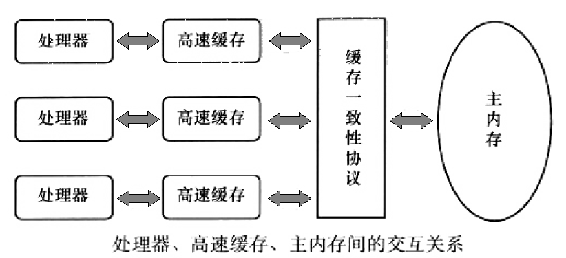
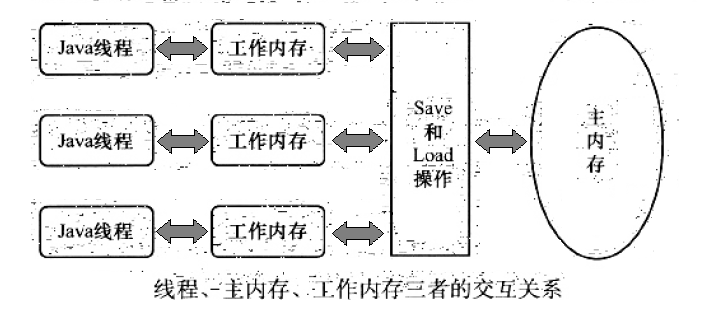
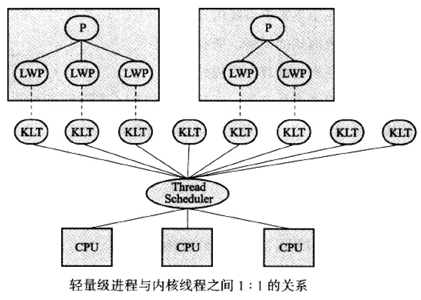
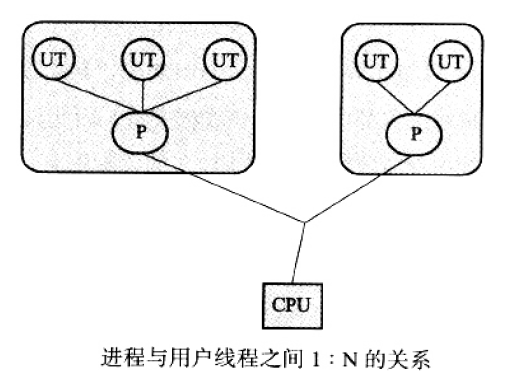
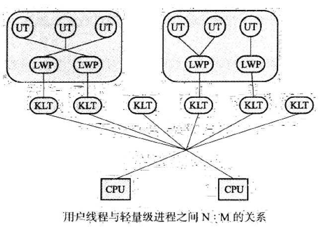
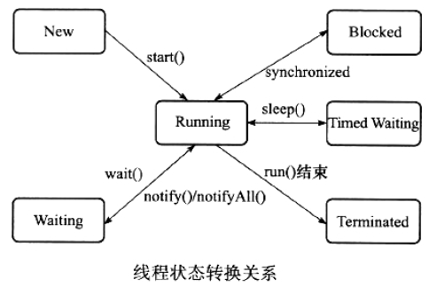

# Java内存模型与线程 #

[1.概述](#概述)

[2.硬件的效率与一致性](#硬件的效率与一致性)

[3.Java内存模型](#java内存模型)

[3.1.主内存与工作内存](#主内存与工作内存)

[3.2.内存间交互操作](#内存间交互操作)

[3.3.对于volatile型变量的特殊规则](#对于volatile型变量的特殊规则)

[3.3.1.volatile第一特性](#volatile第一特性)

[3.3.2.volatile第二特性](#volatile第二特性)

[3.3.3.Java内存模型中对volatile变量定义的特殊规则](#java内存模型中对volatile变量定义的特殊规则)

[3.4.对于long和double型变量的特殊规则](#对于long和double型变量的特殊规则)

[3.5.原子性、可见性与有序性](#原子性可见性与有序性)

[3.5.1.原子性](#原子性)

[3.5.2.可见性](#可见性)

[3.5.3.有序性](#有序性)

[3.6.先行发生原则](#先行发生原则)

[4.Java与线程](#java与线程)

[4.1.线程的实现](#线程的实现)

[4.1.1.使用内核线程实现](#使用内核线程实现)

[4.1.2.使用用户线程实现](#使用用户线程实现)

[4.1.3.使用用户线程加轻量级进程混合实现](#使用用户线程加轻量级进程混合实现)

[4.1.4.Java线程的实现](#java线程的实现)

[4.2.线程调度](#线程调度)

[4.3.状态转换](#状态转换)

## 概述 ##

多任务处理在现代计算机操作系统中几乎已是一项必备的功能了。在许多情况下，让计算机同时去做几件事情，不仅是因为计算机的运算能力强大了，还有一个很重要的原因是计算机的运算速度与它的存储和通信子系统速度的差距太大，大量的时间都花费在磁盘 I/O、网络通信或者数据库访问上。如果不希望处理器在大部分时间里都处于等待其他资源的状态，就必须使用一些手段把处理器的运算能力 “压榨” 出来，否则就会造成很大的浪费，而**让计算机同时处理几项任务则是最容易想到、也被证明是非常有效的 “压榨” 手段**。

除了充分利用计算机处理器的能力外，一个服务端同时对多个客户端提供服务则是另一个更具体的并发应用场景。衡量一个服务性能的高低好坏，**每秒事务处理数（Transactions Per Second，TPS）是最重要的指标之一**，它代表着一秒内服务端平均能响应的请求总数，而 **TPS 值与程序的并发能力又有非常密切的关系**。对于计算量相同的任务，程序线程并发协调得越有条不紊，效率自然就会越高；反之，线程之间频繁阻塞甚至死锁，将会大大降低程序的并发能力。

服务端是 Java 语言最擅长的领域之一，这个领域的应用占了 Java 应用中最大的一块份额，不过如何写好并发应用程序却又是服务端程序开发的难点之一，处理好并发方面的问题通常需要更多的编码经验来支持。幸好 Java 语言和虚拟机提供了许多工具，把并发编程的门槛降低了不少。并且各种中间件服务器、各类框架都努力地替程序员处理尽可能多的线程并发细节，使得程序员在编码时能更关注业务逻辑，而不是花费大部分时间去关注此服务会同时被多少人调用、如何协调硬件资源。无论语言、中间件和框架如何先进，**开发人员都不能期望它们能独立完成所有并发处理的事情，了解并发的内幕也是成为一个高级程序员不可缺少的课程**。

## 硬件的效率与一致性 ##

物理机遇到的并发问题与虚拟机中的情况有不少相似之处，物理机对并发的处理方案对于虚拟机的实现也有相当大的参考意义。

"**让计算机并发执行若干个运算任务**” 与 “**更充分地利用计算机处理器的效能**” 之间的因果关系，看起来顺理成章，实际上它们之间的关系并没有想象中的那么简单，**其中一个重要的复杂性来源是绝大多数的运算任务都不可能只靠处理器 “计算” 就能完成**，处理器至少要与内存交互，如读取运算数据、存储运算结果等，这个 I/O 操作是很难消除的（无法仅靠寄存器来完成所有运算任务）。

由于**计算机的存储设备与处理器的运算速度有几个数量级的差距**，所以现代计算机系统都不得不加入一层读写速度尽可能接近处理器运算速度的**高速缓存**（Cache）来作为内存与处理器之间的缓冲：将运算需要使用到的数据复制到缓存中，让运算能快速进行，当运算结束后再从缓存同步回内存之中，这样处理器就无须等待缓慢的内存读写了。

---

**基于高速缓存的存储交互很好地理解了处理器与内存的速度矛盾**，但是也为计算机系统带来了更高的复杂度，因为它**引入了一个新的问题**：**缓存一致性**（Cache Coherence）。在多处理器系统中，每个处理器都有自己的告诉缓存，而它们又共享同一主内存（Main Memory），如下图所示。

当多个处理器的运算任务都涉及同一块主内存区域时，将可能导致各自的缓存数据不一致，如果真的发生这种情况，那同步回到主内存时以谁的缓存数据为准呢？

为了解决一致性的问题，需要各个处理器访问缓存时都**遵循一些协议**，在读写时要根据协议来进行操作，这类协议有 MSI、MESI（Illinois Protocol）、MOSI、Synapse、Firefly 及 Dragon Protocol 等。j接下来将会多次提到的 “**内存模型**” 一词，可以理解为在特定的操作协议下，对特定的内存或高速缓存进行读写访问的过程抽象。不同架构的物理机器可以拥有不一样的内存模型，而 Java 虚拟机也有自己的内存模型，并且这里介绍的内存访问操作与硬件的缓存访问操作具有很高的可比性。

除了增加高速缓存之外，为了使得处理器内部的运算单元能尽量被充分利用，处理器可能会对输入代码**进行乱序执行**（Out-Of-Order Execution）优化，处理器会在计算之后将乱序执行的结果充足，保证该结果与顺序执行的结果是一致的，但并不保证程序中各个语句计算的先后顺序与输入代码中的顺序一致，因此，如果存在一个计算任务依赖另外一个计算任务的中间结果，那么其顺序并不能靠代码的先后顺序来保证。与处理器的乱序执行优化类型，Java 虚拟机的即时编译器中有有类似的**指令重排序**（Instruction Reorder）优化。

## Java内存模型 ##

Java 虚拟机规范中试图定义一种 Java 内存模型（Java Memory Model，JMM）来屏蔽掉各种硬件和操作系统的内存访问差异，以实现让 Java 程序在各种平台下都能达到一致的内存访问效果。在此之前，主流程序语言（如 C/C++ 等）直接使用物理硬件和操作系统的内存模型，因此，会由于不同平台上内存模型的差异，有可能导致程序在一套平台上并发完全正常，而在另外一套平台上并发访问却经常出错，因此在某些场景就必须针对不同的平台来编写程序。

定义 Java 内存模型并非一件容易的事情，这个模型必须定义得足够严谨，才能让 Java 的并发内存访问操作不会产生歧义；但是，也必须定义得足够宽松，使得虚拟机的实现有足够的自由空间去利用硬件的各种特性（寄存器、高速缓存和指令集中某些特有的指令）来获取更好的执行速度。经过长时间的验证和修补，在 JDK 1.5（实现了 JSR-133）发布后，Java 内存模型已经成熟和完善起来了。

### 主内存与工作内存 ###

**Java 内存模型的主要目标是定义程序中各个变量的访问规则**，即在虚拟机中将变量存储到内存和从内存中取出变量这样的底层细节。此处的变量（Variables）与 Java 编程中所说的变量有所区别，它包括了实例字段、静态字段和构成数组对象的元素，**但不包括局部变量与方法参数，因为后者是线程私有的，不会被共享，自然就不会存在竞争问题**。为了获得较好的执行效能，Java 内存模型并没有限制执行引擎使用处理器的特定寄存器或缓存和主内存进行交互，也没有限制即时编译器进行调整代码执行顺序这类优化措施。

Java 内存模型规定了所有的变量都存储在**主内存**（Main Memory）中（此处的主内存与介绍物理硬件时的主内存名字一样，两者也可以互相类比，但此处仅是虚拟机内存的一部分）。

每条线程还有自己的**工作内存**（Working Memory，可与前面讲的处理器高速缓存类比），线程的工作内存中保存了被该线程使用到的变量的主内存副本拷贝，线程对变量的所有操作（读取、赋值等）都必须在工作内存中进行，而不能直接读写主内存中的变量。不同的线程之间也无法直接访问对方工作内存中的变量，线程间变量值的传递均需要通过主内存来完成，

线程、主内存、工作内存三者的交互关系如下图所示。

这里所讲的主内存、工作内存与前面所讲的 Java 内存区域的 Java 堆、栈、方法区等并**不是同一个层次的内存划分**，这两者基本上是没有关系的，

如果两者一定要勉强对应起来，那从变量、主内存、工作内存的定义来看，**主内存**主要对应于 **Java 堆**中的对象实例数据部分，而**工作内存**则对应于**虚拟机栈**中的部分区域。

从更低层次上说，**主内存**就直接对应于**物理硬件的内存**，而为了获取更高的运行速度，虚拟机（甚至是硬件系统本身的优化措施）可能会让**工作内存**优先存储于**寄存器和高速缓存**中，因为程序运行时主要访问读写的是工作内存。

### 内存间交互操作 ###

关于主内存与工作内存之间具体的交互协议，即**一个变量如何从主内存拷贝到工作内存**、**如何从工作内存同步会主内存**之类的实现细节，Java 内存模型中定义了以下 8 种操作来完成，虚拟机实现时必须保证下面提及的每一种操作都是原子的、不可再分的（对于 double 和 long 类型的变量来说，load、store、read 和 write 操作在某些平台上允许有例外）。

- lock（锁定）：作用于**主内存**的变量，它把一个变量标识为一条线程独占的状态。

- unlock（解锁）：作用于**主内存**的变量，它把一个处于锁定状态的变量释放出来，释放后的变量才可以被其他线程锁定。

- read（读取）：作用于**主内存**的变量，它把一个变量的值从主内存传输到线程的工作内存中，以便随后的 load 动作使用。

- load（载入）：作用于**工作内存**的变量，它把 read 操作从主内存中得到的变量值放入工作内存的**变量副本**中。

- use（使用）：作用于**工作内存**的变量，它把工作内存中一个变量的值传递给执行引擎，每当虚拟机遇到一个需要使用到变量的值的字节码指令时将会执行这个操作。

- assign（赋值）：作用于**工作内存**的变量，它把一个从执行引擎接收到的值赋给工作内存的变量，每当虚拟机遇到一个给变量赋值的字节码指令时执行这个操作。

- store（存储）：作用于**工作内存**的变量，它把工作内存中一个变量的值传送到主内存中，以便随后的 write 操作使用。

- write（写入）：作用于**主内存**的变量，它把 store 操作从工作内存中得到的变量的值放入主内存的变量中。

如果要把一个变量从主内存复制到工作内存，那就要顺序地执行 read 和 load 操作，如果要把变量从工作内存同步回主内存，就要顺序地执行 store 和 write 操作。注意，Java 内存模型只要求上述两个操作必须按顺序执行，而**没有保证是连续执行**。

也就是说，read 与 load 之间、store 与 write 之间是可插入其他指令的，如对主内存中的变量 a、b 进行访问时，一种可能出现顺序是 read a、read b、load b、load a。

---

除此之外，Java 内存模型还规定了在执行上述 8 种基本操作时必须满足如下规则：

- 不允许 read 和 load、store 和 write 操作之一单独出现，即不允许一个变量从主内存读取了但工作内存不接受，或者从工作内存发起回写了但主内存不接受的情况出现。
- 不允许一个线程丢弃它的最近的 assign 操作，即变量在工作内存中改变了之后必须把该变化同步会主内存。
- 不允许一个线程无原因地（没有发生过任何 assign 操作）把数据从线程的工作内存同步回主内存中。
- 一个新的变量只能在主内存中 “诞生”，不允许在工作内存中直接使用一个未被初始化（load 或 assign）的变量，换句话说，就是对一个变量实施 use、store 操作之前，必须先执行过了 assign 和 load 操作。
- 一个变量在同一个时刻只允许一条线程对其进行 lock 操作，但 lock 操作可以被同一条线程重复执行多次，多次执行 lock 后，只有执行相同次数的 unlock 操作，变量才会被解锁。
- 如果对一个变量执行 lock 操作，那将会清空工作内存中此变量的值，在执行引擎使用这个变量前，需要重新执行 load 或 assign 操纵初始化变量的值。
- 如果一个变量事先没有被 lock 操作锁定，那就不允许对它执行 unlock 操作，也不允许去 unlock 一个呗其他线程锁定住的变量。
- 对一个变量执行 unlock 操作之前，必须先把此变量同步会主内存中（执行 store、write 操作）。

这 8 种内存访问操作以及上述规则限定，再加上稍后介绍的对 volatile 的一些特殊规定，就**已经完全确定了 Java 程序中哪些内存访问操作在并发下是安全的**。

由于这种定义相当严谨但又十分烦琐，实践起来很麻烦，所以在后面将介绍这种定义的一个等效判断原则——先行发生原则，用来确定一个访问在并发环境下是否安全。

### 对于volatile型变量的特殊规则 ###

**关键字 volatile 可以说是 Java 虚拟机提供的最轻量级的同步机制**，但是它并不容易完全被正确、完整地理解，以致于许多程序员都习惯不去使用它，遇到需要处理多线程数据竞争问题的时候一律使用 synchronized 来进行同步。了解 volatile 变量的语义对后面了解多线程操作的其他特性很有意义。

当一个变量定义为 volatile 之后，它将具备两种特性。

#### volatile第一特性 ####

第一特性是**保证此变量对所有线程的可见性**，这里的 “可见性” 是指当一条线程修改了这个变量的值，新值对于其他线程来说是可以立即得知的。而普通变量不能做到这一点，普通变量的值在线程间传递均需要通过主内存来完成，例如，线程 A 修改一个普通变量的值，然后向主内存进行回写，另外一条线程 B 在线程 A 回写完成了之后再从主内存进行读取操作，新变量值才会对线程 B 可见。

关于 volatile 变量的可见性，经常会被开发人员误解，认为以下描述成立：“volatile 变量对所有线程是立即可见的，对 volatile 变量所有的写操作都能立刻反应到其他线程之中，换句话说，volatile 变量在各个线程中是一致的，所以基于 volatile 变量的运算在并发下是安全的”。这句话的论据部分并没有错，但是其论据并**不能**得出 “**基于 volatile 变量的运算在并发下是安全的**” 这个结论。

volatile 变量在各个线程的工作内存中不存在一致性问题（在各个线程的工作内存中，volatile 变量也可以存在不一致的情况，但由于每次使用之前都要先刷新，执行引擎看不到不一致的情况，因此可以认为不存在不一致性问题），但是 Java 里面的运算并非原子操作，导致 volatile 变量的运算在并发下一样是不安全的，可以通过一段简单的演示来说明原因，请看下面代码中演示的例子。

---

[VolatileTest](VolatileTest.java)

这段代码发起了 20 个线程，每个线程对 race 变量进行 10000 次自增操作，如果这段代码能够正确并发的话，最后输出的结果应该是 200000。运行完这段代码之后，并不会获得期望的结果，而且发现每次运行程序，输出的结果都不一样，都是一个小于 200000 的数字，这是为什么呢？

问题就出现在自增运算 “race++” 之中，我们用 javap 反编译这段代码后会得到下面代码，发现只有一行代码的 increase() 方法在 Class 文件中是由 4 条字节码指令构成的（return 指令不是由 race++ 产生的，这条指令可以不计算），

	  public static void increase();
	    descriptor: ()V
	    flags: ACC_PUBLIC, ACC_STATIC
	    Code:
	      stack=2, locals=0, args_size=0
	         0: getstatic     #13                 // Field race:I
	         3: iconst_1
	         4: iadd
	         5: putstatic     #13                 // Field race:I
	         8: return
	      LineNumberTable:
	        line 12: 0
	        line 13: 8
	      LocalVariableTable:
	        Start  Length  Slot  Name   Signature

从字节码层面上很容易就分析出并发**失败的原因**了：当 getstatic 指令把 race 的值取到操作栈顶时，volatile 关键字保证了 race 的值在此时是正确的，但是在执行 iconst_1、iadd 这些指令的时候，其他线程可能已经把 race 的值加大了，而在操作栈顶的值就变成了过期的数据，所以 putstatic 指令执行后就可能把较小的 race 值同步会主内存之中。

客观地说，在此使用字节码来分析并发问题，**仍然是不严谨的**，因为即使编译出来只有一条字节码指令，也并不意味着执行这条指令就是一个原子操作。一条字节码指令在解释执行时，解释器将要运行许多行代码才能实现它的语义，如果是编译执行，一条字节码指令也可能转化成若干条本地机器码指令，此处使用 -XX:+PrintAssembly参数输出反汇编来分析会更严峻一些，但为了方便，并且字节码已经能说明问题，所以此处使用字节码来分析。

---

由于 volatile 变量只能保证可见性，在不符合以下两条规则的运算场景中，仍然需要通过加锁（使用 synchronized 或 java.util.concurrent 中的原子类）来保证原子性。

- 运算结果并不依赖变量的当前值，或者能够确保只有单一的线程修改变量的值。
- 变量不需要与其他状态变量共同参与不变约束。

而在像如下的代码所示的这类场景就很适合使用 volatile 变量来控制并发，当 shutdown() 方法被调用时，能保证所有线程中执行的 doWork() 方法都立即停下来。

	volatile boolean shutdownRequested;
	
	public void shutdown() {
		shutdownRequested = true;
	}
	
	public void doWork() {
		while (!shutdownRequested) {
			//do stuff
		}
	}

#### volatile第二特性 ####

使用 volatile 变量的第二个语义是**禁止指令重排序优化**，普通的变量仅仅会保证在该方法的执行过程中所有依赖赋值结果的地方都能获取到正确的结果，而不能保证变量赋值操作的顺序与程序代码中的执行顺序一致。因为在一个线程的方法执行过程中无法感知到这点，这也就是 Java 内存模型中描述的所谓的 “线程内表现为串行的语义”（Within-Thread As-If-Serial Semantics）。

同过代码阐明为何指令重排序会干扰程序的并发执行

	Map configOptions;
	char[] configText;
	// 此变量必须定义为 volatile
	volatile boolean initialized = false;
	
	// 假设以下代码在线程 A 中执行
	// 模拟读取配置信息，当读取完成后将 initialized 设置为 true 以通知其他线程配置可用
	configOptions = new HashMap();
	configText = readConfigFile(fileName);
	processConfigOptions(configText, configOptions);
	initialized = true;

	//----------------------

	// 假设以下代码在线程 B 中执行
	// 等待 initialized 为 true，代表线程 A 已经把配置信息初始化完成
	while (!initialized) {
		sleep();
	}
	// 使用线程 A 中初始化好的配置信息
	doSomethingWithConfig();

代码中的程序是一段伪代码，其中描述的场景十分场景，只是在处理配置文件时一般不会出现并发而已。**如果定义 initialized 变量时没有使用 volatile 修饰，就可能由于指令重排序的优化，导致位于线程 A 中最后一句的代码 “initialized=true” 被提前执行**（这里虽然使用 Java 作为伪代码，但所指的重排序优化是机器级的优化操作，提前执行是指这句话对应的汇编代码被提前执行），这样在线程 B 中使用配置信息的代码就可能出现错误，而 volatile 关键字则可以避免此类情况的发生。

（注：volatile 屏蔽指令重排序的语义在 JDK 1.5 中才被完全修复，此前的 JDK 中即使将变量声明为 volatile 也仍然不能完全避免重排序所导致的问题（主要是 volatile 变量前后的代码仍然存在重排序问题），这点也是在 JDK 1.5 之前的 Java 中无法按期地使用 DCL（双锁检测）来实现单例模式的原因。）

指令重排序是并发编程中最容易让开发人员产生疑惑的地方，除了上面伪代码的例子之外，再举一个可以实际操作运行的例子来分析 volatile 关键字是如何禁止指令重排序优化的。下面是一段标准的 DCL （Double Check Lock） 单例代码，可以观察加入 volatile 和未加入 volatile 关键字时所生成汇编代码的差别([如何获得 JIT 的汇编代码](../c04#hsdisjit生成代码反汇编))

	public class Singleton {
	
		private volatile static Singleton instance;
		
		public static Singleton getInstance() {
			if (instance == null) {
				synchronized (Singleton.class) {
					if (instance == null) {
						instance = new Singleton();
					}
				}
			}
			return instance;
		}
		
		public static void main(String[] args) {
			Singleton.getInstance();
		}
	}

编译后，这段代码对 instance 变量赋值部分如下所示

	0x01a3de0f: mov    $0x3375cdb0,%esi   ;...beb0cd75 33
	                                        ;   {oop('Singleton')}
	0x01a3de14: mov    %eax,0x150(%esi)   ;...89865001 0000
	0x01a3de1a: shr    $0x9,%esi          ;...c1ee09
	0x01a3de1d: movb   $0x0,0x1104800(%esi)  ;...c6860048 100100
	0x01a3de24: lock addl $0x0,(%esp)     ;...f0830424 00
	                                        ;*putstatic instance
	                                        ; - Singleton::getInstance@24 

通过对比就会发现，关键变化在于有 volatile 修饰的变量，赋值后（前面 mov %eax，0x150(%esi) 这句便是赋值操作）**多执行了一个 “lock addl $0x0，(%esp)” 操作**，这个操作相当于一个**内存屏障**（Memory Barrier 或 Memory Fence，指重排序时不能把后面的指令重排序到内存屏障之前的位置），只有一个 CPU 访问内存时，并不需要内存屏障；但如果有两个或更多 CPU 访问同一块内存，且其中有一个在观测另一个，就需要内存屏障来保证一致性了。

这句指令中的 “addl $ 0x0, (%esp)”（把 ESP 寄存器的值加 0）显然是一个**空操作**（采用这个空操作而不是空操作指令 nop 是因为 IA32 手册规定 lock 前缀不允许配合 nop 指令使用），关键在于 lock 前缀，查询 IA32 手册，它的作用是使得本 CPU 的 Cache 写入了内存，该写入动作也会引起别的 CPU 或者别的内核无效化（Invalidate）其 Cache，这种操作相当于对 Cache 中变量做了一次前面介绍 Java 内存模式中所说的 “store 和 write” 操作。所以通过这样一个空操作，可以让前面 volatile 变量的修改对其他 CPU 立即可见。

**那为何说它禁止指令重排序呢**？从硬件架构上讲，指令重排序是指 CPU 采用了允许将多条指令不按程序规定的顺序分开发送给各相应电路单元处理。但并不是说指令任意重排，CPU 需要能正确处理指令依赖情况以保障程序能得出正确的执行结果。

譬如指令 1 把地址 A 中的值加 10，指令 2 把地址 A 中的值乘以 2，指令 3 把地址 B 中的值减去 3，这时指令 1 和 指令 2 是有依赖的，它们之间的顺序不能重排——（A + 10）\* 2 与 A \* 2 + 10 显然不相等，但指令 3 可以重排到指令 1、2 之前或者中间，只要保证 CPU 执行后面依赖到 A、B 值的操作是能获取到正确的 A 和 B 值即可。所以在本内 CPU 中，重排序看起来依然是有序的。因此 lock addl $0x0, (%esp) 指令把修改同步到内存时，意味着所有之前的操作都已经执行完成，这样便形成了“**指令重排序无法越过内存屏障**” 的效果。

解决了 volatile 的语义问题，再来看看在众多保障并发安全的工具中选**用 volatile 的意义——它能让我们的代码比使用其他的同步工具更快吗**？在某些情况下，volatile 的同步机制的性能确实要优于锁（使用 synchronized 关键字或 java.util.concurrent 包里面的锁），但是由于虚拟机对锁实行的许多消除和优化，使得我们很难量化地认为 volatile 就会比 synchronized 快多少。如果让 volatile 自己与自己比较，那可以确定一个原则：volatile 变量读操作的性能消耗与普通变量几乎没有什么差别，但是写操作则可能会慢一些，因为它需要在本地代码中插入许多内存屏障指令来保证处理器不发生乱序执行。不过即便如此，大多数场景下 volatile 的总开销仍然要比锁低，**我们在 volatile 与锁之中选择的唯一依据仅仅是volatile 的语义能否满足使用场景的需求**。

#### Java内存模型中对volatile变量定义的特殊规则 ####

回头看一下 Java 内存模型中对 volatile 变量定义的特殊规则。假定 T 表示一个线程，V 和 W 分别表示两个 volatile 型变量，那么在进行 read、load、use、assign、store 和 write 操作时需要满足如下规则：

- 只有当线程 T 对变量 V 执行的前一个动作是 load 的时候，线程 T 才能对变量 V 执行 use 动作；并且，只有当线程 T 对变量 V 执行的后一个动作是 use 的时候，线程 T 才能对变量 V 执行 load 动作。线程 T 对变量 V 的 use 动作可以认为是和线程 T 对变量 V 的 load、read 动作相关联，必须连续一起出现（这套规则要求在工作内存中，每次使用 V 前都必须先从主内存刷新最新的值，用于保证能看见其他线程对变量 V 所做的修改后的值）。read-&gt;load-&gt;use

- 只有当线程 T 对变量的前一个动作是 assign 的时候，线程 T 才能对变量 V 执行 store 动作；并且，只有当线程 T 对变量 V 执行的后一个动作是 store 的时候，线程 T 才能对变量 V 执行 assign 动作。线程 T 对变量 V 的 assign 动作可以认为是和线程 T 对变量 V 的 store、write 动作相关联，必须连续一起出现（这条规则要求在工作内存中，每次修改 V 后都必须立刻同步回主内存中，用于保证其他线程可以看到自己对变量 V 所做的修改）。assign-&gt;store

- 假定动作 A 是线程 T 对变量 V 实施的 use 或 assign 动作，假定动作 F 是和动作 A 相关联的 load 或 store 动作，假定动作 P 是和动作 F 相应的对变量 V 的 read 或 write 动作；类似的，假定动作 B 是线程 T 对变量 W 实施的 use 或 assign 动作，假定动作 G 是和动作 B 相关联的 load 或 store 动作，假定动作 Q 是和动作 G 相应的对变量 W 的 read 或 write 动作。如果 A 先于 B，那么 P 先于 Q（这条规则要求 volatile 修饰的变量不会被指令重排序优化，保证代码的执行顺序与程序的顺序相同）。

### 对于long和double型变量的特殊规则 ###

Java 内存模型要求 lock、unlock、read、assign、use、store、write 这 8 个操作都具有原子性，但是对于 64 位的数据类型（long 和 double），在模型中特别定义了一条相对宽松的规定：允许虚拟机将没有被 volatile 修饰的 64 位数据的读写操作划分为两次 32 位的操作来进行，即允许虚拟机实现选择可以不保证 64 位数据类型的 load、store、read 和 write 这 4 个操作的原子性，这点就是所谓的 long 和 double 的非原子性协定（Nonatomic Treatment of double and long Variables）。

如果有多个线程共享一个并为声明为 volatile 的 long 或 double 类型的变量，并且同时对它们进行读取和修改操作，那么某些线程可能会读取到一个既非原值，也不是其他线程修改的值的代表了 “半个变量” 的数值。

不过这种读取到 “半个变量” 的情况非常罕见（在目前商用 Java 虚拟机中不会出现），因为 Java 内存模型虽然允许虚拟机不把 long 和 double 变量的读写实现成原子操作，但允许虚拟机选择把这些操作实现为具有原子性的操作，而且还 “强烈建议” 虚拟机这样实现。**在实际开发中，目前各种平台下的商用虚拟机几乎都选择把 64 位的数据的读写操作作为原子操作来对待，因此我们在编写代码时一般不需要把用到的 long 和 double 变量专门声明为 volatile**。

### 原子性、可见性与有序性 ###

Java 内存模型是围绕着在并发过程中如何处理原子性、可见性和有序性这 3 个特征来建立的

#### 原子性 ####

原子性（Atomicity）：由 Java 内存模型来直接保证的原子性变量操作包括 read、load、assign、use、store 和 write，我们大致可以认为基本数据类型的访问读写是具备原子性的（例外就是 long 和 double 的非原子性协定，读者只要知道这件事就可以了，无须太过在意这些几乎不会发生的例外情况）。

**如果应用场景需要一个更大范围的原子性保证**（经常会遇到），Java 内存模型还提供了 lock 和 unlock 操作来满足这种需求，经管虚拟机未把 lock 和 unlock 操作直接开放给用户使用，但是却提供了更高层次的字节码指令 monitorenter 和 monitorexit 来隐式地使用这两个操作，这两个字节码指令反映到 Java 代码中就是同步块——synchronized 关键字，因此在 synchronized 块之间的操作也具备原子性。

#### 可见性 ####

可见性（Visibility）：可见性是指当一个线程修改了共享变量的值，其他线程能够立即得知这个修改。上文在讲解 volatile 变量的时候我们已详细讨论过这一点。Java 内存模型是通过在变量修改后将新值同步回主内存，在变量读取前从主内存刷新变量值这种依赖主内存作为传递媒介的方式来实现可见性的，无论是普通变量还是 volatile 变量都是如此，普通变量与 volatile 变量的区别是，**volatile 的特殊规则保证了新值能立即同步到主内存，以及每次使用前立即从主内存刷新**。因此，可以说 volatile 保证了多线程操作时变量的可见性，而普通变量则不能保证这一点。

**除了 volatile 之外，Java 还有两个关键字能实现可见性，即 synchronized 和 final**。同步块的可见性是由 “对一个变量执行 unlock 操作之前，必须先把此变量同步会主内存中（执行 store、write 操作）” 这条规则获得的，而 final 关键字的可见性是指：被 final 修饰的字段在构造器中一旦初始化完成，并且构造器没有把 “this” 的引用传递出去（this 引用逃逸是一件很危险的事情，其他线程有可能通过这个引用访问到 “初始化了一半” 的对象），那在其他线程中就能看见 final 字段的值。

如代码所示，变量 i 与 j 都具备可见性，它们无须同步就能被其他线程正确访问。

	public static final int i;
	
	public final int j;
	
	static {
	   i = 0;
	   // do something
	} 
	
	{
	   // 也可以选择在构造函数中初始化
	   j = 0;
	   // do something
	}

#### 有序性 ####

有序性（Ordering）：Java 内存模型的有序性在前面讲解 volatile 时也详细地讨论过了，Java 程序中天然的有序性可以总结为一句话：如果在本线程内观察，所有的操作都是有序的；如果在一个线程中观察另一个线程，所有的操作都是无序的。前半句是指 “线程内表现为串行的语义” （Within-Thread As-If-Serial Semantics），后半句是指 “指令重排序” 现象和 “工作内存与主内存同步延迟” 现象。

Java 语言提供了 volatile 和 synchronized 两个关键字来保证线程之间操作的有序性，volatile 关键字本身就包含了禁止指令重排序的语义，而 synchronized 则是由 “一个变量在同一个时刻只允许一条线程对其进行 lock 操作” 这条规则获得的，这条规则决定了持有同一个锁的两个同步块只能串行地进入。

---

介绍完并发中 3 种重要的特性后，有没有发现 **synchronized 关键字**在需要这 3 种特性的时候都可以作为其中一种的解决方案？**看起来很 “万能”** 吧。的确，大部分的并发控制操作都能使用 synchronized 来完成。synchronized 的 “万能” 也间接造就了它被程序员滥用的局面，越 “万能” 的并发控制，通常会伴随着越大的性能影响，这点在后面讲解虚拟机锁优化时再介绍。

>PS. 能力越大，责任越大。

### 先行发生原则 ###

如果 Java 内存模型中所有的有序性都仅仅靠 volatile 和 synchronized 来完成，那么有一些操作将会变得很烦琐，但是我们在编写 Java 并发代码的时候并没有感觉到这一点，这是因为 Java 语言中有一个 “先行发生”（happens-before）的原则。这个原则非常重要，**它是判断数据是否存在竞争、线程是否安全的主要依据**，依靠这个原则，可以通过几条规则**一揽子地**解决并发环境下两个操作之间是否可能存在冲突的所有问题。

**先行发生是 Java 内存模型中定义的两项操作之间的偏序关系**，如果说操作 A 先行发生与操作 B，其实就是说在发生操作 B 之前，操作 A 产生的影响能被操作 B 观察到，“影响” 包括了修改了内存中共享变量的值、发送了消息、调用了方法等。

举个例子来说明一下

	// 以下操作在线程 A 中执行
	i = 1;
	
	// 以下操作在线程 B 中执行
	j = i;
	
	// 以下操作在线程 C 中执行
	i = 2;

假设线程 A 中的操作 “i=1” 先行发生于线程 B 的操作 “j=i”，那么可以确定在线程 B 的操作执行后，变量 j 的值一定等于 1，得出这个结论的依据有两个：一是根据先行发生原则，“i=1” 的结果可以被观察到；而是线程 C 还没 “登场”，线程 A 操作结束之后没有其他线程会修改变量 i 的值。

现在再来考虑线程 C，我们依然保持线程 A 和线程 B 之间的先行发生关系，而**线程 C 出现在线程 A 和线程 B 的操作之间**，但是线程 C 与线程 B 没有先行发生关系，那 j 的值会是多少呢？

**答案是不确定**！1 和 2 都有可能，因为线程 C 对变量 i 的影响可能会被线程 B 观察到，也可能不会，这时候**线程 B 就存在读取到过期数据的风险**，不具备多线程安全性。

---

下面是 Java 内存模型下一些 “天然的” 先行发生关系，**这些先行发生关系无须任何同步器协助就已经存在，可以在编码中直接使用**。如果两个操作之间的关系不在此列，并且无法从下列规则推导出来的话，它们就没有顺序性保障，虚拟机可以对它们随意地进行重排序。

- 程序次序规则（Program Order Rule）：在一个线程内，按照程序代码顺序，书写在前面的操作先行发生于书写在后面的操作。准确地说，应该是控制流顺序而不是程序代码顺序，因为要考虑分支、循环等结果。

- 管程锁定规则（Monitor Lock Rule）：一个 unlock 操作先行发生于后面对同一个锁的 lock 操作。这里必须强调的是同一个锁，而 “后面” 是指时间上的先后顺序。

- volatile 变量规则（Volatile Variable Rule）：对一个 volatile 变量的写操作先行发生于后面对这个变量的读操作，这里的 “后面” 同样是指时间上的先后顺序。

- 线程启动规则（Thread Start Rule）：Thread 对象的 start() 方法先行发生于此线程的每一个动作。

- 线程终止规则（Thread Termination Rule）：线程中的所有操作都先行发生于对此线程的终止检测，我们可以通过 Thread.join() 方法结束、Thread.isAlive() 的返回值等手段检测到线程已经终止执行。

- 线程中断规则（Thread Interruption Rule）：对线程 interrupt() 方法的调用先行发生于被中断线程的代码检测到中断事件的发生，可以通过 Thread.interrupted() 方法检测到是否有中断发生。

- 对象终结规则（Finalizer Rule）：一个对象的初始化完成（构造函数执行结束）先行发生于它的 finalize() 方法的开始。

- 传递性（Transitivity）：如果操作 A 先行发生于操作 B，操作 B 先行发生于操作 C，那就可以得出操作 A 先行发生于操作 C 的结论。

---

**Java 语言无须任何同步手段保障就能成立的先行发生规则就只有上面这些了**，演示一下如何使用这些规则去判定操作间是否具备顺序性，对于读写共享变量的操作来说，就是线程是否完全，读者还可以从下面这个例子中感受一下 “时间上的先后顺序” 与 “先行发生” 之间有什么不同。演示例子如下面代码所示。

	private int value = 0;
	
	public void setValue(int value) {
	    this.value = value;
	}
	
	public int getValue() {
	    return value;
	}

代码中显示的是一组再普通不过的 getter/setter 方法，假设存在线程 A 和 B，线程 A 先（时间上的先后）调用了 “setValue(1)”，然后线程 B 调用了同一个对象的 “getValue()”，那么线程 B 收到的返回值是什么？

依次分析一下先行发生原则中的各项规则，由于两个方法分别由线程 A 和线程 B 调用，不在一个线程中，所以**程序次序规则**在这里不适用；由于没有同步块，自然就不会发生 lock 和 unlock 操作，所以**管程锁定规则**不适用；用于 value 变量没有被 volatile 关键字修饰，所以 **volatile 变量规则**不适用；后面的**线程启动、终止、中断规则**和**对象终结规则**也和这里完全没有关系。因为没有一个适用的先行发生规则，所以最后一条**传递性**也无从谈起，

因此我们可以判断尽管线程 A 在操作时间上先于线程 B，但是无法确定线程 B 中 “getValue()” 方法的返回结果，换句话说，**这里面的操作不是线程安全的**。

**那怎么修复这个问题呢**？我们至少有两种比较简单的方案可以选择：

1. 要么把 getter/setter 方法都定义为 synchronized 方法，这样就可以套用管程锁定规则；

2. 要么把 value 定义为 volatile 变量，由于 setter 方法对 value 的修改不依赖 value 的原值，满足 volatile 关键字使用场景，这样就可以套用 volatile 变量规则来实现先行发生关系。

通过上面的例子，可以得出结论：**一个操作 “时间上的先发生” 不代表这个操作会是 “先行发生”**，那如果一个操作 “先行发生” 是否就能推导出这个操作必定是 “时间上的先发生” 呢？很遗憾，这个推论也是不成立的，一个典型的例子就是多次提到的 “指令重排序”，演示例子如下面所示。

	//  以下操作在同一个线程中执行
	int i = 1;
	int j = 2;

代码的两条赋值语句在同一个线程之中，根据程序次序规则，“int i=1” 的操作先行发生于 “int j=2”，但是 “int j=2” 的代码完全可能先被处理器执行，这并不影响先行发生原则的正确性，因为我们在这条线程之中没有办法感知到这点。

上面两个例子综合起来证明了一个结论：**时间先后顺序与先行发生原则之间基本没有太大的关系**，所以我们衡量并发完全问题的时候不要受到时间顺序的干扰，**一切必须以先行发生原则为准**。

## Java与线程 ##

并发不一定要依赖多线程（如 PHP 中很常见的多进程并发），但是在 Java 里面谈论并发，大多数都与线程脱不开关系。

既然探讨的话题是 Java 虚拟机的特性，那讲到 Java 线程，我们就从 Java 线程在虚拟机中的实现开始讲起。

### 线程的实现 ###

**线程是比进程更轻量级的调度执行单位**，线程的引入，可以把一个进程的资源分配和执行调度分开，各个线程既可以共享进程资源（内存地址、文件 I/O 等），又可以独立调度（线程是 CPU 调度的基本单位）。

主流的操作系统都提供了线程实现，Java 语言则提供了在不同硬件和操作系统平台下对线程操作的统一处理，每个已经执行 start() 且还未结束的 java.lang.Thread 类的实例就代表了一个线程。

注意到 Thread 类与大部分的 Java API 有显著的差别，它的所有关键方法都是声明为 Native 的。在 Java API 中，一个 Native 方法往往意味着这个方法没有使用或无法使用平台无关的手段来实现（当然也可能是为了执行效率而使用 Native 方法，不过，通常最高效率的手段也就是平台相关的手段）。

正因为如此，本节的标题定为 “线程的实现” 而不是 “Java 线程的实现”。

实现线程主要有 3 种方式：使用内核线程实现、使用用户线程实现和使用用户线程加轻量级进程混合实现。

#### 使用内核线程实现 ####

内核线程（Kernel-Level Thread，KLT）就是直接由操作系统内核（Kernel，下称内核）支持的线程，这种线程由内核来完成线程切换，内核通过操纵调度器（Scheduler）对线程进行调度，并负责将线程的任务映射到各个处理器上。每个内核线程可以视为内核的一个分身，这样操作系统就有能力同时处理多件事情，支持多线程的内核就叫做多线程内核（Multi-Threads Kernel）。

程序一般不会直接去使用内核线程，而是去使用**内核线程的一种高级接口—**—轻量级进程（Light Weight Process，LWP），轻量级进程就是我们通常意义上所讲的线程，由于每个轻量级进程都由一个内核线程支持，因此只有先支持内核线程，才能有轻量级进程。这种轻量级进程与内核线程之间 1 : 1 的关系称为一对一的线程模型，如下图所示。

由于内核线程的支持，每个轻量级进程都会成为一个独立的调度单元，即使有一个轻量级进程在系统调用中阻塞了，也不会影响整个进程继续工作，但是轻量级进程具有它的局限性：首先，由于是基于内核线程实现的，所以各种线程操作，如创建、析构及同步，都需要进行系统调用。而系统调用的代价相对较高，需要在用户态（User Mode）和内核态（Kernel Mode）中**来回切换**。其次，每个轻量级进程都需要有一个内核线程的支持，因此轻量级进程要**消耗**一定的内核资源（如内核线程的栈空间），因此一个系统支持轻量级进程的数量是有限的。

#### 使用用户线程实现 ####

从广义上来讲，一个线程只要不是内核线程，就可以认为是用户线程（User Thread，UT），因此，从这个定义上讲，轻量级进程也属于用户线程，但轻量级进程的实现始终是建立在内核之上的，许多操作都要进行系统调用，效率会收到限制。

而狭义上的用户线程指的是完全建立在用户控件的线程库上，系统内核不能感知线程存在的实现。用户线程的建立、同步、销毁和调度完全在用户态中完成，不需要内核的帮助。如果程序实现得当，这种线程不需要切换到内核态，因此操作可以是非常快速且低消耗的，也可以支持规模更大的线程数量，部分高性能数据库中的多线程就是由用户线程实现的。这种进程与用户线程之间 1：N 的关系称为一对多的线程模型，如下图所示。

使用用户线程的**优势**在于不需要系统内核支援，**劣势**也在于没有系统内核的支援，所有的线程操作都需要用户程序自己处理。线程的创建、切换和调度都是需要考虑的问题，而且由于操作系统只把处理器资源分配到进程，那诸如 “阻塞如何处理”、“多处理器系统中如何将线程映射到其他处理器上” 这类问题解决起来将会异常困难，甚至不可能完成。

因而使用**用户线程实现的程序一般都比较复杂**，除了以前在不支持多线程的操作系统中（如 DOS）的多线程程序与少数有特殊需求的程序外，现在使用用户线程的程序越来越少了，Java、Ruby 等语言都曾经使用过用户线程，最终又都放弃使用它。

#### 使用用户线程加轻量级进程混合实现 ####

线程除了依赖内核线程实现和完全由用户程序自己实现之外，还有一种将内核线程与用户线程一起使用的实现方式。在这种混合实现下，既存在用户线程，也存在轻量级进程。用户线程还是完全建立在用户空间中，因此用户线程的创建、切换、析构等操作依然廉价，并且可以支持大规模的用户线程并发。而操作系统提供支持的轻量级进程则作为用户线程和内核线程之间的桥梁，这样可以使用内核提供的线程调度功能及处理器映射，并且用户线程的系统调用要通过轻量级线程来完成，大大降低了整个进程被完全阻塞的风险。在这种混合模式中，用户线程与轻量级进程的数量比是不定的，即为 N：M 的关系，如下图所示，这种就是多对多的线程模型。

许多 UNIX 系列的操作系统，如 Solaris、HP-UX 等都提供了 N：M 的线程模型实现。

#### Java线程的实现 ####

Java 线程在 JDK 1.2 之前，是基于称为 “绿色线程”（Green Threads）的用户线程实现的，而在 JDK 1.2 中，线程模型替换为基于操作系统原生线程模型来实现。因此，在目前的 JDK 版本中，操作系统支持怎样的线程模型，在很大程度上决定了 Java 虚拟机的线程是怎样映射的，这点在不同的平台上没有办法达成一致，虚拟机规范中也并未限定 Java 线程需要使用哪种线程模型来实现。线程模型只对线程的并发规模和操作成本产生影响，对 Java 程序的编码和运行过程来说，这些差异都是透明的。

**对于 Sun SDK 来说，它的 Windows 版与 Linux 版都是使用一对一的线程模型实现的，一条 Java 线程就映射到一条轻量级进程之中，因为 Windows 和 Linux 系统提供的线程模型就是一对一的**。

而在 Solaris 平台中，由于操作系统的线程特性可以同时支持一对一（通过 Bound Threads 或 Alternate Libthread 实现）级多对多（通过 LWP/Thread Based Synchronization 实现）的线程模型，因此在 Solaris 版的 JDK 中也对应提供了两个平台专有的虚拟机参数：-XX:+UseLWPSynchronization（默认值）和 -XX:+UseBoundThreads 来明确指定虚拟机使用哪种线程模型。

### 线程调度 ###

线程调度是指系统为线程分配处理器使用权的过程，主要调度方式有两种，分别是协同式线程调度（Cooperative Threads-Scheduling）和抢占式线程调度（Preemptive Threads-Scheduling）。

- 如果使用**协同式调度**的多线程系统，线程的执行时间由线程本身来控制，线程把自己的工作执行完了之后，要主动通知系统切换到另外一个线程上。协同式多线程的最大好处是实现简单，而且由于线程要把自己的事情干完后才会进行线程切换，切换操作对线程自己是可知的，所以没有什么线程同步的问题。Lua 语言中的“协同例程”就是这类实现。它的坏处也很明显：线程执行时间不可控制，甚至如果一个线程编写有问题，一直不告知系统进行线程切换，那么程序就会一直阻塞在那里。很久以前的 Windows 3.x 系统就是使用协同式来实现多进程多任务的，相当不稳定，一个进程坚持不让出 CPU 执行时间久可能会导致整个系统崩溃。

- 如果使用**抢占式调度**的多线程系统，那么每个线程将由系统来分配执行时间，线程的切换不由线程本身来决定（在 Java 中，Thread.yield() 可以让出执行时间，但是要获取执行时间的话，线程本身是没有什么办法的）。在这种实现线程调度的方式下，线程的执行时间是系统可控的，也不会有一个线程导致整个进程阻塞的问题，Java 使用的线程调度方式就是抢占式调度。与前面所说的 Windows 3.x 的例子相对，在 Windows 9x/NT 内核中就是使用抢占式来实现多进程的，当一个进程出了问题，我们还可以使用任务管理器把这个进程 “杀掉”，而不至于导致系统崩溃。

虽然 Java 线程调度是系统自动完成的，但是我们还是可以 “建议” 系统给某些线程多分配一点执行时间，另外一些线程则可以少分配一点——这项操作可以通过设置线程优先级来完成。Java 语言一共设置了 10 个级别的线程优先级（Thread.MIN_PRORITY 至 Thread.MAX_PRIORITY），在两个线程同时处于 Ready 状态时，优先级越高的线程越容易被系统选择执行。

不过，**线程优先级并不是太靠谱**，原因是 Java 的线程是通过映射到系统的原生线程上来实现的，所以线程调度最终还是取决于操作系统，虽然现在很多操作系统都提供线程优先级的概念，但是并不见得能与 Java 线程的优先级一一对应，如 Solaris 中有 2147483648（2^31）种优先级，但Windows 中就只有 7 种，比 Java 线程优先级多的系统还好说，中间留下一点空位就可以了，但比 Java 线程优先级少的系统，就不得不出现几个优先级相同的情况了，表 12-1 显示了 Java 线程优先级与 Windows 线程优先级之间的对应关系，Windows 平台的 JDK 中使用了除 THREAD_PRIORITY_IDLE 之外的其余 6 种线程优先级。

Java线程优先级|Windows线程优先级
---|---
1（Thread.MIN_PRIORITY）|THREAD_PRIORITY_LOWEST
2|THREAD_PRIORITY_LOWEST
3|THREAD_PRIORITY_BELOW_NORMAL
4|THREAD_PRIORITY_BELOW_NORMAL
5（Thread.NORM_PRIORITY）|THREAD_PRIORITY_NORMAL
6|THREAD_PRIORITY_ABOVE_NORMAL
7|THREAD_PRIORITY_ABOVE_NORMAL
8|THREAD_PRIORITY_HIGHEST
9|THREAD_PRIORITY_HIGHEST
10（Thread.MAX_PRIORITY）|THREAD_PRIORTIY_CRITICAL

上文说到 “线程优先级并不是太靠谱”，不仅仅是说在一些平台上不同的优先级实际会变得相同这一点，还有其他情况让我们不能太让依赖优先级：优先级可能会被系统自行改变。例如，在 Windows 系统中存在一个存在一个称谓  “优先级推进器” （Priority Boosting，当然它可以被关闭掉）的功能，它的大致作用就是当系统发现一个线程执行得到特别 “勤奋努力” 的话，可能会越过线程优先级去为它分配执行时间。因此，我们不能在程序中通过优先级来完全准确地判断一组状态都为 Ready 的线程将会先执行哪一个。

### 状态转换 ###

Java语言定义了5种线程状态，在任意一个时间点，一个线程只能有且只有其中的一种状态，这5种状态分别如下：

- 新建（New）：创建后尚未启动的线程处于这种状态。

- 运行（Runable）：Runable包括了操作系统线程状态中的Running和Ready，也就是处于此状态的线程有可能正在执行，也有可能正在等待着CPU为它分配执行时间。

- 无限期等待（Waiting）：处于这种状态的线程不会被分配CPU执行时间，它们要等待被其它线程显示地唤醒。以下方法会让线程陷入无限期的等待状态：
	- 没有设置Timeout参数的Object.wait()方法
	- 没有设置Timeout参数的Thread.join()方法
	- LockSupport.park()方法

- 限期等待（Timed Waiting）：处于这种状态的线程也不会被分配CPU执行时间，不过无须等待被其它线程显示地唤醒，在一定时间之后它们会由系统自动唤醒。以下方法会让线程进入限期等待状态：

	- Thread.sleep()方法
	- 设置了Timeout参数的Object.wait()方法
	- 设置了Timeout参数的Thread.join()方法
	- LockSupport.parkNanos()方法
	- LockSupport.parkUntil()方法

- 阻塞（Blocked）：线程被阻塞了，“阻塞状态”与“等待状态”的区别是：“阻塞状态”在等待着获取到一个排它锁，这个事件将在另外一个线程放弃这个锁的时候发生；而“等待状态”则是在等待一段时间，或者唤醒动作的发生。在程序等待进入同步区域的时候，线程将进入这种状态。

- 结束（Terminated）：已终止线程的线程状态，线程已经结束执行。

上述5种状态在遇到特定事件发生的时候将会互相转换，它们的转换关系如下图：

